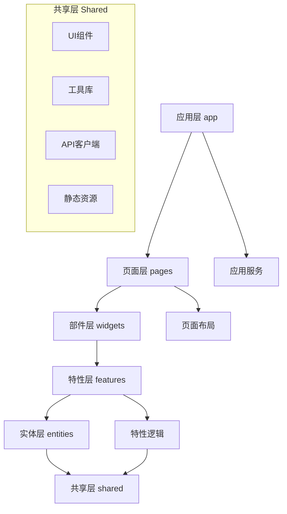
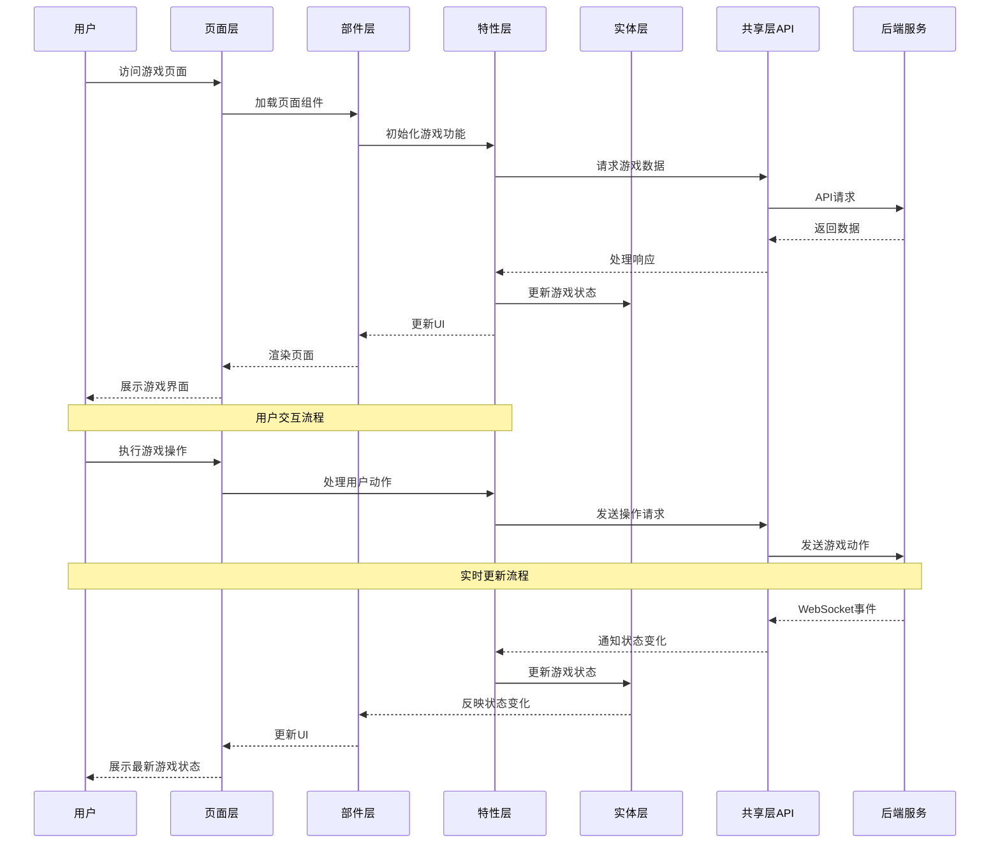

# 灾变创世录 (Catastrophe-Genesis) 前端源码

## 模块概述

灾变创世录是一个基于Web的区块链卡牌对战游戏平台，采用Feature Sliced Design (FSD)架构构建。源码目录遵循严格的分层原则，将应用拆分为六个主要功能层，每层具有明确的职责和边界，保证代码组织的清晰性和可维护性。这种架构使开发团队能够并行工作，同时降低了代码间的耦合度。

## 核心功能

- **分层架构**: 实现Feature Sliced Design架构，确保关注点分离和依赖控制
- **状态管理**: 基于Redux实现可预测的状态管理系统，支持复杂游戏状态追踪
- **路由系统**: 使用React Router实现页面导航和权限控制
- **组件库**: 提供从原子级到页面级的可复用React组件体系
- **API集成**: 封装与后端服务的通信，支持实时对战和游戏功能
- **响应式设计**: 支持多种设备尺寸的用户界面适配

## 关键组件

### 应用层 (app/)
- **client.tsx**: 应用的根组件，集成全局服务和提供应用入口
- **store.ts**: Redux存储配置，集成所有功能模块的状态切片
- **desktop-only.tsx**: 桌面端限制组件，提供设备兼容性检查
- **global-styles.tsx**: 全局样式定义，包括主题、颜色和基础样式

### 实体层 (entities/)
- **card/**: 游戏卡牌实体，包含卡牌数据模型和基础UI
- **user/**: 用户实体，包含用户信息和账户相关功能
- **match/**: 对战实体，定义游戏对战的核心概念
- **lobby/**: 游戏大厅实体，管理房间和玩家集合
- **leaderboard/**: 排行榜实体，处理玩家排名数据
- **viewer/**: 观战者实体，定义观战相关功能

### 特性层 (features/)
- **auth/**: 用户认证和授权功能，包括登录、注册和会话管理
- **chat/**: 游戏内聊天系统，支持实时消息交换
- **current-match/**: 当前对战管理，处理游戏进行中的交互
- **create-lobby/**: 创建游戏大厅功能，设置游戏参数
- **join-lobby/**: 加入游戏大厅功能，连接现有游戏室
- **matchmaking-queue/**: 匹配队列功能，自动配对玩家
- **preferences/**: 用户偏好设置，包括游戏和界面选项

### 页面层 (pages/)
- **home.tsx**: 应用首页，展示游戏概览和主要入口
- **auth/**: 认证页面，包含登录和注册视图
- **lobby.tsx**: 游戏大厅页面，管理房间和玩家
- **match.tsx**: 游戏对战页面，展示核心游戏界面
- **leaderboard.tsx**: 排行榜页面，展示玩家排名
- **user.tsx**: 用户资料页面，显示个人信息和统计
- **routes.tsx**: 路由配置，定义应用导航结构

### 共享层 (shared/)
- **ui/**: 可复用UI组件库，从原子级到模板级
- **lib/**: 工具函数和服务，提供通用功能支持
- **api/**: API客户端，封装后端接口调用
- **assets/**: 静态资源，包括图像、字体和媒体文件

### 部件层 (widgets/)
- **header.tsx**: 应用顶部导航栏，提供全局导航和用户功能
- **sidebar/**: 侧边栏组件，提供上下文导航和附加功能

## 依赖关系

项目采用自下而上的依赖关系，确保低层不依赖高层：

- **app**: 依赖所有其他层，作为应用入口和集成点
- **pages**: 依赖widgets、features、entities和shared，组合成完整页面
- **widgets**: 依赖features、entities和shared，构建复合UI组件
- **features**: 依赖entities和shared，实现业务功能
- **entities**: 仅依赖shared，定义核心业务概念
- **shared**: 不依赖其他任何层，提供基础工具和组件

## 使用示例

### 页面组装示例
```tsx
// 游戏大厅页面示例
import React from 'react';
import { useParams } from 'react-router-dom';
import { Header } from '@widgets/header';
import { LobbyInfo } from '@widgets/lobby-info';
import { ChatPanel } from '@features/chat';
import { JoinLobbyButton } from '@features/join-lobby';
import { LobbyDetails } from '@entities/lobby';
import { useAuth } from '@features/auth';

const LobbyPage: React.FC = () => {
  const { lobbyId } = useParams<{ lobbyId: string }>();
  const { user } = useAuth();
  
  return (
    <div className="lobby-page">
      <Header />
      <main>
        <LobbyDetails id={lobbyId} />
        <div className="actions">
          {user && <JoinLobbyButton lobbyId={lobbyId} />}
        </div>
        <LobbyInfo id={lobbyId} />
        <ChatPanel scope="lobby" id={lobbyId} />
      </main>
    </div>
  );
};
```

### 特性使用示例
```tsx
// 用户认证功能示例
import React, { useState } from 'react';
import { Button, TextField } from '@shared/ui/atoms';
import { Card } from '@shared/ui/molecules';
import { useLogin } from '@features/auth';

const LoginForm: React.FC = () => {
  const [username, setUsername] = useState('');
  const [password, setPassword] = useState('');
  const { login, isLoading, error } = useLogin();
  
  const handleSubmit = async (e: React.FormEvent) => {
    e.preventDefault();
    await login({ username, password });
  };
  
  return (
    <Card>
      <form onSubmit={handleSubmit}>
        <TextField
          label="用户名"
          value={username}
          onChange={(e) => setUsername(e.target.value)}
        />
        <TextField
          type="password"
          label="密码"
          value={password}
          onChange={(e) => setPassword(e.target.value)}
        />
        {error && <div className="error">{error}</div>}
        <Button type="submit" disabled={isLoading}>
          {isLoading ? '登录中...' : '登录'}
        </Button>
      </form>
    </Card>
  );
};
```

## 架构说明

灾变创世录前端采用Feature Sliced Design (FSD)架构，这是一种组织前端代码的方法论，专注于业务领域和功能隔离：



每一层都有明确的职责和设计约束：
- **应用层**：提供全局服务和初始化
- **页面层**：组合widgets和features形成完整页面
- **部件层**：组合多个features形成复杂UI区块
- **特性层**：实现特定业务功能的逻辑和UI
- **实体层**：定义核心业务概念和基础UI
- **共享层**：提供通用工具和组件

## 功能模块泳道流程图



源码目录采用严格的模块化设计，使得团队可以并行开发不同功能，同时保持代码的可维护性和可测试性。通过清晰的层次结构和依赖规则，我们确保了代码的可扩展性和长期可维护性，为游戏的持续迭代提供了坚实的技术基础。 