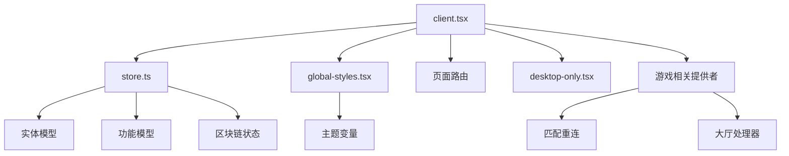
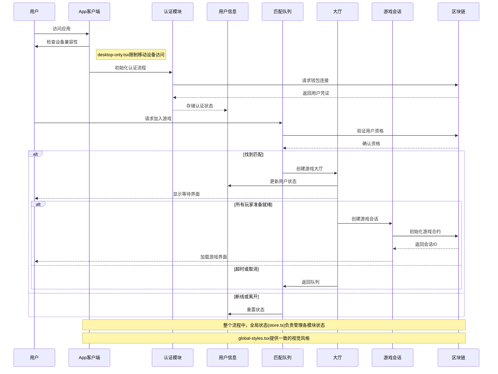

# 应用层 (App Layer)

## 模块概述

应用层是整个Exploding Cats GameFi平台的核心层，负责应用程序的全局配置、状态管理和布局结构。它将所有其他模块集成在一起，提供应用程序的运行环境和全局状态管理。

## 核心功能

- **应用入口**: 提供React应用的主入口点，组织组件层次结构和路由系统
- **全局状态管理**: 集中配置Redux存储，整合所有功能模块的状态
- **环境限制**: 确保应用只在桌面环境中运行，提供移动设备访问限制
- **全局样式**: 定义应用的基础视觉风格和CSS变量
- **主题支持**: 实现应用的主题切换功能和视觉样式配置

## 关键组件

### 应用入口 (client.tsx)
- 应用程序的主入口组件
- 设置全局提供者（主题、通知等）
- 集成用户认证流程
- 配置路由系统

### 状态管理 (store.ts)
- Redux存储配置
- 整合所有模块的状态管理器（包括游戏相关的卡牌、匹配、大厅等状态）
- 配置中间件和增强器
- 提供TypeScript类型定义

### 环境限制 (desktop-only.tsx)
- 检测用户设备类型
- 限制移动设备访问
- 提供桌面专属体验
- 优化特定环境显示

### 全局样式 (global-styles.tsx)
- 全局CSS重置和基础样式
- 定义主题变量和颜色方案
- 设置全局排版规则和字体
- 提供响应式布局支持

## 依赖关系

### 内部依赖
- **entities**: 用户、观察者、排行榜等核心业务实体
- **features**: 认证、匹配、聊天、游戏交互等功能模块
- **pages**: 路由和页面组件
- **shared**: 主题、通知、样式等共享工具

### 外部依赖
- **React** 和 **React DOM**: 核心UI渲染
- **Redux** 和 **Redux Toolkit**: 状态管理
- **MUI (Material-UI)**: UI组件库和样式系统

## 使用示例

```tsx
// src/main.tsx - 应用入口点
import {createRoot} from "react-dom/client";
import {BrowserRouter} from "react-router-dom";
import {Provider} from "react-redux";

import {App} from "@app/client";
import {store} from "@app/store";
import "@shared/lib/i18n";

const element = document.getElementById("root") as Element;
const root = createRoot(element);

root.render(
  <Provider store={store}>
    <BrowserRouter>
      <App />
    </BrowserRouter>
  </Provider>,
);
```

```tsx
// 使用应用全局状态的示例
import {useDispatch, useSelector} from "react-redux";
import {RootState} from "@app/store";
import {themingModel} from "@shared/lib/theming";

const ThemeToggle = () => {
  const dispatch = useDispatch();
  const currentTheme = useSelector((state: RootState) => state.theming.theme);
  
  const toggleTheme = () => {
    dispatch(themingModel.actions.setTheme(
      currentTheme === "light" ? "dark" : "light"
    ));
  };
  
  return <button onClick={toggleTheme}>切换主题</button>;
};
```

## 架构说明

应用层采用组合式设计，将全局关注点分离到专门的模块中，同时为区块链卡牌游戏提供必要的基础架构：



应用层是整个Exploding Cats GameFi应用的根节点，负责组织应用结构和提供全局环境，但不包含具体游戏逻辑。游戏逻辑由features和entities层实现，而区块链交互则通过专门的服务和适配器处理。

## 功能模块泳道流程图

以下泳道图展示了用户从登录到进入游戏的完整流程，以及各个模块间的交互过程：



## 开发指南

1. 应用层应专注于组织和配置，不应包含具体业务逻辑
2. 全局状态只应包含真正需要在整个应用中共享的数据
3. 样式应遵循项目设计规范，保持一致性
4. 环境限制应考虑用户体验，提供友好的提示 