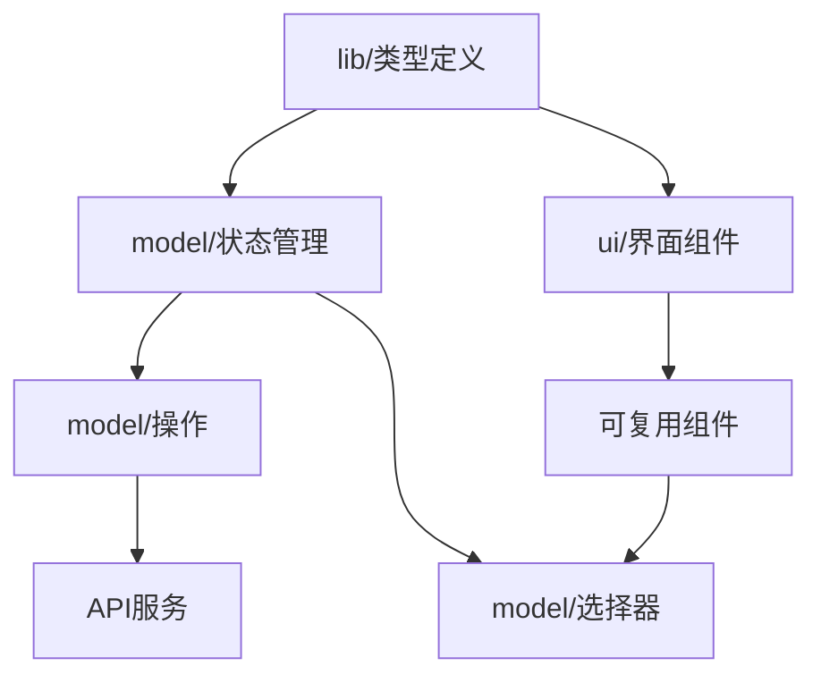
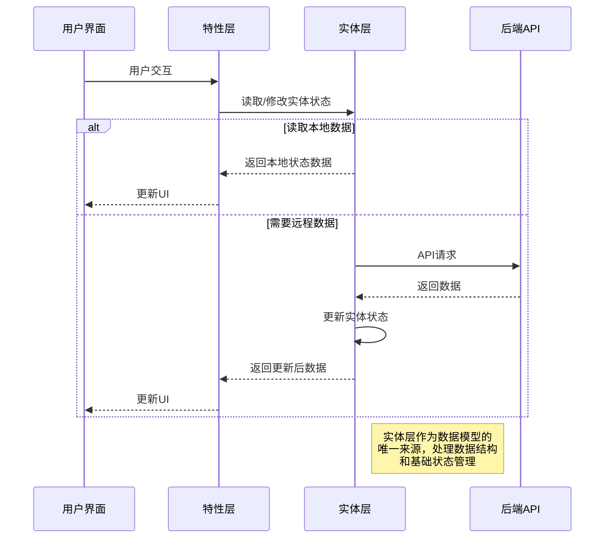
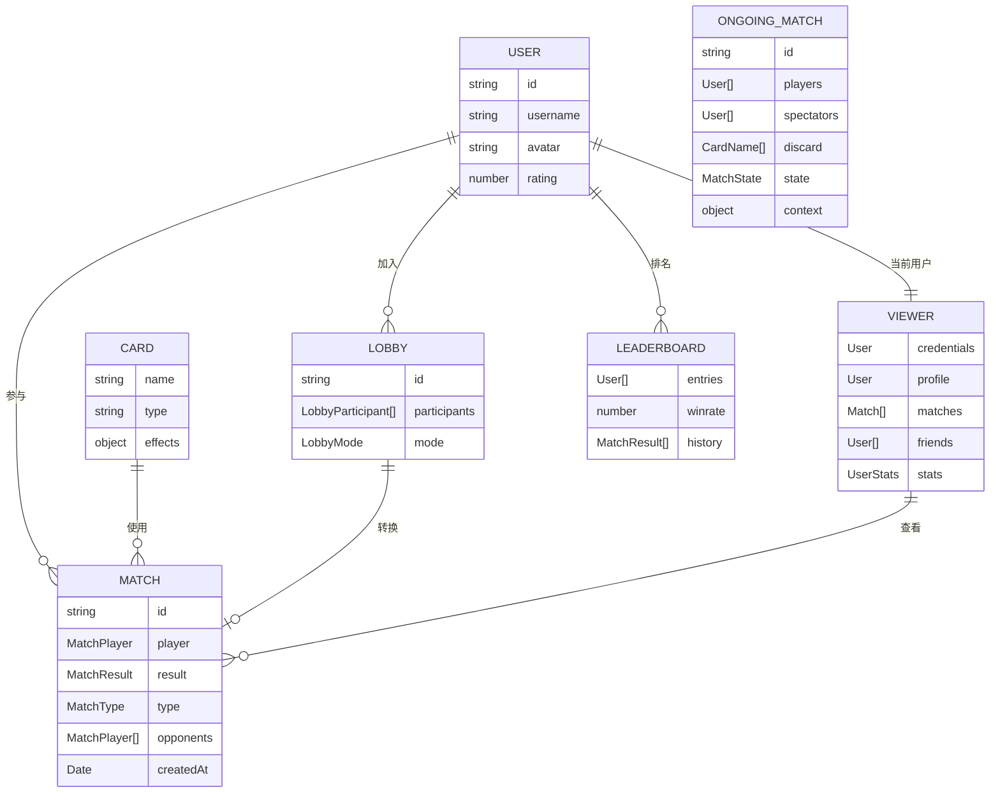

# 实体层 (Entities Layer)

## 模块概述

实体层是灾变创世录游戏平台的核心基础数据层，定义了业务领域中的关键概念和数据模型。该层封装了游戏中的本质对象（如卡牌、用户、对战、大厅等），提供统一的数据结构、状态管理和基础UI组件，作为特性层和页面层的支持基础。实体层专注于对象的纯粹定义和简单交互，避免复杂业务逻辑，确保应用架构的清晰分层和组件复用。

## 核心功能

- **领域模型定义**: 提供游戏核心实体的数据结构、类型和状态定义
- **基础状态管理**: 实现实体的状态存储、更新和查询功能
- **UI表示组件**: 为每个实体提供标准的视觉表现和基础交互
- **模块间关系**: 定义并管理不同实体间的关联和引用关系
- **工具函数集**: 提供各实体特有的辅助功能和计算工具
- **类型系统**: 确保实体数据的类型安全和一致性

## 关键组件

实体层包含多个子模块，每个子模块专注于一个业务领域概念：

### 卡牌模块 (card/)
- **定义范围**: 卡牌类型、属性、效果和交互逻辑
- **核心组件**: 
  - 卡牌类型定义和常量
  - 卡牌UI展示组件
  - 卡牌排序、筛选工具
  - 卡牌效果处理逻辑
- **关键特性**: 支持不同类型卡牌的展示和交互，提供卡牌操作工具

### 用户模块 (user/)
- **定义范围**: 用户资料、状态、关系和统计数据
- **核心组件**: 
  - 用户基础数据接口
  - 用户活动和统计展示
  - 用户关系状态管理
  - 用户事件处理机制
- **关键特性**: 管理用户信息展示、关系处理和活动追踪

### 查看者模块 (viewer/)
- **定义范围**: 当前登录用户的身份、凭证和状态
- **核心组件**: 
  - 用户凭证管理机制
  - 个人资料和数据获取
  - 好友列表和对战记录
  - 资料处理组件
- **关键特性**: 作为当前用户身份上下文的唯一来源，提供认证状态和用户信息

### 对战模块 (match/)
- **定义范围**: 游戏对战流程、状态和结果处理
- **核心组件**: 
  - 对战数据模型
  - 状态类型和常量
  - 结果处理机制
  - 积分系统支持
- **关键特性**: 定义完整对战结构和状态转换逻辑，提供游戏进程管理

### 大厅模块 (lobby/)
- **定义范围**: 游戏大厅组织、玩家准备和参数设置
- **核心组件**: 
  - 大厅参与者接口
  - 游戏模式设置
  - 组队和角色分配
  - 状态验证工具
- **关键特性**: 支持游戏前准备、玩家分组和参数配置

### 排行榜模块 (leaderboard/)
- **定义范围**: 游戏排名、竞技记录和统计展示
- **核心组件**: 
  - 排行榜数据模型
  - 排名计算和展示
  - 胜率和历史记录
  - 用户排名比较
- **关键特性**: 提供玩家竞技表现的量化展示和比较功能

## 数据模型

实体层定义了游戏中的关键数据结构，下面是核心实体的简化数据模型：

```typescript
// 用户基础接口
export interface User {
  id: string;            // 用户唯一标识
  username: string;      // 用户名
  avatar: string;        // 头像URL
  rating: number;        // 用户评分/等级
}

// 卡牌名称类型
export type CardName = string;

// 卡牌单位接口
export interface CardUnit {
  name: CardName;        // 卡牌名称
  // 其他卡牌属性
}

// 大厅数据结构
export interface Lobby {
  id: string;                        // 大厅标识符
  participants: LobbyParticipant[];  // 参与者列表
  mode: LobbyMode;                   // 游戏模式
}

// 对战结果类型
export type MatchResult = "victory" | "defeat";

// 对战类型
export type MatchType = "public" | "private";

// 对战接口
export interface Match {
  id: string;                // 对战ID
  player: MatchPlayer;       // 当前玩家
  result: MatchResult;       // 对战结果
  type: MatchType;           // 对战类型
  opponents: MatchPlayer[];  // 对手列表
  createdAt: Date;           // 创建时间
}

// 进行中对战
export interface OngoingMatch {
  id: string;                // 对战ID
  players: OngoingMatchPlayer[]; // 玩家列表
  out: OngoingMatchOutPlayer[]; // 出局玩家
  spectators: User[];        // 观战者
  // 其他游戏状态字段
}

// 查看者状态存储结构
export interface ViewerStore {
  credentials: Nullable<Credentials>;         // 用户凭证
  profile: Fetchable<Nullable<User>>;         // 用户资料
  matches: Fetchable<Nullable<Match[]>>;      // 对战历史
  friends: Fetchable<Nullable<User[]>>;       // 好友列表
  stats: Fetchable<Nullable<UserStats>>;      // 统计数据
}
```

## 依赖关系

### 模块间依赖

实体层内部的依赖关系遵循清晰的层次结构：

- **基础实体**：
  - `user`: 定义基础用户接口，被多数模块引用
  - `card`: 提供卡牌基础定义，主要被match使用

- **复合实体**：
  - `viewer`: 扩展自user，专注于当前用户
  - `match`: 使用user和card构建对战流程
  - `lobby`: 基于user创建游戏准备空间
  - `leaderboard`: 基于user和match数据生成排名

### 外部依赖

实体层主要依赖于：

- **@app/store**: 访问Redux存储和dispatch工具
- **@shared/ui**: 使用基础UI组件如按钮、文本和图标
- **@shared/lib**: 使用通用工具函数和类型定义
- **@shared/api**: 获取后端数据和进行API调用
- **React相关库**: 构建组件和管理组件状态

### 被依赖情况

实体层被应用的其他层使用：

- **features/**: 使用实体构建更复杂的业务功能
- **widgets/**: 组合多个实体组件创建复合UI元素
- **pages/**: 整合实体和特性构建完整页面
- **app/**: 在全局配置和路由中使用实体

## 使用示例

以下是实体层组件和工具的典型使用示例：

```tsx
import React from "react";
import { useSelector } from "react-redux";
import { useDispatch } from "@app/store";

// 引入多个实体模块的组件和工具
import { CardName } from "@entities/card";
import { User, UserHub, UserStats } from "@entities/user";
import { viewerModel } from "@entities/viewer";
import { Match, MATCH_STATE, MATCH_RESULT } from "@entities/match";
import { Lobby, LobbyParticipant } from "@entities/lobby";

// 游戏对战组件示例
const GameView: React.FC = () => {
  const dispatch = useDispatch();
  
  // 使用实体选择器获取数据
  const credentials = useSelector(viewerModel.selectors.credentials);
  const currentMatch = useSelector(currentMatchModel.selectors.match);
  
  // 根据当前对战状态渲染界面
  if (!currentMatch) {
    return <div className="no-match">无进行中的对战</div>;
  }
  
  const isMyTurn = currentMatch.turn % currentMatch.players.length === 
    currentMatch.players.findIndex(p => p.id === credentials?.id);
  
  // 使用对战模块的状态常量
  const isWaitingForAction = currentMatch.state.type === MATCH_STATE.WFA;
  
  return (
    <div className="game-board">
      <div className="game-status">
        {isMyTurn ? "你的回合" : "对手回合"}
        {!isWaitingForAction && (
          <div className="special-action">
            需要特殊操作: {currentMatch.state.type}
          </div>
        )}
      </div>
      
      {/* 渲染玩家手牌和场上卡牌 */}
      {currentMatch.me.cards && (
        <div className="hand-container">
          {currentMatch.me.cards.map((card, index) => (
            <div key={index} className="card" onClick={() => handleCardPlay(card)}>
              {card.name}
            </div>
          ))}
        </div>
      )}
      
      {/* 使用其他实体模块的组件 */}
      <div className="player-info">
        <UserStats />
      </div>
    </div>
  );
};
```

## 架构说明

实体层采用模块化设计，每个实体模块内部统一遵循以下架构：



每个实体模块内部通常包含：

1. **lib/**: 包含类型定义、常量和工具函数
2. **model/**: 管理状态的存储、操作和选择器
3. **ui/**: 提供实体的视觉表现组件
4. **index.ts**: 统一导出模块公共API

## 功能模块泳道流程图



## 实体关系图

以下是主要实体间的关系：



实体层的设计原则是保持每个实体的纯粹性和独立性，专注于定义领域概念而不涉及复杂业务逻辑。这种设计使得实体易于理解、测试和复用，为应用的其他部分提供了坚实的基础。当需要组合多个实体或实现复杂业务逻辑时，应在特性层而非实体层进行。 