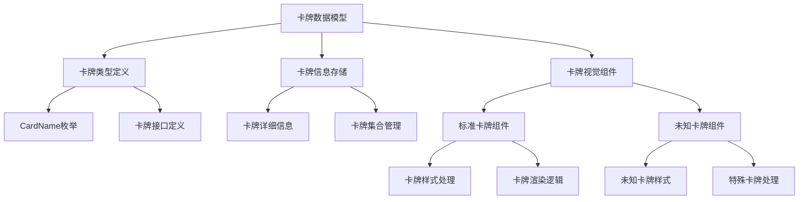
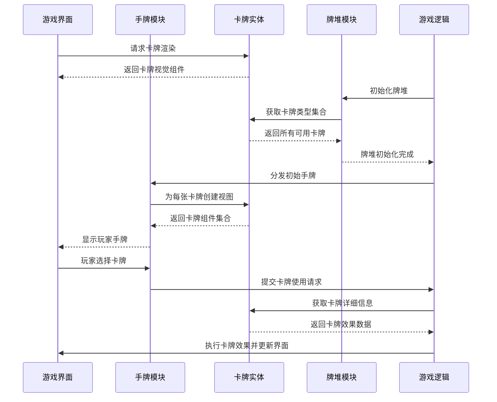

# 卡牌实体模块 (Card Entity)

## 模块概述

卡牌模块是灾变创世录游戏的核心组件，定义了游戏中所有卡牌的数据结构、视觉表现和基础功能。该模块为游戏提供了统一的卡牌管理系统，包括卡牌类型定义、详细信息存储和渲染组件，确保游戏中卡牌的一致性展示和交互。

## 核心功能

- **卡牌类型系统**: 定义游戏中所有卡牌类型的标准数据模型
- **卡牌信息管理**: 集中存储卡牌名称、描述、图像和视觉样式
- **卡牌渲染组件**: 提供标准化的卡牌视觉呈现组件
- **未知卡牌处理**: 支持展示未知或背面朝上的卡牌
- **多尺寸支持**: 适应游戏中不同场景的卡牌显示需求

## 关键组件

### 卡牌数据模型 (lib/typings.ts)
- 定义卡牌名称枚举类型`CardName`，包含所有可用卡牌类型
- 提供`CardDetails`接口，描述卡牌的详细信息结构
- 定义`CardUnit`接口，表示游戏中的卡牌实例

### 卡牌库管理 (lib/cards.ts)
- 管理所有卡牌的详细信息集合
- 为每种卡牌类型提供标准化的数据，包括名称、色调、描述和图像
- 提供卡牌集合访问接口，便于游戏逻辑获取卡牌信息

### 卡牌显示组件 (ui/card.tsx)
- 实现卡牌的视觉呈现逻辑
- 支持正常和迷你尺寸的卡牌显示
- 处理卡牌样式、边框和阴影效果
- 集成多语言支持，显示翻译后的卡牌名称

### 未知卡牌组件 (ui/unknown-card.tsx)
- 提供未知卡牌（背面朝上）的视觉呈现
- 支持特殊卡牌类型的条件显示
- 保持与标准卡牌组件一致的尺寸和交互行为

## 数据模型

卡牌实体的核心数据结构：

```typescript
// 卡牌名称类型
export type CardName =
  | "exploding-kitten"
  | "defuse"
  | "attack"
  | "nope"
  | "shuffle"
  | "skip"
  | "see-the-future-3x"
  // ... 其他卡牌类型

// 卡牌详细信息
export interface CardDetails {
  name: string;      // 卡牌显示名称
  tone: string;      // 卡牌颜色色调
  description: string; // 卡牌效果描述
  image: string;     // 卡牌图像资源
}

// 卡牌单元（游戏中的实例）
export interface CardUnit {
  id: string;        // 卡牌唯一标识符
  name: CardName;    // 卡牌类型名称
}
```

## 依赖关系

卡牌模块依赖于：
- **@shared/assets/cards**: 提供卡牌图像资源
- **@shared/lib/layout**: 使用布局组件构建卡牌结构
- **@shared/ui/atoms**: 使用文本组件显示卡牌名称
- **@shared/ui/icons**: 提供未知卡牌问号图标
- **@mui/material**: 使用样式化组件和CSS工具
- **react-i18next**: 实现卡牌文本的多语言支持

卡牌模块被以下模块使用：
- **entities/deck**: 管理卡牌集合和抽牌堆
- **entities/hand**: 处理玩家手牌展示和交互
- **features/gameplay**: 实现卡牌使用和效果逻辑
- **widgets/game-board**: 在游戏界面显示各类卡牌元素

## 使用示例

### 在组件中渲染卡牌

```tsx
import { Card, CardName } from '@entities/card';

const GameHandView: React.FC = () => {
  // 玩家手牌数据示例
  const playerHand: CardName[] = [
    "defuse", 
    "attack", 
    "shuffle", 
    "see-the-future-3x"
  ];
  
  return (
    <div className="player-hand">
      <h2>你的手牌</h2>
      <div className="cards-container">
        {playerHand.map((cardName, index) => (
          <Card 
            key={index} 
            name={cardName} 
            onClick={() => handleCardSelect(cardName, index)}
          />
        ))}
      </div>
    </div>
  );
};

// 处理卡牌选择
const handleCardSelect = (cardName: CardName, index: number) => {
  console.log(`选择了卡牌: ${cardName}, 位置: ${index}`);
  // 实现卡牌选择逻辑
};
```

### 渲染未知卡牌（对手卡牌或牌堆）

```tsx
import { UnknownCard } from '@entities/card';

const OpponentView: React.FC = () => {
  // 对手手牌数量
  const opponentCardCount = 4;
  
  return (
    <div className="opponent-hand">
      <h3>对手手牌</h3>
      <div className="cards-container">
        {Array.from({ length: opponentCardCount }).map((_, index) => (
          <UnknownCard key={index} mini={true} />
        ))}
      </div>
      
      <div className="deck-area">
        <h3>牌堆</h3>
        <div className="deck-stack">
          {/* 显示牌堆顶部的未知卡牌 */}
          <UnknownCard />
          <div className="cards-remaining">剩余卡牌: 15</div>
        </div>
      </div>
    </div>
  );
};
```

## 架构说明

卡牌模块采用分层设计，将数据定义、信息存储和视觉呈现分离：



## 功能模块泳道流程图



卡牌模块是游戏系统的基础构建块，提供卡牌的数据结构和视觉表现。通过将卡牌数据与视觉分离，该模块实现了高度的灵活性和可扩展性，便于添加新的卡牌类型和效果。卡牌组件支持不同尺寸和状态的显示，适应游戏中各种场景需求，确保玩家获得一致且直观的游戏体验。 