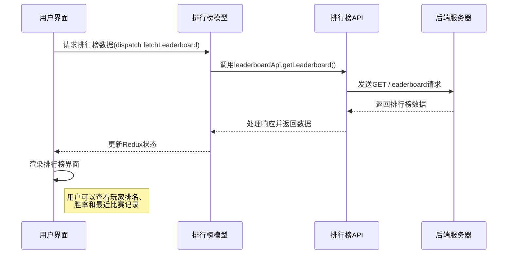
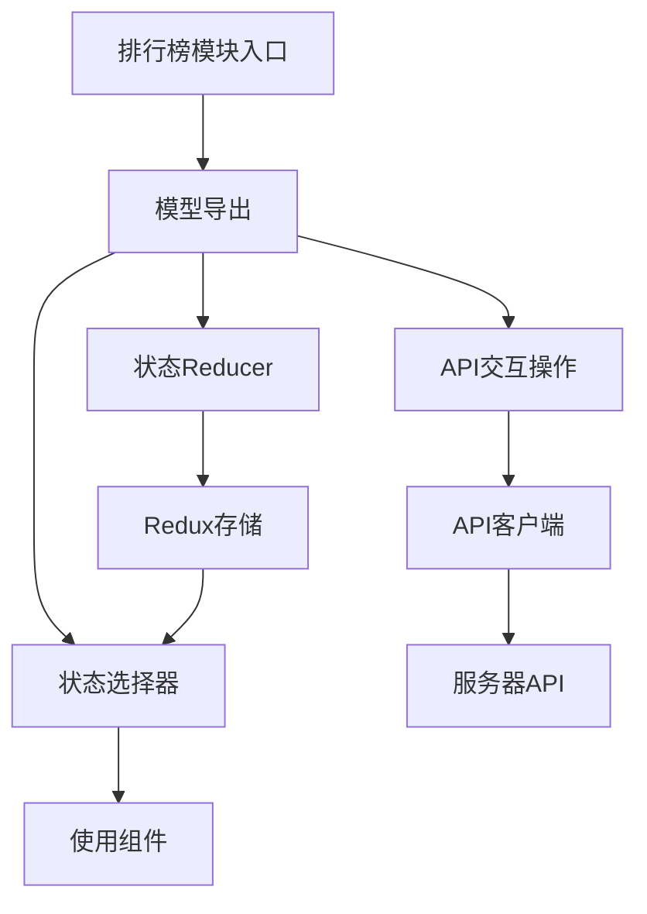

# 排行榜实体模块 (Leaderboard Entity)

## 模块概述

排行榜模块是灾变创世录游戏平台的竞技排名系统，定义了游戏排行榜的数据模型、状态管理和展示组件。该模块提供了玩家排名的数据结构、排序规则和查询功能，作为游戏竞争机制的量化展现，同时为特性层的排行榜功能提供数据支持，帮助玩家了解自己在游戏社区中的竞技表现。

## 核心功能

- **排行榜数据获取**: 从服务器获取最新的排行榜数据
- **排名状态管理**: 在Redux存储中提供排行榜数据的存储和查询功能
- **胜率与历史记录展示**: 显示玩家胜率和最近对战结果
- **用户排名比较**: 方便玩家查看和比较不同玩家的排名表现
- **排行榜数据选择器**: 提供便捷访问排行榜数据的Redux选择器

## 关键组件

### 排行榜数据模型 (model/reducer.ts)
- 定义排行榜的状态结构 `LeaderboardState`
- 管理排行榜数据的存储和更新
- 处理从API获取的排行榜数据

### 排行榜API交互 (model/actions.ts)
- 实现获取排行榜数据的异步操作
- 使用`createAsyncThunk`处理API调用
- 从服务器获取最新排行榜信息

### 排行榜选择器 (model/selectors.ts)
- 提供从Redux状态中获取排行榜数据的选择器
- 便于组件访问排行榜状态
- 支持在组件中使用`useSelector`钩子获取数据

### 模块导出接口 (model/index.ts)
- 整合并导出排行榜模块的所有功能
- 提供统一的访问接口
- 组织reducer、actions和selectors

## 数据模型

排行榜实体的核心数据结构：

```typescript
// 从 @shared/api/common 导入的排行榜类型
export type Leaderboard = (User & {
  winrate: number;
  history: MatchResult[];
})[];

// 用户基本信息
export interface User {
  id: string;
  username: string;
  avatar: string;
  rating: number;
}

// 比赛结果类型
export type MatchResult = "victory" | "defeat";

// 排行榜状态接口
export interface LeaderboardState {
  leaderboard: Leaderboard;
}

// API响应接口
export interface GetLeaderboardResponse {
  leaderboard: Leaderboard;
}
```

## 状态管理

### Redux状态结构

```typescript
// 初始状态
{
  leaderboard: []
}

// Redux reducer
export const reducer = createReducer<LeaderboardState>(
  {
    leaderboard: [],
  },
  {
    [actions.fetchLeaderboard.fulfilled.type]: (
      state,
      {payload}: PayloadAction<actions.FetchLeaderboardPayload>,
    ) => {
      state.leaderboard = payload.leaderboard;
    },
  },
);
```

### 主要Action

```typescript
// 获取排行榜数据
export const fetchLeaderboard = createAsyncThunk<FetchLeaderboardPayload, void>(
  `${prefix}/fetchLeaderboard`,
  async () => {
    const {data} = await leaderboardApi.getLeaderboard();
    return data;
  },
);
```

### 选择器

```typescript
// 获取排行榜数据
export const leaderboard = (s: RootState) => state(s).leaderboard;
```

## 依赖关系

排行榜模块依赖于：
- **@shared/api/leaderboard**: 提供排行榜API调用
- **@shared/api/common**: 定义排行榜和用户数据类型
- **@app/store**: 访问Redux根状态
- **@reduxjs/toolkit**: 使用Redux工具简化状态管理

排行榜模块被以下模块使用：
- **pages/leaderboard**: 排行榜页面的实现
- **widgets/sidebar**: 在侧边栏可能显示排名信息
- **features/user-profile**: 在用户档案中显示排名

## 使用示例

```tsx
import React from "react";
import {useSelector} from "react-redux";
import {useTranslation} from "react-i18next";

import {leaderboardModel} from "@entities/leaderboard";
import {useDispatch} from "@app/store";

const LeaderboardView: React.FC = () => {
  const {t} = useTranslation("leaderboard");
  const dispatch = useDispatch();
  const leaderboard = useSelector(leaderboardModel.selectors.leaderboard);

  React.useEffect(() => {
    // 组件挂载时获取排行榜数据
    dispatch(leaderboardModel.actions.fetchLeaderboard());
  }, []);

  if (leaderboard.length === 0) {
    return <div>加载中...</div>;
  }

  return (
    <div className="leaderboard-container">
      <h2>{t("header")}</h2>
      <table>
        <thead>
          <tr>
            <th>#</th>
            <th>{t("w.username")}</th>
            <th>{t("w.rating")}</th>
            <th>{t("w.performance")}</th>
          </tr>
        </thead>
        <tbody>
          {leaderboard.map((user, idx) => (
            <tr key={user.id}>
              <td>{idx + 1}</td>
              <td>{user.username}</td>
              <td>{user.rating} ({user.winrate}%)</td>
              <td>
                {/* 显示最近对战记录 */}
                {[...user.history].reverse().map((result, idx) => (
                  <span key={idx} className={result === "victory" ? "win" : "loss"}>
                    {result === "victory" ? "W" : "L"}
                  </span>
                ))}
              </td>
            </tr>
          ))}
        </tbody>
      </table>
    </div>
  );
};
```

## 功能模块泳道流程图



## 架构说明

排行榜模块采用简洁的分层设计，将状态管理和数据获取分离：



排行榜模块专注于从服务器获取和展示排名数据，不包含具体的排名计算逻辑，这些计算在后端进行。通过简洁的Redux集成，排行榜数据可以在应用中轻松访问和展示，为玩家提供直观的竞技表现反馈。 