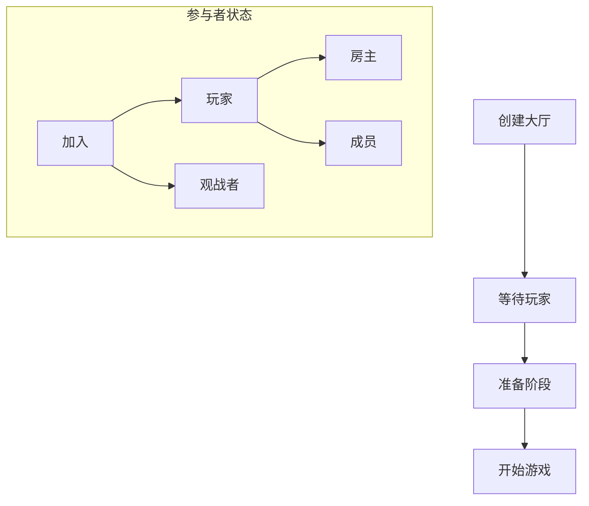
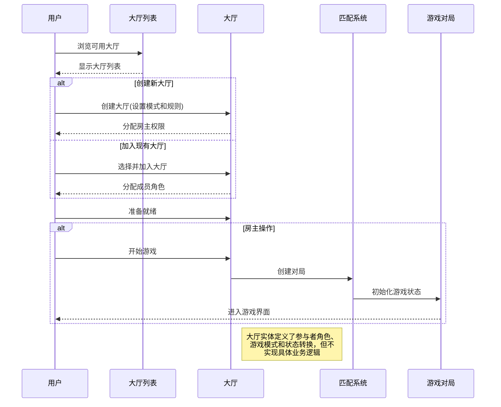

# 大厅实体模块 (Lobby Entity)

## 模块概述

大厅模块是灾变创世录游戏平台的多人对战准备系统，定义了游戏大厅的数据模型、状态管理和基础工具函数。该模块提供了玩家在进入实际对战前组队、准备和设置游戏参数的虚拟空间，作为游戏社交和对战前准备的桥梁，同时为特性层的大厅功能提供数据支持。

## 核心功能

- **大厅数据模型**: 定义完整的大厅结构、参与者角色和状态转换系统
- **玩家管理**: 提供玩家加入、离开、角色分配和准备状态控制
- **游戏模式设置**: 支持默认、核心、随机和自定义等多种游戏模式配置
- **团队功能**: 在团队模式下管理玩家分组和平衡
- **状态验证工具**: 提供大厅状态检查和操作验证的工具函数

## 关键组件

### 类型定义 (lib/typings.ts)
- 定义 `Lobby` 数据结构和相关类型
- 提供 `LobbyParticipant` 接口扩展用户实体
- 定义 `LobbyMode` 和 `LobbyModeType` 游戏模式类型
- 支持玩家和观战者角色分类

### 模块导出接口 (index.ts)
- 导出大厅实体的所有类型定义
- 提供统一的访问入口
- 简化模块使用方式

## 数据模型

大厅实体的核心数据结构：

```typescript
// 大厅参与者接口
export interface LobbyParticipant extends User {
  as: "player" | "spectator";  // 参与者类型
  role: "leader" | "member";   // 参与者角色
}

// 游戏模式类型
export type LobbyModeType = "default" | "core" | "random" | "custom";

// 游戏模式设置
export interface LobbyMode {
  type: LobbyModeType;
  payload?: {
    disabled?: CardName[];  // 禁用的卡牌
  };
}

// 大厅数据结构
export interface Lobby {
  id: string;                        // 大厅标识符
  participants: LobbyParticipant[];  // 参与者列表
  mode: LobbyMode;                   // 游戏模式
}
```

## 依赖关系

大厅模块依赖于：
- **@entities/card**: 使用 `CardName` 类型定义禁用卡牌列表
- **@entities/user**: 扩展 `User` 接口以创建大厅参与者

大厅模块被以下模块使用：
- **features/lobby-list**: 实现大厅列表和搜索功能
- **features/current-lobby**: 处理当前加入的大厅状态
- **widgets/game-room**: 实现游戏房间界面
- **pages/play**: 集成大厅功能到游戏流程

## 使用示例

```tsx
import React from "react";
import { useSelector } from "react-redux";
import { Lobby, LobbyParticipant } from "@entities/lobby";
import { selectCurrentLobby } from "@features/current-lobby/model";
import { selectCurrentUser } from "@entities/user/model";

const LobbyView: React.FC = () => {
  const lobby = useSelector(selectCurrentLobby);
  const currentUser = useSelector(selectCurrentUser);
  
  // 检查用户是否为房主
  const isLeader = React.useMemo(() => {
    if (!lobby || !currentUser) return false;
    const participant = lobby.participants.find(p => p.id === currentUser.id);
    return participant?.role === "leader";
  }, [lobby, currentUser]);
  
  // 获取玩家列表
  const players = React.useMemo(() => {
    if (!lobby) return [];
    return lobby.participants.filter(p => p.as === "player");
  }, [lobby]);
  
  if (!lobby) {
    return <div>未加入任何大厅</div>;
  }
  
  return (
    <div className="lobby-container">
      <h2>大厅: {lobby.id}</h2>
      
      <div className="mode-info">
        <h3>游戏模式: {getModeName(lobby.mode.type)}</h3>
        {lobby.mode.type === "custom" && lobby.mode.payload?.disabled && (
          <div className="disabled-cards">
            <h4>禁用卡牌:</h4>
            <ul>
              {lobby.mode.payload.disabled.map(card => (
                <li key={card}>{card}</li>
              ))}
            </ul>
          </div>
        )}
      </div>
      
      <div className="players-list">
        <h3>玩家 ({players.length})</h3>
        <ul>
          {players.map(player => (
            <li key={player.id} className={player.role === "leader" ? "leader" : ""}>
              {player.username} {player.role === "leader" ? "(房主)" : ""}
            </li>
          ))}
        </ul>
      </div>
      
      {isLeader && (
        <button onClick={handleStartGame}>开始游戏</button>
      )}
    </div>
  );
};

// 辅助函数: 获取游戏模式的显示名称
function getModeName(mode: LobbyModeType): string {
  const modeNames = {
    default: "标准模式",
    core: "核心模式",
    random: "随机模式",
    custom: "自定义模式"
  };
  return modeNames[mode] || "未知模式";
}
```

## 架构说明

大厅模块使用简洁的实体设计，专注于定义数据模型和类型，将状态管理交给特性层处理。这种设计实现了关注点分离，使大厅实体可以在不同场景中灵活使用。大厅状态的变化遵循明确的流程：



## 功能模块泳道流程图



大厅模块专注于定义数据结构和类型，是游戏匹配和对战前准备的基础组件。它提供了清晰的参与者角色区分和游戏模式配置，使得特性层可以基于这些定义构建丰富的大厅功能。 