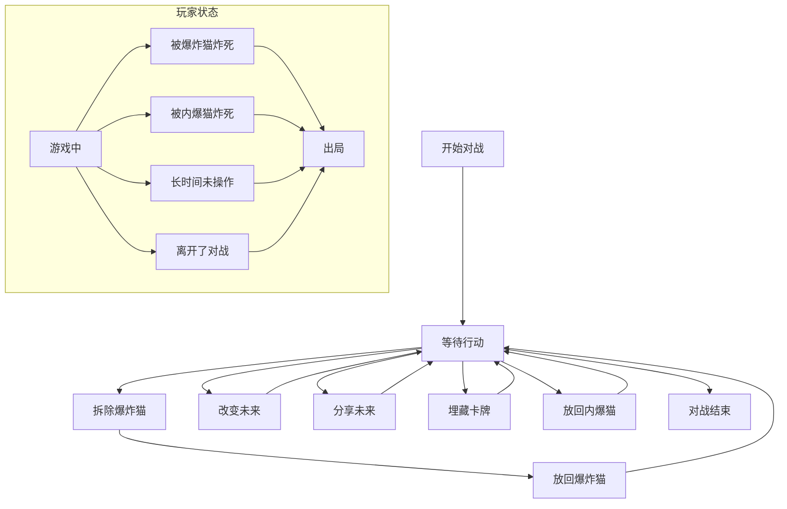
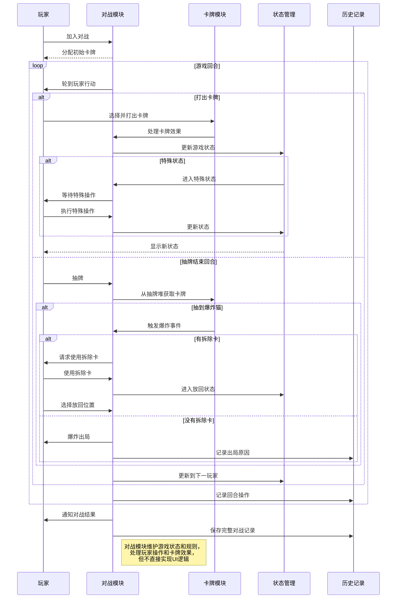

# 对战实体模块 (Match Entity)

## 模块概述

对战模块是灾变创世录游戏的核心游戏流程基础，定义了游戏对战的数据模型、状态类型和结果处理。该模块提供了完整的对战数据结构、玩家状态表示和游戏流程状态管理，作为卡牌对战游戏核心机制的基础模型，同时为特性层的对战功能提供数据支持和状态转换逻辑。

## 核心功能

- **对战数据模型**: 定义完整的对战结构、玩家状态和游戏类型
- **状态管理**: 提供对战中不同状态类型的定义和处理
- **结果处理**: 定义对战结果和战败原因的类型系统
- **积分系统**: 支持玩家等级和积分变化的处理
- **进行中对战**: 提供详细的进行中对战状态和上下文管理

## 关键组件

### 类型定义 (lib/typings.ts)
- 定义核心数据结构如 `Match`、`OngoingMatch` 和 `MatchPlayer`
- 提供对战状态类型 `MatchStateType` 和状态处理接口
- 定义战败原因 `DefeatReason` 和对战结果 `MatchResult`
- 支持对战玩家和观战者的数据模型

### 状态常量 (lib/state.ts)
- 定义对战状态的常量映射
- 提供状态类型的统一访问点
- 支持状态转换和状态判断
- 使用 `AssertRecordType` 确保类型安全

### 结果处理 (lib/results.ts)
- 提供对战结果的常量定义
- 支持胜利和失败状态的处理
- 使用类型断言确保结果类型安全
- 简化结果处理和展示逻辑

### 等级系统 (lib/rating.ts)
- 处理玩家等级和积分变化
- 提供积分调整的格式化功能
- 支持积分增减的可视化处理
- 简化积分变化的展示逻辑

## 数据模型

对战实体的核心数据结构：

```typescript
// 对战玩家接口
export interface MatchPlayer extends User {
  rating: number;    // 玩家等级积分
  shift: number;     // 本场积分变化
}

// 对战结果类型
export type MatchResult = "victory" | "defeat";

// 对战类型
export type MatchType = "public" | "private";

// 基础对战接口
export interface Match {
  id: string;                // 对战ID
  player: MatchPlayer;       // 当前玩家
  result: MatchResult;       // 对战结果
  type: MatchType;           // 对战类型
  opponents: MatchPlayer[];  // 对手列表
  createdAt: Date;           // 创建时间
}

// 进行中对战玩家
export interface OngoingMatchPlayer extends User {
  cards: string[];           // 手牌ID列表
  marked: CardUnit[];        // 标记的卡牌
}

// 对战状态类型
export type MatchStateType =
  | "defuse-exploding-kitten"   // 拆除爆炸猫
  | "insert-exploding-kitten"   // 放回爆炸猫
  | "alter-the-future"          // 改变未来
  | "share-the-future"          // 分享未来
  | "bury-card"                 // 埋藏卡牌
  | "insert-imploding-kitten"   // 放回内爆猫
  | "waiting-for-action";       // 等待行动

// 对战上下文
export interface OngoingMatchContext {
  reversed: boolean;         // 是否反转顺序
  attacks: number;           // 攻击次数
  ikspot: number | null;     // 内爆猫位置
}

// 进行中对战
export interface OngoingMatch {
  id: string;                // 对战ID
  players: OngoingMatchPlayer[]; // 玩家列表
  out: OngoingMatchOutPlayer[]; // 出局玩家
  spectators: User[];        // 观战者
  discard: CardName[];       // 弃牌堆
  draw: number;              // 抽牌堆剩余
  turn: number;              // 当前回合
  state: MatchState;         // 当前状态
  context: OngoingMatchContext; // 游戏上下文
  type: MatchType;           // 对战类型
  last: string | null;       // 最后行动玩家
  me: {                      // 当前用户信息
    as: "player" | "spectator"; // 身份
    cards?: CardUnit[];      // 手牌
    marked?: CardUnit[];     // 标记牌
  };
}
```

## 依赖关系

对战模块依赖于：
- **@entities/user**: 使用 `User` 接口扩展对战玩家数据
- **@entities/card**: 使用 `CardName` 和 `CardUnit` 类型定义卡牌数据
- **@shared/lib/typings**: 使用 `AssertRecordType` 工具确保类型安全

对战模块被以下模块使用：
- **features/match-history**: 展示历史对战记录
- **features/current-match**: 提供当前对战的状态和操作
- **features/matchmaking**: 对战匹配和创建功能
- **widgets/game-board**: 游戏棋盘和对战界面实现

## 使用示例

```tsx
import React from "react";
import { useSelector } from "react-redux";
import { OngoingMatch, MATCH_STATE, MATCH_RESULT, rating } from "@entities/match";
import { selectCurrentMatch } from "@features/current-match/model";
import { selectViewerId } from "@entities/viewer/model";

const MatchView: React.FC = () => {
  const match = useSelector(selectCurrentMatch);
  const viewerId = useSelector(selectViewerId);
  
  if (!match) {
    return <div className="no-match">当前没有进行中的对战</div>;
  }
  
  // 获取当前玩家
  const currentPlayer = match.players.find(p => p.id === viewerId);
  
  // 获取当前回合的玩家
  const turnPlayer = match.players[match.turn % match.players.length];
  
  // 检查是否轮到当前玩家
  const isMyTurn = currentPlayer && turnPlayer?.id === currentPlayer.id;
  
  // 检查当前游戏状态
  const isWaitingForAction = match.state.type === MATCH_STATE.WFA;
  
  return (
    <div className="match-container">
      <div className="match-header">
        <h2>对战 ID: {match.id}</h2>
        <div className="match-type">
          {match.type === "public" ? "公开对战" : "私人对战"}
        </div>
      </div>
      
      <div className="game-state">
        <div className="turn-info">
          <span>当前回合: {turnPlayer?.username}</span>
          {isMyTurn && <span className="my-turn-indicator">轮到你了!</span>}
        </div>
        
        <div className="deck-info">
          <span>抽牌堆: {match.draw} 张</span>
          <span>弃牌堆: {match.discard.length} 张</span>
        </div>
        
        {match.state.type !== MATCH_STATE.WFA && (
          <div className="special-state">
            <span>特殊状态: {getStateDisplayName(match.state.type)}</span>
          </div>
        )}
      </div>
      
      {match.me.as === "player" && match.me.cards && (
        <div className="my-hand">
          <h3>我的手牌 ({match.me.cards.length})</h3>
          <div className="cards-container">
            {match.me.cards.map((card, index) => (
              <div key={index} className="card">
                {card.name}
              </div>
            ))}
          </div>
        </div>
      )}
      
      <div className="players-list">
        <h3>玩家 ({match.players.length})</h3>
        {match.players.map(player => (
          <div 
            key={player.id} 
            className={`player-item ${player.id === turnPlayer?.id ? 'active' : ''}`}
          >
            <span className="player-name">{player.username}</span>
            <span className="cards-count">手牌: {player.cards.length}</span>
          </div>
        ))}
      </div>
      
      {match.out.length > 0 && (
        <div className="out-players">
          <h3>出局玩家</h3>
          {match.out.map(player => (
            <div key={player.id} className="out-player">
              <span>{player.username}</span>
              <span className="out-reason">
                {getDefeatReasonText(player.reason)}
              </span>
            </div>
          ))}
        </div>
      )}
    </div>
  );
};

// 辅助函数: 获取状态显示名称
function getStateDisplayName(stateType: MatchStateType): string {
  const displayNames = {
    [MATCH_STATE.DEK]: "拆除爆炸猫",
    [MATCH_STATE.IEK]: "放回爆炸猫",
    [MATCH_STATE.ATF]: "改变未来",
    [MATCH_STATE.STF]: "分享未来",
    [MATCH_STATE.BC]: "埋藏卡牌",
    [MATCH_STATE.IIK]: "放回内爆猫",
    [MATCH_STATE.WFA]: "等待行动"
  };
  return displayNames[stateType] || stateType;
}

// 辅助函数: 获取失败原因文本
function getDefeatReasonText(reason: DefeatReason): string {
  const reasonTexts = {
    "exploded-by-ek": "被爆炸猫炸死",
    "exploded-by-ik": "被内爆猫炸死",
    "was-inactive-for-too-long": "长时间未操作",
    "left-match": "离开了对战"
  };
  return reasonTexts[reason] || "未知原因";
}
```

## 架构说明

对战模块采用状态机设计，清晰地定义了对战中不同状态的转换和处理逻辑。模块结构围绕以下几个核心概念展开：

1. **对战状态流转**：对战在不同的特殊状态间转换，如等待行动、拆除爆炸猫、改变未来等
2. **玩家状态变化**：玩家可以处于正常游戏、出局或观战状态
3. **卡牌操作**：管理卡牌在手牌、抽牌堆和弃牌堆之间的流转
4. **上下文管理**：维护游戏上下文如顺序、攻击次数等特殊状态



## 功能模块泳道流程图



对战模块是游戏的核心引擎，它定义了游戏流程和状态转换的基础数据模型，但将具体的游戏规则实现和界面呈现分离到特性层，保持了实体层的纯粹性和可复用性。通过清晰的状态定义和类型系统，该模块为复杂的卡牌对战游戏提供了坚实的基础架构。 