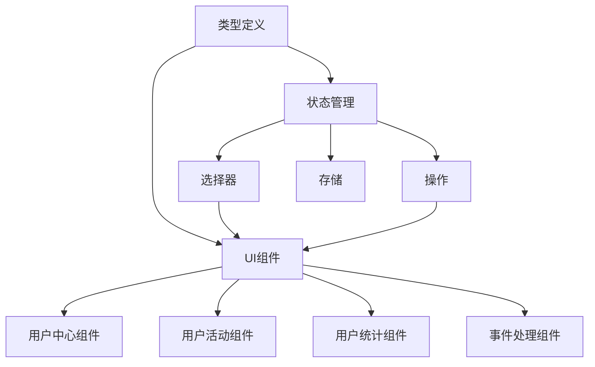
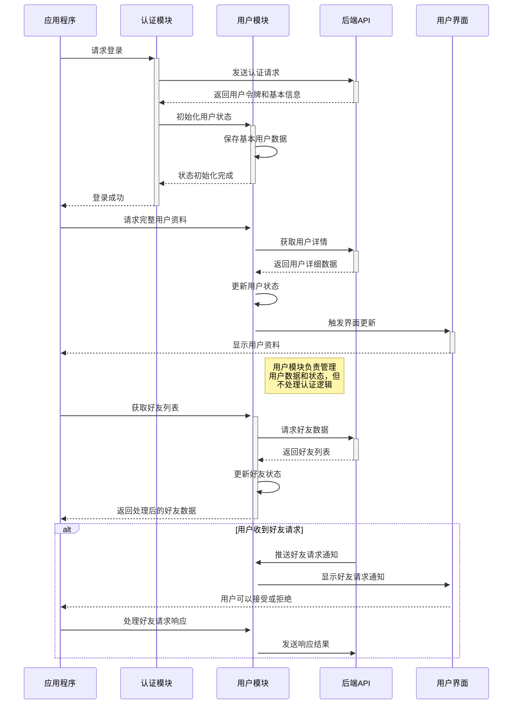

# 用户实体模块 (User Entity)

## 模块概述

用户模块是灾变创世录游戏平台的基础身份系统，定义了应用中用户的数据模型、状态管理和基础UI组件。该模块提供了用户资料的数据结构、状态处理和界面展示，作为游戏中玩家标识和互动的核心支持，同时为特性层的功能模块提供用户上下文和数据访问能力。

## 核心功能

- **用户数据模型**: 定义基础用户类型和状态枚举，提供用户身份标识和属性结构
- **用户状态管理**: 实现用户数据的存取、选择器和操作，管理用户相关状态
- **用户界面组件**: 提供用户活动、统计数据和中心面板的可复用组件
- **用户关系系统**: 支持好友关系状态管理和交互功能
- **事件处理机制**: 处理用户相关事件和活动状态变更

## 关键组件

### 类型定义 (lib/typings.ts)
- 定义 `User` 基础接口，包含核心用户属性
- 提供用户模块使用的基本类型定义
- 确保用户数据结构的一致性
- 为其他模块提供类型参考

### 状态枚举 (lib/status.ts)
- 定义 `UserStatus` 类型表示用户在线状态
- 区分用户"在线"和"离线"两种基本状态
- 简化用户状态判断和展示
- 提供状态管理的基础类型

### 关系管理 (lib/relationship.ts)
- 定义 `RELATIONSHIP_STATUS` 常量表示好友关系状态
- 提供关系状态的枚举值，如好友请求、已成为好友等
- 支持用户社交关系的状态控制
- 实现好友系统的基础逻辑

### 用户中心组件 (ui/user-hub.tsx)
- 实现用户中心面板，展示用户游戏和好友信息
- 提供多标签页界面，支持游戏记录和好友列表切换
- 包含用户交互功能，如观战和加入大厅
- 处理各种用户关系的操作和显示

### 用户活动组件 (ui/user-activity.tsx)
- 显示用户活动状态和最近操作
- 提供活动状态的可视化展示
- 支持活动更新的实时反馈
- 增强用户交互体验

### 用户事件处理 (ui/user-events-handler.tsx)
- 管理和响应用户相关事件
- 处理好友请求、游戏邀请等通知
- 集中处理用户事件逻辑
- 确保用户状态与事件同步

### 状态管理模型 (model/)
- 定义用户状态的存储结构和初始值
- 提供状态选择器用于访问用户数据
- 实现用户数据的获取和更新操作
- 支持用户会话状态的持久化

## 数据模型

用户实体的核心数据结构：

```typescript
// 用户基础接口
export interface User {
  id: string;            // 用户唯一标识
  username: string;      // 用户名
  avatar: string;        // 头像URL
  rating: number;        // 用户评分/等级
}

// 用户在线状态
export type UserStatus = "online" | "offline";

// 用户关系状态常量
export const RELATIONSHIP_STATUS = {
  FRIEND_REQ_SENT: 0,    // 已发送好友请求
  FRIEND_REQ_RECEIVED: 1, // 已收到好友请求
  FRIENDS: 2,            // 已成为好友
  NONE: 3,               // 无关系
};

// 带临时状态的用户类型(来自API)
export interface UserWithInterim extends User {
  interim?: {            // 临时状态信息
    match?: string;      // 正在进行的对战ID
    lobby?: string;      // 所在大厅ID
  }
}
```

## 依赖关系

用户模块依赖于：
- **@app/store**: 使用Redux存储和dispatch钩子
- **@entities/match**: 使用积分系统和对战类型
- **@entities/viewer**: 获取当前用户视角
- **@shared/ui/atoms**: 使用基础UI组件如头像、文本和链接
- **@shared/ui/icons**: 使用图标组件
- **@shared/ui/molecules**: 使用分子级UI组件如动作和标签页
- **@shared/lib/typings**: 使用共享类型工具

用户模块被以下模块使用：
- **features/auth**: 用户认证和授权功能
- **features/profile**: 用户资料管理和展示
- **features/social**: 社交互动和好友管理
- **entities/lobby**: 大厅参与者识别
- **entities/match**: 对战玩家标识

## 使用示例

```tsx
import React from "react";
import { useSelector } from "react-redux";
import { userModel, UserHub, UserStats } from "@entities/user";
import { selectViewerId } from "@entities/viewer/model";

const UserProfile: React.FC = () => {
  // 获取当前用户ID
  const viewerId = useSelector(selectViewerId);
  
  // 使用用户模型选择器获取数据
  const user = useSelector(userModel.selectors.user);
  const friends = useSelector(userModel.selectors.friends);
  const matches = useSelector(userModel.selectors.matches);
  const stats = useSelector(userModel.selectors.stats);
  
  if (!user) {
    return <div className="loading">加载用户数据中...</div>;
  }
  
  return (
    <div className="user-profile-container">
      <header className="profile-header">
        
        <div className="profile-info">
          <h1>{user.username}</h1>
          <div className="profile-rating">评分: {user.rating}</div>
        </div>
      </header>
      
      {/* 使用用户统计组件显示游戏数据 */}
      <section className="profile-stats">
        <h2>游戏统计</h2>
        <UserStats />
      </section>
      
      {/* 使用用户中心组件显示游戏记录和好友 */}
      <section className="profile-hub">
        <UserHub 
          friends={friends || []} 
          matches={matches || []} 
          isOwn={user.id === viewerId}
        />
      </section>
    </div>
  );
};

// 处理用户事件和状态变化
import { UserEventsHandler } from "@entities/user";

const App: React.FC = () => {
  return (
    <div className="app">
      {/* 添加用户事件处理程序，监听和响应用户事件 */}
      <UserEventsHandler />
      
      {/* 应用的其他部分 */}
      <Router>
        <Routes>
          <Route path="/profile" element={<UserProfile />} />
          {/* 其他路由 */}
        </Routes>
      </Router>
    </div>
  );
};
```

## 架构说明

用户模块采用特性分层架构，将核心类型定义、状态管理和UI表示分离，使各部分职责清晰：



## 功能模块泳道流程图



用户模块专注于定义用户数据结构和基础操作，提供状态管理和UI组件，但将复杂的业务逻辑委托给特性层实现。这种设计确保了实体层的纯粹性，同时为整个应用提供一致的用户数据访问方式。 