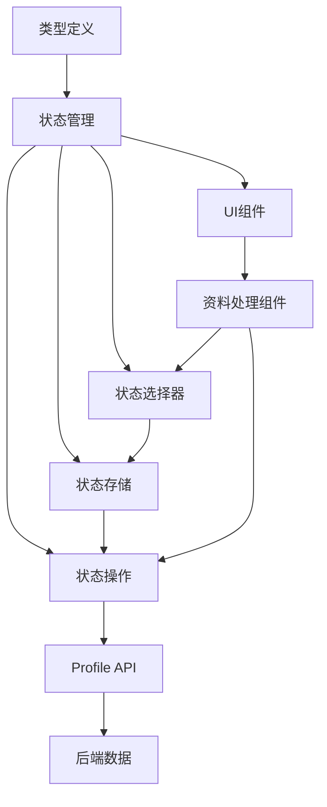
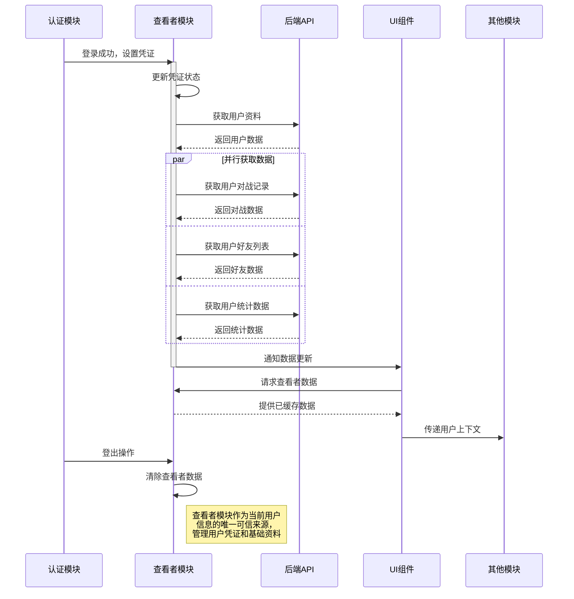

# 查看者实体模块 (Viewer Entity)

## 模块概述

查看者模块是灾变创世录游戏平台的当前登录用户管理系统，定义了当前活跃用户的数据模型、状态管理和相关组件。该模块在用户实体基础上构建，专注于当前登录用户的身份、资料和状态管理，作为应用中用户身份上下文的核心，为其他模块提供当前用户信息和操作能力。

## 核心功能

- **用户凭证管理**: 维护当前登录用户的身份凭证和访问令牌
- **个人资料获取**: 提供当前用户详细资料的获取和缓存
- **关系数据管理**: 处理当前用户的好友列表和社交关系
- **对战记录同步**: 管理用户的历史对战和游戏数据
- **统计数据获取**: 支持用户游戏统计和成就数据的访问

## 关键组件

### 类型定义 (lib/typings.ts)
- 定义 `Credentials` 类型，扩展自用户实体
- 建立查看者凭证和用户实体之间的关联
- 提供类型安全的凭证管理基础
- 简化身份验证和用户状态关联

### 状态存储 (model/store.ts)
- 实现 `ViewerStore` 接口定义查看者状态结构
- 管理用户凭证、个人资料、对战记录等状态
- 提供完整的状态更新和处理逻辑
- 支持数据的异步加载和状态变更

### 状态操作 (model/actions.ts)
- 定义获取用户资料的异步操作
- 实现好友列表和对战记录的加载功能
- 支持统计数据的获取和刷新
- 提供凭证设置和好友管理操作

### 状态选择器 (model/selectors.ts)
- 提供访问查看者状态的选择器函数
- 支持获取用户凭证、资料和统计数据
- 便于组件访问查看者状态
- 简化状态数据的消费和使用

### 资料处理组件 (ui/viewer-profile-handler.tsx)
- 实现自动化的用户资料获取机制
- 处理用户好友数据和统计信息的加载
- 响应认证状态变化更新用户数据
- 简化应用中用户数据的初始化流程

## 数据模型

查看者实体的核心数据结构：

```typescript
// 查看者凭证类型
export type Credentials = User;

// 查看者状态存储结构
export interface ViewerStore {
  credentials: Nullable<Credentials>;         // 用户凭证
  profile: Fetchable<Nullable<User>>;         // 用户资料
  matches: Fetchable<Nullable<Match[]>>;      // 对战历史
  friends: Fetchable<Nullable<User[]>>;       // 好友列表
  stats: Fetchable<Nullable<UserStats>>;      // 统计数据
}

// 可获取数据包装类型
export interface Fetchable<T> {
  data: T;                                    // 实际数据
  fetching: boolean;                          // 加载状态
}

// 操作数据类型
export type FetchProfilePayload = GetMeResponse;
export type FetchMatchesPayload = GetMyMatchesResponse;
export type FetchFriendsPayload = GetMyFriendsResponse;
export type FetchStatsPayload = GetMyStatsResponse;
export type FetchOngoingMatchPayload = GetMyOngoingMatchResponse;
```

## 依赖关系

查看者模块依赖于：
- **@entities/user**: 使用 `User` 类型作为凭证基础
- **@app/store**: 访问Redux根状态和dispatch工具
- **@features/auth**: 使用认证状态监控
- **@features/current-match**: 获取当前对战信息
- **@shared/api/profile**: 调用个人资料相关API
- **@shared/api/common**: 使用通用数据类型
- **@shared/lib/typings**: 使用 `Nullable` 和数据包装工具

查看者模块被以下模块使用：
- **features/auth**: 登录后设置用户凭证
- **features/profile**: 展示当前用户资料
- **features/social**: 管理好友关系
- **features/matchmaking**: 创建对战和匹配
- **widgets/header**: 显示用户状态和菜单

## 使用示例

```tsx
import React from 'react';
import { useSelector } from 'react-redux';
import { viewerModel } from '@entities/viewer';
import { useDispatch } from '@app/store';

// 获取当前用户资料的组件
const UserProfileCard: React.FC = () => {
  const dispatch = useDispatch();
  const profile = useSelector(viewerModel.selectors.profile);
  const credentials = useSelector(viewerModel.selectors.credentials);
  const stats = useSelector(viewerModel.selectors.stats);
  
  React.useEffect(() => {
    // 组件挂载时获取用户资料和统计数据
    if (credentials) {
      dispatch(viewerModel.actions.fetchProfile());
      dispatch(viewerModel.actions.fetchStats());
    }
  }, [credentials, dispatch]);
  
  if (!profile.data) {
    return <div className="loading">加载用户资料中...</div>;
  }
  
  return (
    <div className="profile-card">
      <header className="profile-header">
        
        <h2>{profile.data.username}</h2>
        <div className="rating">评分: {profile.data.rating}</div>
      </header>
      
      {stats.data && (
        <div className="stats-section">
          <h3>游戏统计</h3>
          <div className="stats-grid">
            <div className="stat-item">
              <span className="value">{stats.data.wins}</span>
              <span className="label">胜场</span>
            </div>
            <div className="stat-item">
              <span className="value">{stats.data.losses}</span>
              <span className="label">负场</span>
            </div>
            <div className="stat-item">
              <span className="value">{stats.data.draws}</span>
              <span className="label">平局</span>
            </div>
          </div>
        </div>
      )}
    </div>
  );
};

// 使用资料处理组件包装应用
import { ViewerProfileHandler } from '@entities/viewer';

const App: React.FC = () => {
  return (
    <ViewerProfileHandler>
      <div className="app-container">
        {/* 应用内容 */}
        <header>
          <UserProfileCard />
        </header>
        <main>
          {/* 其他内容 */}
        </main>
      </div>
    </ViewerProfileHandler>
  );
};
```

## 架构说明

查看者模块采用结构清晰的分层架构，将数据定义、状态管理和界面组件分离：



## 功能模块泳道流程图



查看者模块专注于当前登录用户的状态管理，与通用用户实体保持清晰分工：用户实体定义所有用户的基本数据结构，而查看者模块管理当前活跃用户的特定状态和操作。这种设计确保了应用中用户身份上下文的一致性，同时简化了身份验证和用户数据管理的实现。 