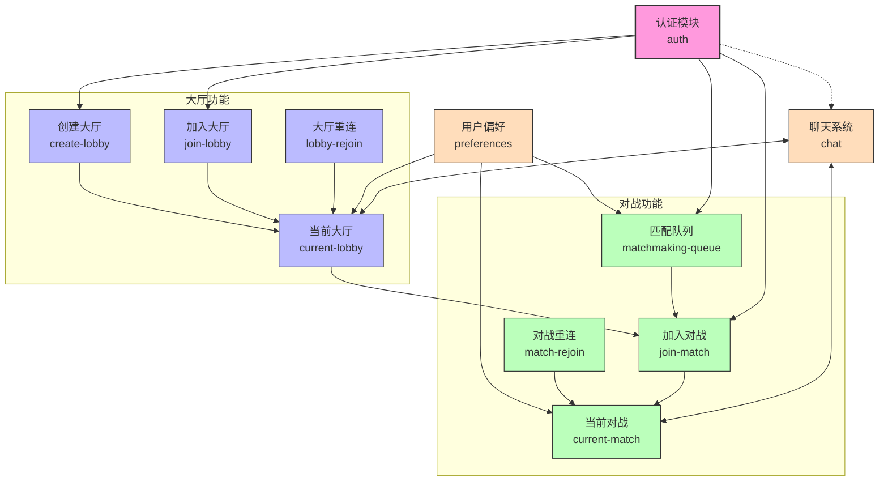

# 特性层 (Features Layer)

## 模块概述

特性层是灾变创世录游戏应用程序的业务逻辑核心，实现了与用户直接相关的功能模块。每个特性(feature)代表一个具体的用户场景或业务流程，封装相关的业务逻辑、状态管理和UI交互。特性层基于实体层构建，将简单的业务对象转换为完整的用户功能，提供了从认证到对战的完整游戏体验。

## 核心功能

- **业务流程实现**: 编排实体和操作，实现游戏中的完整业务流程和用户场景
- **状态管理**: 通过Redux管理复杂业务流程的状态变化和数据处理
- **用户交互**: 提供与用户场景相关的交互界面和控制逻辑
- **异步操作处理**: 管理API调用、WebSocket连接和异步状态更新
- **游戏流程控制**: 处理从玩家匹配到对战结束的完整游戏周期
- **模块间协同**: 实现不同功能模块间的通信和数据共享

## 模块结构

特性层包含以下关键模块，每个模块都有自己的详细文档：

- [**认证 (Auth)**](./auth/README.md) - 用户身份验证和会话管理
- [**聊天 (Chat)**](./chat/README.md) - 游戏内通信系统
- [**创建大厅 (Create Lobby)**](./create-lobby/README.md) - 新游戏大厅创建
- [**当前大厅 (Current Lobby)**](./current-lobby/README.md) - 大厅状态和玩家互动
- [**当前对战 (Current Match)**](./current-match/README.md) - 游戏对战核心逻辑
- [**加入大厅 (Join Lobby)**](./join-lobby/README.md) - 加入现有大厅功能
- [**加入对战 (Join Match)**](./join-match/README.md) - 加入游戏对战
- [**大厅重连 (Lobby Rejoin)**](./lobby-rejoin/README.md) - 大厅断线重连
- [**对战重连 (Match Rejoin)**](./match-rejoin/README.md) - 对战断线重连
- [**匹配队列 (Matchmaking Queue)**](./matchmaking-queue/README.md) - 自动匹配系统
- [**用户偏好 (Preferences)**](./preferences/README.md) - 用户设置和偏好

## 关键组件

### 用户认证 (auth/)

认证模块是应用程序的安全基础，负责用户的身份验证、注册和会话管理：

- **用户认证功能**: 登录、注册和登出流程的完整实现
- **会话管理**: 维护用户登录状态和令牌刷新机制
- **权限控制**: 基于用户角色的访问限制和路由保护
- **安全组件**: 提供如`CredentialsObtainer`、`Authenticated`和`ProtectedRoute`等工具组件

### 聊天系统 (chat/)

聊天模块提供了游戏内通信系统，加强游戏社交体验：

- **多上下文聊天**: 支持全局聊天、大厅聊天、对战聊天、私人对话和团队聊天
- **消息管理**: 处理消息的发送、接收、历史记录存储和加载
- **实时通信**: WebSocket连接管理和消息同步机制
- **通知与提醒**: 提供新消息提示、用户提及通知和未读消息计数

### 大厅管理

大厅相关功能包含多个协同工作的模块：

#### 创建大厅 (create-lobby/)

提供创建新游戏大厅的功能：

- **大厅创建请求**: 发起创建请求并处理服务器响应
- **创建状态反馈**: 提供加载中、成功和失败状态的处理
- **导航整合**: 成功创建后自动导航至新大厅页面

#### 当前大厅 (current-lobby/)

管理玩家加入大厅后的状态和交互：

- **大厅状态管理**: 同步玩家列表、准备状态和大厅设置
- **玩家交互**: 支持准备/取消准备、队伍分配和大厅内聊天
- **游戏启动控制**: 检查游戏启动条件和处理创建游戏流程
- **主机权限**: 提供大厅设置修改、玩家踢出和大厅控制功能

#### 加入大厅 (join-lobby/)

允许玩家加入现有游戏大厅：

- **玩家加入**: 支持作为参与者加入游戏大厅
- **观战加入**: 允许以观战者身份加入大厅
- **密码验证**: 处理密码保护大厅的认证流程
- **加入反馈**: 提供加入状态和错误处理机制

#### 大厅重连 (lobby-rejoin/)

处理玩家与大厅连接中断的场景：

- **连接监控**: 实时检测大厅连接状态和网络变化
- **会话持久化**: 存储大厅会话信息，支持断线后恢复
- **自动重连**: 实现断线后的无缝重新连接流程
- **状态恢复**: 重连后同步获取最新大厅状态

### 对战系统

对战系统是游戏的核心玩法部分，包含以下模块：

#### 当前对战 (current-match/)

管理玩家正在进行的卡牌对战：

- **对战状态管理**: 处理回合流程、行动序列和游戏规则实施
- **玩家互动**: 支持卡牌使用、目标选择和特殊能力激活
- **游戏规则实施**: 检查行动合法性、计算结果和处理卡牌效果
- **界面呈现**: 提供游戏战场、手牌区和各类状态指示器

#### 加入对战 (join-match/)

允许玩家加入进行中的对战：

- **对战连接**: 支持通过ID或邀请链接加入对战
- **权限验证**: 确认玩家的加入资格和身份
- **角色选择**: 允许作为玩家或观战者身份加入
- **状态同步**: 加入后加载当前对战的完整状态

#### 对战重连 (match-rejoin/)

处理玩家在对战中断线的情况：

- **连接监控**: 持续检测对战连接状态和断线事件
- **会话持久化**: 保存对战状态信息，支持断线恢复
- **重连流程**: 实现断线重连和游戏状态恢复机制
- **超时处理**: 提供长时间断线玩家的处理机制

### 匹配队列 (matchmaking-queue/)

管理自动匹配对手的过程：

- **队列管理**: 处理玩家加入/离开队列和等待状态
- **匹配算法**: 基于技能等级和游戏模式的玩家匹配
- **匹配通知**: 处理匹配成功后的游戏启动流程
- **状态反馈**: 提供等待时间和队列状态的视觉反馈

### 用户偏好 (preferences/)

管理玩家的个性化设置：

- **主题切换**: 支持浅色和深色主题的切换
- **语言管理**: 提供多语言支持和语言切换功能
- **偏好持久化**: 将设置保存到本地存储，保持会话间一致性
- **设置界面**: 提供用户友好的设置管理对话框

## 内部结构

特性模块内部通常遵循分层架构，将业务逻辑、UI表现和API调用分离：

- **model/**: 包含状态管理（Redux)、业务逻辑和数据处理
- **ui/**: 包含特性专用UI组件和视图逻辑
- **lib/**: 包含特性专用工具函数、钩子和高阶组件
- **index.ts**: 统一导出模块公共API，简化引用

功能复杂的模块（如当前对战）可能会进一步细分为子功能模块，每个子模块都遵循相同的内部架构模式。

## 依赖关系

特性层在应用架构中的依赖关系：

- **依赖于**:
  - **entities**层提供的业务对象和数据模型（如卡牌、用户、对战）
  - **shared**层提供的通用工具、UI组件和API客户端

- **被以下层使用**:
  - **widgets**层将特性组合成更大的UI功能块
  - **pages**层整合多个特性构建完整页面
  - **app**层进行全局配置和初始化

## 功能模块关系图



## 使用示例

### 认证与游戏大厅集成

```tsx
import { useEffect } from 'react';
import { useDispatch, useSelector } from 'react-redux';
import { useAuth } from '@features/auth';
import { createLobby } from '@features/create-lobby/model';
import { selectPreferences } from '@features/preferences';
import { LobbyList } from '@widgets/lobby-browser';

const GameLobbyPage: React.FC = () => {
  const dispatch = useDispatch();
  const { isAuthenticated, currentUser } = useAuth();
  const preferences = useSelector(selectPreferences);
  
  const handleCreateLobby = async () => {
    try {
      const result = await dispatch(createLobby());
      // 处理创建结果...
    } catch (error) {
      console.error('创建大厅失败:', error);
    }
  };
  
  if (!isAuthenticated) {
    return <div>请先登录以访问游戏大厅</div>;
  }
  
  return (
    <div className="game-lobby-page">
      <h1>游戏大厅</h1>
      <button onClick={handleCreateLobby}>创建新大厅</button>
      <LobbyList preferredGameMode={preferences.gameplay.preferredMatchmakingMode} />
    </div>
  );
};
```

### 对战系统与聊天整合

```tsx
import { useEffect } from 'react';
import { useSelector, useDispatch } from 'react-redux';
import { useParams } from 'react-router-dom';
import { 
  loadMatch, 
  selectCurrentMatch 
} from '@features/current-match/model';
import { GameBoard } from '@features/current-match/ui';
import { ChatWindow } from '@features/chat';

const MatchPage: React.FC = () => {
  const { matchId } = useParams();
  const dispatch = useDispatch();
  const match = useSelector(selectCurrentMatch);
  
  useEffect(() => {
    if (matchId) {
      dispatch(loadMatch(matchId));
    }
  }, [matchId, dispatch]);
  
  if (!match) {
    return <div>加载对战中...</div>;
  }
  
  return (
    <div className="match-page">
      <GameBoard />
      <ChatWindow 
        contextId={matchId}
        contextType="MATCH"
        height="300px"
      />
    </div>
  );
};
```

## 开发指南

在特性层开发时，应遵循以下最佳实践：

1. **关注点分离**: 将业务逻辑(model)、UI表现(ui)和通用工具(lib)分开
2. **明确API边界**: 通过index.ts限制对外暴露的API，隐藏内部实现细节
3. **状态封装**: 特性内部状态应通过selectors访问，避免直接依赖状态结构
4. **合理组织代码**: 复杂特性应进一步拆分为子模块，保持单一职责
5. **文档完善**: 为每个特性提供独立的README.md，描述其功能、组件和使用方式
6. **保持独立性**: 特性间应通过明确定义的API通信，避免紧耦合
7. **性能考量**: 使用React.memo、useCallback和useMemo优化渲染性能

## 技术栈选择

特性层主要使用以下技术：

- **状态管理**: Redux + Redux Toolkit + Redux Thunk
- **UI组件**: React函数组件 + React Hooks
- **样式方案**: MUI + Styled Components
- **类型检查**: TypeScript
- **异步处理**: Async/Await + Promise
- **实时通信**: WebSocket + Socket.IO

## 可能的改进方向

- **测试覆盖**: 增加单元测试和集成测试，提高代码质量
- **代码拆分**: 实现基于路由的代码分割，优化加载性能
- **状态持久化**: 增强本地状态缓存，减少网络请求
- **错误处理**: 改进错误捕获和用户反馈机制
- **国际化**: 完善多语言支持和本地化策略
- **模块预设**: 为常见功能组合提供预设配置和快速集成方案 