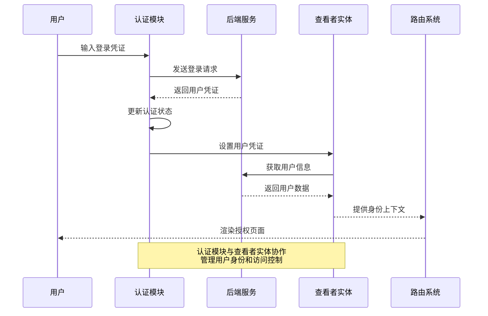
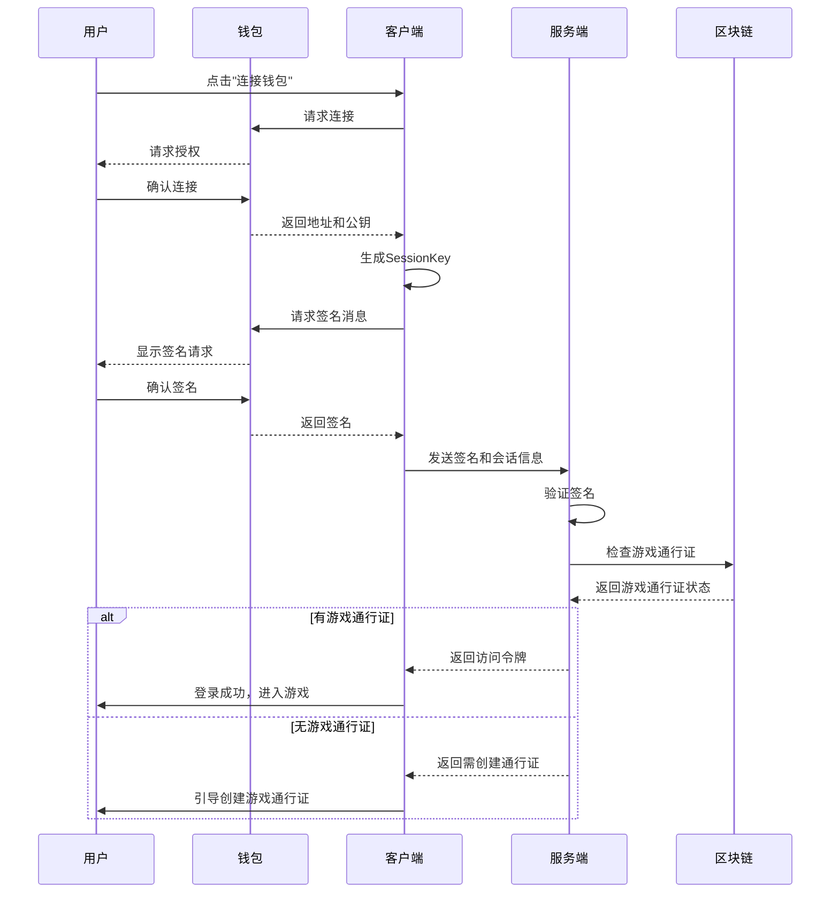

# 认证功能模块 (Auth Feature)

## 模块概述

认证模块是灾变创世录游戏平台的安全基础，负责用户身份验证、会话管理和访问控制。该模块处理用户登录、注册、权限验证和身份恢复等关键安全功能，确保只有授权用户才能访问受保护资源，为整个应用提供统一的身份上下文管理。

## 核心功能

- **身份认证**: 提供用户登录、注册和身份验证的完整流程，支持多种认证方式
- **会话管理**: 处理用户会话的创建、维护、刷新和销毁，确保安全的用户状态持久化
- **权限控制**: 提供基于角色和权限的访问控制系统，保护受限资源和路由
- **自动身份恢复**: 在页面刷新或会话中断后自动重新建立用户认证状态
- **认证状态管理**: 集中管理和同步应用中的用户认证状态
- **安全防护**: 实现防止CSRF、XSS等常见安全威胁的机制

## 关键组件

### 模型层 (model/)

- **store.ts**: 定义认证状态存储结构和更新逻辑，维护 `isAuthenticated` 和 `areCredentialsFetching` 等核心状态
- **actions.ts**: 提供认证相关的异步操作，包括 `fetchCredentials`、`signIn`、`signUp` 和 `verifyUsername` 等
- **selectors.ts**: 提供从全局状态中获取认证信息的选择器，如 `isAuthenticated` 和 `areCredentialsFetching`
- **index.ts**: 统一导出模型层组件，形成模型公共 API

### 工具组件 (lib/)

- **authenticated.tsx**: 条件渲染组件，根据用户认证状态显示不同内容，支持加载状态处理
- **credentials-obtainer.tsx**: 自动获取用户凭证的高阶组件，通常放置在应用顶层以实现自动登录
- **protected-route.tsx**: 保护路由组件，控制只有已认证用户才能访问特定页面

## 依赖关系

### 内部依赖

- **@entities/viewer**: 获取和管理当前用户信息
- **@app/store**: 访问全局 Redux 存储和 dispatch 工具
- **@shared/lib**: 使用公共工具函数如 Branch 组件
- **@shared/api**: 使用认证相关的 API 客户端

### 外部依赖

- **Redux Toolkit**: 状态管理和异步操作
- **Axios**: HTTP 请求处理和错误管理
- **React**: 组件构建与状态管理
- **MUI**: 使用 CircularProgress 等 UI 组件

## 使用示例

### 自动身份恢复

```tsx
// 在应用入口点使用 CredentialsObtainer
import { CredentialsObtainer } from '@features/auth';

const App = () => (
  <CredentialsObtainer>
    {/* 应用内容将在凭证获取后渲染 */}
    <MainContent />
  </CredentialsObtainer>
);
```

### 条件渲染认证内容

```tsx
// 根据认证状态显示不同内容
import { Authenticated } from '@features/auth';
import { useSelector } from 'react-redux';
import { authModel } from '@features/auth';

const Header = () => {
  // 获取认证状态
  const isAuthenticated = useSelector(authModel.selectors.isAuthenticated);
  
  return (
    <header>
      <Logo />
      <Authenticated
        render={({ credentials }) => (
          // 已登录用户看到的内容
          <UserMenu username={credentials.username} />
        )}
      >
        {/* 未登录用户看到的内容 */}
        <LoginButton />
      </Authenticated>
    </header>
  );
};
```

## 架构说明

认证模块采用了 Redux 状态管理模式，将状态、操作和选择器分离，形成清晰的数据流动：

1. 用户触发认证操作（如登录）
2. 异步 action 发送 API 请求，获取凭证
3. 成功后更新认证状态并存储凭证
4. 选择器暴露当前认证状态供组件使用
5. 工具组件根据认证状态条件渲染内容

模块通过高阶组件和条件渲染组件将认证逻辑从业务逻辑中分离，实现关注点分离，增强可维护性。

## 功能模块泳道流程图



## 数据模型

```typescript
// 认证状态
export interface AuthState {
  isAuthenticated: boolean;
  areCredentialsFetching: boolean;
}

// 登录数据
export interface SignInData {
  username: string;
  password: string;
  rememberMe?: boolean;
}

// 注册数据
export interface SignUpData {
  username: string;
  email: string;
  password: string;
  confirmPassword: string;
}

// 认证操作结果
export interface AuthResponse {
  credentials: {
    id: string;
    token: string;
    username: string;
  }
}
```

## 最佳实践

1. 使用 `CredentialsObtainer` 在应用顶层自动恢复用户会话
2. 利用 `Authenticated` 组件实现基于认证状态的条件渲染
3. 保护敏感路由时使用 `ProtectedRoute` 组件
4. 监听认证状态变化以触发相应的UI更新和重定向
5. 确保所有异步认证操作都有适当的加载状态和错误处理
6. 在用户操作前验证认证状态，避免未授权访问 

# 基于SessionKey的认证功能

## 概述

爆炸猫游戏采用基于区块链的SessionKey认证机制，取代传统的用户名密码认证方式。这种机制结合了钱包签名验证和游戏通行证(GameEntry)系统，提供了更安全且符合区块链游戏特性的用户认证体验。

## 核心功能

- **钱包连接认证**: 使用SUI钱包进行身份验证，无需记忆密码
- **会话密钥机制**: 生成临时会话密钥用于授权访问，有效期限定
- **游戏通行证集成**: 与Nexus模块的GameEntry系统无缝集成
- **自动护照创建**: 检测用户是否拥有游戏护照，无则引导创建

## 技术原理

### SessionKey认证流程

1. **连接钱包**: 用户连接SUI钱包，获取钱包地址
2. **生成会话密钥**: 创建临时Ed25519密钥对作为会话密钥
3. **用户授权**: 通过钱包签名特定消息授权会话
4. **服务端验证**: 后端验证签名有效性并检查游戏通行证
5. **返回凭证**: 返回访问令牌和用户状态信息



### 数据对象

**SessionKey对象结构**:
```typescript
class SessionKey {
  // 私有属性
  private address: string;        // 用户钱包地址
  private packageId: string;      // 合约包ID
  private creationTimeMs: number; // 创建时间戳
  private ttlMin: number;         // 有效期(分钟)
  private sessionKey: Ed25519Keypair; // 会话密钥对
  private personalMessageSignature?: string; // 用户签名
  
  // 公开方法
  getAddress(): string;
  getPackageId(): string;
  getPersonalMessage(): Uint8Array;
  setPersonalMessageSignature(signature: string): void;
  getCertificate(): Certificate;
  isExpired(): boolean;
  // ...其他方法
}
```

**证书对象结构**:
```typescript
interface Certificate {
  user: string;            // 用户钱包地址
  sessionKey: string;      // 会话公钥(Base64)
  creationTime: number;    // 创建时间戳
  ttlMin: number;          // 有效期(分钟)
  signature: string;       // 用户签名
}
```

## 用法示例

### 基本认证流程

```typescript
// 1. 连接钱包
await requestSigner.connect();
const address = requestSigner.getAddress();

// 2. 创建会话密钥
const sessionKey = new SessionKey({
  address,
  packageId: PACKAGE_ID,
  ttlMin: 10
});

// 3. 请求用户签名
await sessionKey.requestSignature();

// 4. 获取证书并发送到服务器验证
const certificate = sessionKey.getCertificate();
const authResult = await authApi.sessionKeyAuth({
  signature: certificate.signature,
  sessionKey: certificate.sessionKey,
  address: certificate.user,
  timestamp: certificate.creationTime,
  ttlMin: certificate.ttlMin
});

// 5. 处理认证结果
if (authResult.hasGameEntry) {
  // 正常进入游戏
} else {
  // 引导创建游戏通行证
}
```

## 与游戏系统集成

本认证系统与Citadel和Nexus模块无缝集成，实现了以下功能：

1. **通行证验证**: 使用Nexus模块的GameEntry系统验证用户身份
2. **护照绑定**: 将游戏通行证与用户护照关联
3. **权限管理**: 基于链上状态控制用户访问权限
4. **数据持久化**: 用户数据在区块链上安全存储

## 安全考量

1. **无密码存储**: 不需要在服务器存储密码，降低数据泄露风险
2. **时效性授权**: 会话密钥有严格的时间限制，降低长期风险
3. **链上验证**: 关键权限验证在链上执行，提高安全性
4. **隔离性**: 每个应用程序需要单独授权，互不影响
5. **签名验证**: 所有操作需要用户显式签名确认 