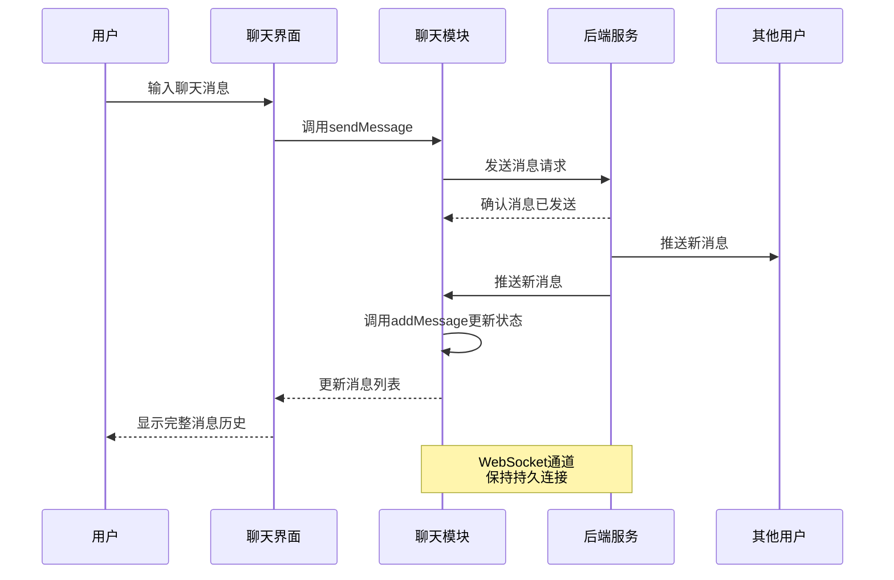

# 聊天功能模块 (Chat Feature)

## 模块概述

聊天模块是灾变创世录游戏平台的实时通信系统，为玩家提供在游戏中进行交流的功能。该模块支持对战内聊天、消息发送接收、历史记录管理，增强了玩家间的互动体验和团队协作能力，是游戏社交功能的核心组成部分。

## 核心功能

- **实时消息交换**: 提供玩家间即时通信功能，支持对战内聊天和系统通知
- **消息管理**: 处理消息的发送、接收、存储和展示，包括文本消息和系统通知
- **聊天界面**: 提供直观友好的聊天面板，支持消息输入和历史记录显示
- **上下文感知**: 根据不同游戏场景（如对战中）自动加入相应聊天频道
- **多语言支持**: 集成国际化框架，支持多种语言的聊天界面
- **状态同步**: 确保聊天状态在不同客户端间保持同步，提供一致的用户体验

## 关键组件

### 模型层 (model/)

- **store.ts**: 定义聊天状态存储结构和更新逻辑，管理消息列表及相关状态
- **actions.ts**: 提供聊天相关的异步操作，包括 `joinChat`、`sendMessage` 以及状态管理操作 `addMessage` 和 `resetChat`
- **selectors.ts**: 提供从全局状态中获取聊天信息的选择器，主要是 `messages` 选择器
- **index.ts**: 统一导出模型层组件，形成模型公共 API

### UI组件 (ui/)

- **chat-panel.tsx**: 完整的聊天面板组件，包含消息展示区域和消息输入表单，支持消息发送和历史记录查看
- **index.ts**: 导出聊天界面组件，供其他模块使用

## 依赖关系

### 内部依赖

- **@app/store**: 访问全局Redux存储和dispatch工具
- **@features/current-match**: 获取当前对战信息，确定聊天上下文
- **@shared/ui/atoms**: 使用基础UI组件如Button、Input和Text构建聊天界面
- **@shared/lib/layout**: 使用Layout组件进行界面布局
- **@shared/api/chat**: 使用聊天相关API客户端发送请求
- **@shared/api/common**: 使用共享的数据类型定义

### 外部依赖

- **React**: 构建UI组件和管理组件状态
- **Redux Toolkit**: 状态管理和异步操作处理
- **MUI (Material-UI)**: 提供样式化组件和布局支持
- **i18next**: 国际化文本处理，支持多语言界面

## 使用示例

### 在对战页面集成聊天面板

```tsx
import React from 'react';
import { useSelector } from 'react-redux';
import { ChatPanel } from '@features/chat';
import { Box, Paper, Typography } from '@mui/material';

const MatchScreen = () => {
  return (
    <Box display="flex" height="100%">
      <Box flex="1">
        {/* 游戏主区域 */}
        <GameBoard />
      </Box>
      
      <Paper 
        sx={{ 
          width: '300px', 
          padding: 2,
          display: 'flex',
          flexDirection: 'column'
        }}
      >
        <Typography variant="h6" mb={1}>聊天</Typography>
        <Box flex="1" overflow="hidden">
          <ChatPanel />
        </Box>
      </Paper>
    </Box>
  );
};
```

### 手动发送消息

```tsx
import { useDispatch } from '@app/store';
import { chatModel } from '@features/chat';

const ChatActions = ({ matchId }) => {
  const dispatch = useDispatch();
  
  // 发送预设消息
  const sendQuickMessage = (messageText) => {
    dispatch(chatModel.actions.sendMessage({
      chatId: matchId,
      text: messageText
    }));
  };
  
  return (
    <div className="quick-actions">
      <button onClick={() => sendQuickMessage('你好！')}>
        问好
      </button>
      <button onClick={() => sendQuickMessage('祝你好运！')}>
        祝福
      </button>
      <button onClick={() => sendQuickMessage('精彩操作！')}>
        称赞
      </button>
    </div>
  );
};
```

## 架构说明

聊天模块采用了标准的Redux状态管理模式，遵循单向数据流设计：

1. 用户通过UI组件（如ChatPanel中的表单）触发聊天操作
2. 操作被分发到相应的action处理器（如sendMessage）
3. Action处理器调用API服务发送请求到后端
4. 后端通过WebSocket推送新消息到所有相关客户端
5. 客户端接收到新消息后，通过addMessage action更新状态
6. 状态更新后，UI组件自动重新渲染显示新消息

该模块采用了清晰的职责分离：模型层负责数据和逻辑，UI层负责展示和交互，减少了组件间的耦合，提高了可维护性和可测试性。

## 功能模块泳道流程图



## 数据模型

```typescript
// 聊天消息结构
export interface ChatMessage {
  id: string;          // 消息唯一ID
  sender: {            // 发送者信息
    id: string;        // 发送者ID
    username: string;  // 发送者用户名
  };
  text: string;        // 消息内容
  timestamp: string;   // 发送时间戳
  type?: string;       // 消息类型（文本/系统/等）
}

// 聊天状态
export interface ChatState {
  messages: ChatMessage[];  // 消息列表
}

// 发送消息参数
export interface SendMessageData {
  chatId: string;      // 聊天ID（通常是对战ID）
  text: string;        // 消息文本
}

// 加入聊天参数
export interface JoinChatData {
  chatId: string;      // 要加入的聊天ID
}
```

## 最佳实践

1. 在游戏关键节点（如对战开始）自动加入相应的聊天频道
2. 聊天界面应当保持精简设计，不干扰游戏主界面但易于访问
3. 消息应按时间顺序显示，最新消息出现在列表底部
4. 对长消息列表实现虚拟滚动，优化性能
5. 使用节流控制消息发送频率，避免刷屏
6. 实现适当的消息过滤机制，防止不当内容
7. 确保聊天组件响应式设计，适应不同设备和布局 