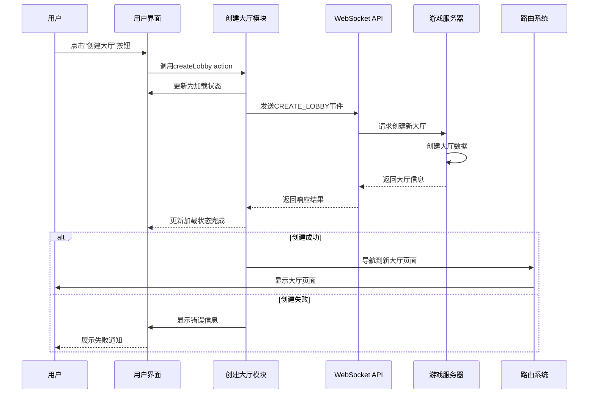

# 创建大厅功能模块 (Create Lobby Feature)

## 模块概述

创建大厅模块是灾变创世录游戏平台的功能入口点，提供简洁高效的大厅创建机制。该模块允许玩家快速创建新的游戏大厅，作为游戏匹配流程的起点，为玩家自定义游戏体验提供基础设施，支持后续游戏配置和玩家组织。

## 核心功能

- **大厅创建**: 提供一键创建新游戏大厅的功能，简化游戏准备流程
- **状态管理**: 处理创建过程中的各种状态（进行中、成功、失败），提供用户反馈
- **错误处理**: 处理创建过程中可能出现的网络错误和服务器异常
- **导航整合**: 在成功创建后自动导航至新建大厅页面
- **扩展准备**: 支持后续添加自定义大厅参数和配置选项

## 关键组件

### 模型层 (model/)

- **actions.ts**: 实现创建大厅的异步操作，使用Redux Toolkit的`createAsyncThunk`管理异步状态
- **index.ts**: 统一导出模型层组件，形成模型公共API

## 依赖关系

### 内部依赖

- **@shared/api/match**: 使用matchApi.createLobby服务创建新大厅
- **@entities/lobby**: 使用Lobby实体类型定义处理大厅数据

### 外部依赖

- **Redux Toolkit**: 状态管理和异步操作处理
- **React Router**: 处理大厅创建后的导航

## 使用示例

### 基础使用方式

```tsx
import React, { useState } from 'react';
import { useDispatch } from '@app/store';
import { useNavigate } from 'react-router-dom';
import { createLobbyModel } from '@features/create-lobby';
import { Button } from '@shared/ui/atoms';

const CreateLobbyButton: React.FC = () => {
  const dispatch = useDispatch();
  const navigate = useNavigate();
  const [isLoading, setIsLoading] = useState(false);
  
  const handleCreateLobby = async () => {
    try {
      setIsLoading(true);
      const result = await dispatch(createLobbyModel.actions.createLobby()).unwrap();
      navigate(`/lobbies/${result.lobby.id}`);
    } catch (error) {
      console.error('大厅创建失败', error);
      // 处理错误，例如显示错误提示
    } finally {
      setIsLoading(false);
    }
  };
  
  return (
    <Button 
      variant="contained" 
      color="primary" 
      onClick={handleCreateLobby}
      disabled={isLoading}
    >
      {isLoading ? '创建中...' : '创建新大厅'}
    </Button>
  );
};
```

### 集成到游戏大厅选择页面

```tsx
import React from 'react';
import { useTranslation } from 'react-i18next';
import { LobbyList } from '@widgets/lobby-list';
import { CreateLobbyButton } from '@features/create-lobby/ui';
import { JoinQueueButton } from '@features/matchmaking';
import { Layout } from '@shared/lib/layout';
import { Text } from '@shared/ui/atoms';

const GameLobbyPage: React.FC = () => {
  const { t } = useTranslation('lobbies');
  
  return (
    <Layout.Col gap={4} width="100%">
      <Text as="h1" size={2.4} weight={700}>
        {t('title')}
      </Text>
      
      <Layout.Row gap={2} justify="flex-start">
        <CreateLobbyButton />
        <JoinQueueButton />
      </Layout.Row>
      
      <Text as="h2" size={1.8} weight={600}>
        {t('available_lobbies')}
      </Text>
      
      <LobbyList />
    </Layout.Col>
  );
};
```

## 架构说明

创建大厅模块采用轻量级设计，专注于单一职责 - 创建新的游戏大厅：

1. 用户触发创建大厅操作
2. 模块发送WebSocket请求到服务器
3. 服务器创建新大厅并返回大厅信息
4. 模块处理响应，在成功时触发导航到新大厅页面

该模块遵循特性层设计原则，只包含逻辑和模型层，UI组件通常在用户界面处实现，使其更易于在不同场景中复用。

## 功能模块泳道流程图



## 数据模型

```typescript
// 创建大厅选项（当前为空，可未来扩展）
export type CreateLobbyOptions = void;

// 创建大厅响应
export interface CreateLobbyResponse {
  lobby: Lobby;
}

// 大厅实体（简化版）
export interface Lobby {
  id: string;
  host: User;
  participants: LobbyParticipant[];
  mode: LobbyModeType;
  createdAt: string;
  // 其他大厅属性
}

// 创建大厅的异步Thunk
export const createLobby = createAsyncThunk<
  CreateLobbyResponse,
  void
>(`create-lobby/createLobby`, async () => {
  return matchApi.createLobby();
});
```

## 最佳实践

1. 使用组件内的状态管理创建大厅加载状态，提供用户反馈
2. 实现适当的错误处理机制，确保网络问题时用户收到明确提示
3. 大厅创建成功后，立即导航至新大厅页面，降低用户操作步骤
4. 考虑添加防抖措施，防止用户连续多次创建大厅
5. 保持模块轻量，让详细的大厅设置留给专门的大厅配置模块
6. 当创建功能扩展时，考虑添加参数验证和默认值处理 