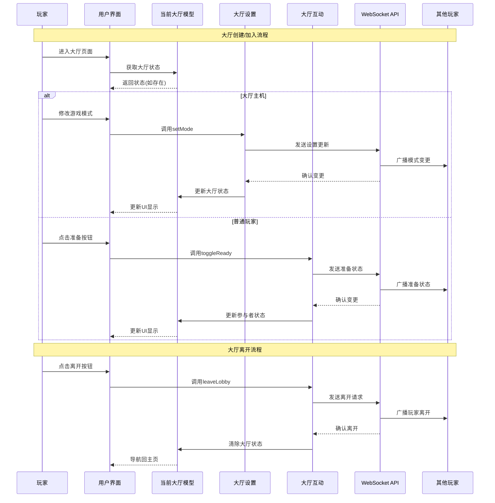

# 当前大厅功能模块 (Current Lobby Feature)

## 模块概述

当前大厅模块是灾变创世录游戏平台的核心社交和比赛准备中心，负责管理玩家在进入实际对战前的大厅体验。该模块处理大厅状态、玩家管理、游戏设置配置以及大厅内玩家互动，为游戏前的准备阶段提供完整的功能支持，确保玩家能顺畅地组织、社交并准备游戏。

## 核心功能

- **大厅状态管理**: 集中处理游戏大厅的创建、加载和状态跟踪，维护大厅的完整生命周期
- **玩家互动系统**: 提供大厅内玩家间的互动机制，包括准备状态、角色分配和离开操作
- **游戏设置配置**: 支持多种游戏模式选择与自定义规则设置，满足不同玩家的游戏偏好
- **主机控制功能**: 提供大厅主机特殊权限和控制机制，包括玩家管理和游戏启动
- **实时同步更新**: 确保所有玩家实时获取大厅状态变化，提供一致的用户体验
- **游戏启动协调**: 管理从大厅到游戏的过渡过程，包括检查条件和初始化游戏

## 关键组件

### 模型层 (model/)

- **store.ts**: 定义大厅状态存储结构和更新逻辑，维护 `lobby` 等核心状态
- **actions.ts**: 提供大厅状态修改操作，如 `setLobby`、`addParticipant` 和 `setMode` 等
- **selectors.ts**: 提供从全局状态中获取大厅信息的选择器
- **hooks.ts**: 封装与大厅相关的自定义React钩子，便于组件访问和操作大厅状态

### 大厅互动子模块 (lobby-interactions/)

- **model/**: 处理玩家互动相关的状态和操作，如加入/离开大厅、准备状态切换
- **ui/lobby-actions.tsx**: 提供大厅内玩家可执行的操作界面组件，如离开大厅和打开设置

### 大厅设置子模块 (lobby-settings/)

- **model/**: 管理大厅设置相关的状态和操作，如游戏模式切换和规则配置
- **ui/game-mode-selection.tsx**: 游戏模式选择界面，支持默认、核心和自定义模式
- **ui/active-cards.tsx**: 活动卡牌设置界面，允许自定义游戏中可用的卡牌

## 依赖关系

### 内部依赖

- **@entities/lobby**: 使用大厅实体类型定义和基础组件
- **@entities/viewer**: 获取当前用户信息和权限
- **@entities/card**: 使用卡牌实体类型定义
- **@features/preferences**: 集成用户偏好设置功能
- **@features/chat**: 整合大厅内聊天功能

### 外部依赖

- **React Router**: 处理大厅导航和URL参数
- **Redux Toolkit**: 状态管理和操作处理
- **MUI (Material-UI)**: 构建用户界面组件
- **i18next**: 多语言支持
- **WebSocket API**: 实时通信和状态同步

## 使用示例

### 大厅页面集成

```tsx
import React, { useEffect } from 'react';
import { useDispatch } from '@app/store';
import { useParams, useNavigate } from 'react-router-dom';
import { currentLobbyModel } from '@features/current-lobby';
import { GameModeSelection, ActiveCards } from '@features/current-lobby/lobby-settings';
import { LobbyActions } from '@features/current-lobby/lobby-interactions';
import { LoadingSpinner, ErrorDisplay } from '@shared/ui/atoms';
import { Layout } from '@shared/lib/layout';

const LobbyPage: React.FC = () => {
  const { lobbyId } = useParams();
  const dispatch = useDispatch();
  const navigate = useNavigate();
  
  // 使用自定义钩子获取大厅状态
  const lobby = currentLobbyModel.useLobby();
  const isLoading = currentLobbyModel.useIsLoading();
  
  // 大厅加载
  useEffect(() => {
    if (lobbyId) {
      // 从服务器加载大厅数据或从创建/加入操作中获取
      if (!lobby || lobby.id !== lobbyId) {
        // 这里可能会有实际加载逻辑
        console.log(`加载大厅 ${lobbyId}`);
      }
    } else {
      navigate('/');
    }
    
    // 组件卸载时清理
    return () => {
      if (lobby) {
        // 可能的清理操作，如离开大厅
      }
    };
  }, [lobbyId, lobby, dispatch, navigate]);
  
  if (isLoading || !lobby) {
    return <LoadingSpinner />;
  }
  
  return (
    <Layout.Col gap={4}>
      <Layout.Row justify="space-between" align="center">
        <h1>大厅: {lobby.id}</h1>
        <LobbyActions />
      </Layout.Row>
      
      <Layout.Row gap={4}>
        <Layout.Col flex="1">
          <h2>玩家列表</h2>
          <PlayersList participants={lobby.participants} />
        </Layout.Col>
        
        <Layout.Col flex="2">
          <h2>游戏设置</h2>
          <GameModeSelection />
          {lobby.mode.type === 'custom' && <ActiveCards />}
        </Layout.Col>
      </Layout.Row>
    </Layout.Col>
  );
};

// 简单的玩家列表组件
const PlayersList: React.FC<{ participants: any[] }> = ({ participants }) => (
  <ul>
    {participants.map(p => (
      <li key={p.id}>
        {p.role === 'leader' ? '👑 ' : ''}{p.name}
        {p.ready && ' ✓'}
      </li>
    ))}
  </ul>
);
```

### 游戏模式设置使用

```tsx
import React from 'react';
import { useDispatch } from '@app/store';
import { currentLobbyModel } from '@features/current-lobby';
import { lobbySettingsModel } from '@features/current-lobby/lobby-settings';
import { Button, RadioGroup, Radio, FormControlLabel } from '@shared/ui/atoms';
import { Layout } from '@shared/lib/layout';

const CustomGameSettings: React.FC = () => {
  const dispatch = useDispatch();
  const lobby = currentLobbyModel.useLobby();
  const isHost = currentLobbyModel.useIsHost();
  
  if (!lobby || !isHost) return null;
  
  const handleStartingLifeChange = (value: number) => {
    dispatch(lobbySettingsModel.actions.updateCustomRule({
      lobbyId: lobby.id,
      ruleName: 'startingLife',
      value
    }));
  };
  
  const handleStartGame = () => {
    // 发送开始游戏请求
    dispatch(lobbySettingsModel.actions.startGame({
      lobbyId: lobby.id
    }));
  };
  
  return (
    <Layout.Col gap={3}>
      <h3>自定义游戏设置</h3>
      
      <Layout.Row gap={2}>
        <label>初始生命值:</label>
        <RadioGroup 
          row 
          value={lobby.settings?.startingLife || 5}
          onChange={(e) => handleStartingLifeChange(Number(e.target.value))}
        >
          <FormControlLabel value={3} control={<Radio />} label="3" />
          <FormControlLabel value={5} control={<Radio />} label="5" />
          <FormControlLabel value={7} control={<Radio />} label="7" />
        </RadioGroup>
      </Layout.Row>
      
      <Button 
        variant="contained" 
        color="primary"
        onClick={handleStartGame}
        disabled={!lobby.participants.every(p => p.ready || p.role === 'leader')}
      >
        开始游戏
      </Button>
    </Layout.Col>
  );
};
```

## 架构说明

当前大厅模块采用分层设计，清晰分离数据管理和用户界面:

1. **核心状态层**：
   - 维护中央大厅状态
   - 处理从WebSocket接收的大厅更新
   - 提供自定义钩子简化组件接入

2. **功能子模块层**：
   - 大厅互动：关注玩家间交互和状态变更
   - 大厅设置：专注于游戏规则和模式配置

3. **数据流模式**：
   - 用户操作触发action发送到服务器
   - 服务器验证后广播给所有大厅参与者
   - 本地状态通过action更新，反映服务器确认的变更
   - UI组件响应状态变化进行重新渲染

该架构确保所有大厅参与者拥有同步的大厅状态，同时保持清晰的职责分离和高可维护性。

## 功能模块泳道流程图



## 数据模型

```typescript
// 大厅状态
export interface CurrentLobbyStore {
  lobby: Nullable<Lobby>;
}

// 大厅数据结构
export interface Lobby {
  id: string;
  mode: {
    type: LobbyModeType; // 'default' | 'core' | 'custom'
    payload?: {
      disabled: CardName[]; // 禁用的卡牌
    };
  };
  participants: LobbyParticipant[];
  spectators: string[];
  createdAt: string;
}

// 大厅参与者
export interface LobbyParticipant {
  id: string;
  name: string;
  avatar: string;
  role: 'leader' | 'player'; // 主机或普通玩家
  ready: boolean; // 准备状态
}

// 主要操作类型
export interface SetLobbyPayload {
  lobby: Nullable<Lobby>;
}

export interface SetModePayload {
  mode: LobbyMode;
}

export interface AddParticipantPayload {
  participant: LobbyParticipant;
}

export interface RemoveParticipantPayload {
  participantId: string;
}

export interface SetParticipantRolePayload {
  participantId: string;
  role: LobbyParticipant["role"];
}
```

## 最佳实践

1. 始终使用模块提供的自定义钩子（如 `useLobby`）访问状态，而非直接使用选择器
2. 区分主机和普通玩家权限，在UI层实现相应的权限控制
3. 处理网络延迟和断线情况，提供适当的加载和错误状态
4. 为所有用户操作提供即时视觉反馈，特别是需要服务器确认的操作
5. 使用WebSocket进行实时通信，确保所有玩家状态同步
6. 实现防抖/节流逻辑，避免频繁触发设置更新请求
7. 保持大厅设置界面简洁明了，突出显示当前选中的选项
8. 为重要操作（如离开大厅）提供确认机制，防止误操作 