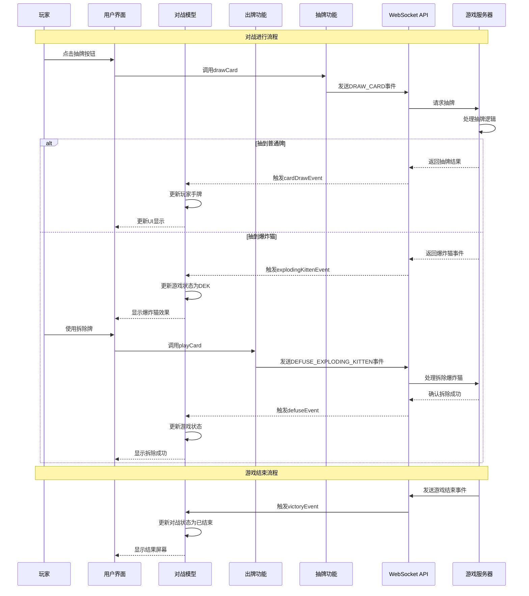

# 当前对战功能模块 (Current Match Feature)

## 模块概述

当前对战模块是灾变创世录游戏平台的核心游戏引擎，负责管理和协调卡牌对战的全生命周期。该模块实现了游戏规则逻辑、状态管理、玩家交互和视觉反馈，支持多种游戏机制（如出牌、抽牌、特殊效果）和游戏模式，为玩家提供流畅的游戏体验和实时互动。

## 核心功能

- **对战状态管理**: 维护完整的游戏状态，包括玩家信息、牌库、弃牌堆和游戏规则参数
- **回合与行动控制**: 实现游戏回合流转、玩家行动顺序和特殊状态处理
- **卡牌操作机制**: 提供完整的卡牌出牌、抽牌、效果处理和特殊互动功能
- **实时事件处理**: 处理游戏中的各类事件（如爆炸猫触发、攻击生效等）并更新状态
- **游戏结果判定**: 识别和处理游戏结束条件，计算胜负结果和积分变化
- **视觉效果呈现**: 提供游戏状态的直观视觉表现，增强游戏体验

## 关键组件

### 模型层 (model/)

- **store.ts**: 定义对战状态存储结构和更新逻辑，管理 `match` 对象及其属性
- **actions.ts**: 提供状态修改操作，如添加/移除玩家、更新牌库和修改游戏状态
- **hooks.ts**: 封装WebSocket事件处理和状态访问钩子，处理游戏事件和玩家操作
- **selectors.ts**: 提供从全局状态中获取对战信息的选择器

### 用户界面组件 (ui/)

- **players.tsx**: 玩家信息和状态展示组件，包括回合指示和特殊状态
- **discard-pile.tsx**: 弃牌堆展示组件，显示已使用的卡牌
- **state-timer.tsx**: 状态计时器组件，显示当前操作剩余时间
- **context-indicator.tsx**: 游戏上下文指示器，显示当前游戏特殊状态
- **exploding-kitten-probability.tsx**: 爆炸猫概率计算和显示组件

### 游戏机制子模块

- **card-play/**: 专注于卡牌使用逻辑和效果处理的子模块
- **card-draw/**: 处理抽牌机制、牌库管理和抽牌结果的子模块
- **in-game-interactions/**: 管理游戏内特殊互动（如查看未来、选择目标等）的子模块
- **match-interactions/**: 处理对战层面交互（如回合控制、投降等）的子模块
- **match-results/**: 负责对战结果计算、展示和统计的子模块

## 依赖关系

### 内部依赖

- **@entities/card**: 使用卡牌实体类型定义和UI组件
- **@entities/match**: 使用对战相关的常量和类型定义
- **@entities/viewer**: 获取当前用户信息和凭证
- **@features/chat**: 集成对战内聊天功能
- **@shared/api/match**: 使用WebSocket事件和API方法

### 外部依赖

- **React**: 构建UI组件和管理组件状态
- **Redux Toolkit**: 状态管理和操作处理
- **MUI (Material-UI)**: 样式系统和UI组件基础
- **WebSocket API**: 实时通信和游戏状态同步

## 使用示例

### 对战页面集成

```tsx
import React, { useEffect } from 'react';
import { useDispatch } from '@app/store';
import { useParams } from 'react-router-dom';
import { 
  currentMatchModel, 
  Players, 
  DiscardPile, 
  StateTimer 
} from '@features/current-match';
import { CardHand } from '@features/current-match/card-play';
import { DrawButton } from '@features/current-match/card-draw';
import { EndTurnButton } from '@features/current-match/match-interactions';
import { GameResultModal } from '@features/current-match/match-results';
import { Layout } from '@shared/lib/layout';

const MatchPage: React.FC = () => {
  const { matchId } = useParams<{ matchId: string }>();
  const dispatch = useDispatch();
  
  const match = currentMatchModel.useMatch();
  const isLoading = !match;
  
  // 使用WebSocket事件处理器
  currentMatchModel.useWsHandlers();
  
  useEffect(() => {
    // 组件加载时可能需要执行某些初始化操作
    console.log(`对战页面已加载，ID: ${matchId}`);
    
    return () => {
      // 组件卸载时的清理操作
      console.log('离开对战页面');
    };
  }, [matchId]);
  
  if (isLoading) {
    return <div>加载对战中...</div>;
  }
  
  return (
    <Layout.Col gap={2}>
      <GameResultModal />
      
      <Layout.Row justify="space-between" align="center">
        <StateTimer />
        <h2>回合 {match.turn + 1}</h2>
      </Layout.Row>
      
      <Players />
      
      <Layout.Row gap={4} align="flex-start">
        <Layout.Col flex="1">
          <DiscardPile />
        </Layout.Col>
        
        <Layout.Col flex="2">
          <CardHand />
          
          <Layout.Row gap={2} justify="center" mt={3}>
            <DrawButton />
            <EndTurnButton />
          </Layout.Row>
        </Layout.Col>
      </Layout.Row>
    </Layout.Col>
  );
};
```

### 特殊游戏交互处理

```tsx
import React from 'react';
import { useDispatch } from '@app/store';
import { currentMatchModel } from '@features/current-match';
import { inGameInteractionsModel, MODAL } from '@features/current-match/in-game-interactions';
import { Button, Dialog, DialogTitle, DialogContent, DialogActions } from '@shared/ui/atoms';
import { Layout } from '@shared/lib/layout';
import { Card } from '@entities/card';

// 查看未来三张牌的对话框组件
const SeeTheFutureDialog: React.FC = () => {
  const dispatch = useDispatch();
  const modalData = inGameInteractionsModel.useModalData(MODAL.SEE_THE_FUTURE);
  
  if (!modalData?.open) return null;
  
  const { cards } = modalData.payload;
  
  const handleClose = () => {
    dispatch(inGameInteractionsModel.actions.setModalData({
      modal: MODAL.SEE_THE_FUTURE,
      data: { open: false }
    }));
  };
  
  return (
    <Dialog open={modalData.open} onClose={handleClose}>
      <DialogTitle>未来的牌</DialogTitle>
      <DialogContent>
        <Layout.Row gap={2} justify="center">
          {cards.map((card, index) => (
            <Card key={index} name={card.name} />
          ))}
        </Layout.Row>
      </DialogContent>
      <DialogActions>
        <Button onClick={handleClose} color="primary">
          关闭
        </Button>
      </DialogActions>
    </Dialog>
  );
};
```

## 架构说明

当前对战模块采用多层次架构设计，实现了游戏逻辑和用户界面的清晰分离：

1. **核心状态层**:
   - 集中式状态管理，通过Redux存储对战全局状态
   - 事件驱动更新，基于WebSocket实时同步
   - 自定义钩子简化状态访问和事件处理

2. **游戏机制层**:
   - 分离不同游戏机制为独立子模块
   - 每个子模块专注于特定游戏功能
   - 子模块间通过中央状态协作

3. **用户界面层**:
   - 反应式UI组件，随状态变化自动更新
   - 组件化设计，每个组件负责特定视觉表现
   - 状态变更动画和视觉反馈

该架构确保了逻辑与表现分离、模块间低耦合高内聚，并支持游戏机制的可扩展性和可测试性。

## 功能模块泳道流程图



## 数据模型

```typescript
// 对战状态存储
export interface CurrentMatchStore {
  match: Nullable<OngoingMatch>;
}

// 进行中的对战
export interface OngoingMatch {
  id: string;           // 对战ID
  players: Player[];    // 活跃玩家
  out: OutPlayer[];     // 出局玩家
  spectators: User[];   // 观战者
  discard: Card[];      // 弃牌堆
  draw: number;         // 牌库剩余牌数
  cards?: Card[];       // 可见的牌（如未来三张）
  turn: number;         // 当前回合玩家索引
  state: MatchState;    // 对战状态
  context: MatchContext; // 游戏上下文
  last?: LastAction;    // 最后行动
}

// 玩家
export interface Player {
  id: string;           // 玩家ID
  username: string;     // 用户名
  avatar: string;       // 头像URL
  cards: string[];      // 手牌ID列表
  marked: Card[];       // 标记的牌（对其他玩家可见）
}

// 对战状态
export interface MatchState {
  type: string;         // 状态类型，如WFA（等待行动）、DEK（处理爆炸猫）
  params?: any;         // 状态参数
  deadline?: number;    // 截止时间戳
}

// 游戏上下文
export interface MatchContext {
  ikspot?: number;      // 内爆猫位置
  reversed?: boolean;   // 游戏方向是否反转
  attacks?: number;     // 攻击次数
  // 其他上下文信息
}
```

## 最佳实践

1. 使用模块提供的自定义钩子如 `useMatch` 和 `useWsHandlers` 获取状态和处理事件
2. 将游戏逻辑操作封装在相应子模块中，避免直接操作状态
3. 为游戏中的重要状态变化提供清晰的视觉反馈和动画效果
4. 处理游戏中的错误状态和边缘情况，确保游戏不会卡死或崩溃
5. 使用常量定义游戏状态和事件类型，避免硬编码字符串
6. 实现网络延迟处理和断线重连机制，确保游戏体验流畅
7. 对复杂的游戏逻辑进行单元测试，验证规则实现的正确性
8. 保持用户界面简洁直观，突出重要游戏元素和当前可执行操作

## 子模块结构

当前对战模块由多个专注于特定功能的子模块组成，每个子模块都有详细的文档：

- [**模型 (Model)**](./model/README.md) - 核心状态管理和数据结构
- [**界面 (UI)**](./ui/README.md) - 对战用户界面组件
- [**出牌功能 (Card Play)**](./card-play/README.md) - 卡牌使用与效果处理
- [**抽牌功能 (Card Draw)**](./card-draw/README.md) - 牌库与抽牌机制
- [**游戏内交互 (In-Game Interactions)**](./in-game-interactions/README.md) - 玩家与游戏元素的交互
- [**对战互动 (Match Interactions)**](./match-interactions/README.md) - 回合、阶段与时间管理
- [**对战结果 (Match Results)**](./match-results/README.md) - 结果判定与战后统计

## 文件结构

```
current-match/
├── index.ts                # 模块导出
├── README.md               # 本文档
├── model/                  # 对战状态管理
│   ├── index.ts            # 模型导出
│   ├── store.ts            # Redux状态存储
│   ├── actions.ts          # 状态更新操作
│   ├── selectors.ts        # 状态选择器 
│   └── hooks.ts            # 自定义React钩子
├── ui/                     # 对战界面组件
│   ├── index.ts            # UI组件导出
│   ├── players.tsx         # 玩家信息展示
│   ├── state-timer.tsx     # 状态计时器
│   └── ...                 # 其他UI组件
├── card-play/              # 出牌功能
│   ├── index.ts            # 功能导出
│   ├── model/              # 出牌状态管理
│   └── ui/                 # 出牌界面组件
├── card-draw/              # 抽牌功能
│   ├── index.ts            # 功能导出
│   ├── model/              # 抽牌状态管理
│   └── ui/                 # 抽牌界面组件
├── in-game-interactions/   # 游戏内交互
│   ├── index.ts            # 功能导出
│   ├── model/              # 交互状态管理
│   ├── ui/                 # 交互界面组件
│   └── lib/                # 交互工具库
├── match-interactions/     # 对战互动
│   ├── index.ts            # 功能导出
│   ├── model/              # 互动状态管理
│   └── ui/                 # 互动界面组件
└── match-results/          # 对战结果
    ├── index.ts            # 功能导出
    ├── model/              # 结果状态管理
    ├── ui/                 # 结果界面组件
    └── lib/                # 结果工具库
```

## 功能职责

### 对战状态管理

处理和维护对战的核心状态：
- 跟踪玩家状态（生命值、法力、手牌等）
- 管理游戏板状态（场上卡牌、效果等）
- 控制回合和阶段流转
- 处理时间限制和计时
- 记录游戏历史和日志

### 游戏规则实现

执行卡牌游戏的核心规则逻辑：
- 卡牌使用规则和验证
- 回合结构和顺序
- 胜负判定条件
- 特殊效果和触发时机
- 资源管理（法力、抽牌等）

### 玩家交互处理

管理玩家在对战中的各种交互：
- 卡牌出牌和目标选择
- 回合操作（结束回合、跳过阶段等）
- 特殊操作（如使用技能、触发效果）
- 时间管理和优先权传递
- 玩家响应和选择

### 视觉呈现

提供对战的视觉界面和反馈：
- 游戏板和卡牌显示
- 玩家信息和资源展示
- 动画和视觉效果
- 状态指示器和提示
- 对战结果展示

### 网络同步

处理多人对战的网络同步：
- 状态同步和冲突解决
- 动作验证和执行
- 延迟和断线处理
- 观战者视角管理
- 安全和防作弊措施

## 模块关系

当前对战模块与多个其他模块互相协作：

- 使用**卡牌实体**定义和展示卡牌
- 与**玩家实体**交互获取玩家信息
- 从**加入对战**模块接收初始对战数据
- 提供数据给**对战重连**功能用于恢复断线
- 与**聊天**模块集成对战中的沟通功能
- 对战结束后通知**排行榜**和**用户资料**系统

## 开发指南

1. 状态管理应严格遵循Redux最佳实践，确保状态可预测性
2. 游戏规则实现应与状态呈现分离，便于单独测试
3. 复杂操作应分解为多个小操作，提高可维护性
4. 视觉效果应考虑性能影响，特别是在移动设备上
5. 网络同步应考虑延迟和断线情况，提供优雅的恢复机制
6. 错误处理应全面，确保异常情况不会导致游戏崩溃
7. 状态更新应考虑动画时序，避免视觉不连贯
8. 关键游戏逻辑应在服务器端验证，防止作弊
9. 代码组织应遵循功能内聚原则，相关功能应放在一起 