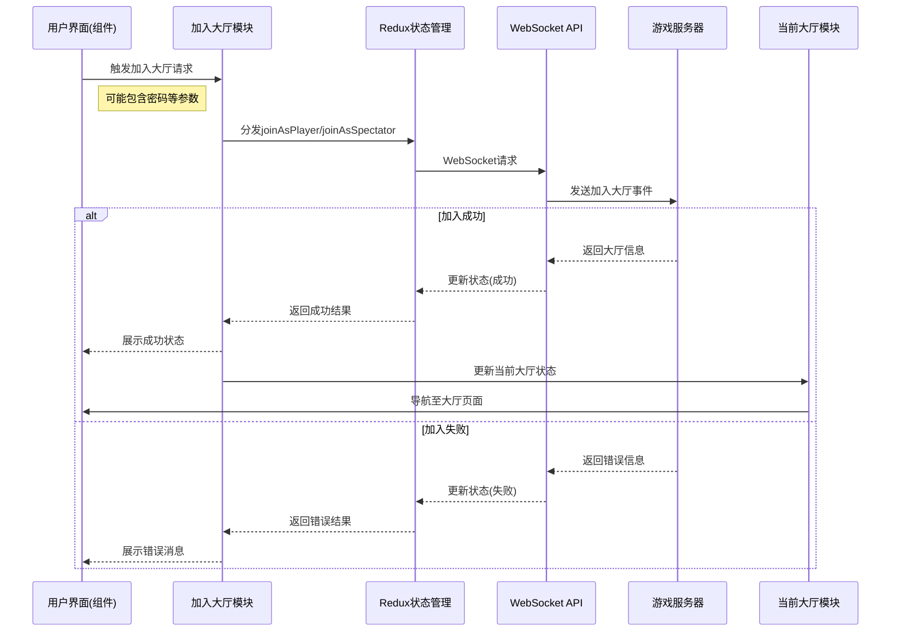

# 加入大厅功能模块 (Join Lobby Feature)

## 模块概述

加入大厅模块提供了让玩家加入现有游戏大厅的功能，支持以玩家或观战者身份参与。该模块是连接玩家与已存在大厅的桥梁，处理加入请求、验证权限（如密码保护的大厅）、处理响应结果，并将用户引导至成功加入的大厅。尽管结构简洁，但该模块对于游戏的社交性和可访问性至关重要。

## 核心功能

- **玩家身份加入**: 提供以正式玩家身份加入大厅的功能，使用户能够参与游戏对战
- **观战者身份加入**: 支持以观战者身份加入大厅，允许用户观看游戏但不直接参与
- **密码验证**: 处理密码保护大厅的验证，确保只有授权用户能够访问私密大厅
- **状态管理**: 使用 Redux 状态管理处理加入流程中的各种状态（加载中、成功、失败）
- **无缝导航**: 在成功加入后自动将用户引导至目标大厅界面

## 关键组件

### 核心文件

- **index.ts**: 导出模块主要功能，提供对外接口
- **model/index.ts**: 整合并导出模型逻辑
- **model/actions.ts**: 使用 Redux Toolkit 的异步 thunk 定义主要操作：加入为玩家和加入为观战者

### 主要类型定义

```typescript
// 加入大厅数据（请求参数）
export type JoinLobbyData = {
  lobbyId: string;
  password?: string;  // 可选，用于密码保护的大厅
};

// 加入为玩家选项
export type JoinAsPlayerOptions = JoinLobbyData;

// 加入为玩家响应载荷
export type JoinAsPlayerPayload = {
  lobby: Lobby;  // 包含完整大厅信息的响应
};

// 加入为观战者选项
export type JoinAsSpectatorOptions = JoinLobbyData;

// 加入为观战者响应载荷
export type JoinAsSpectatorPayload = {
  lobby: Lobby;  // 包含完整大厅信息的响应
};
```

## 依赖关系

### 内部依赖

- **@shared/api/match**: 提供 matchApi 服务，处理大厅加入的 WebSocket 通信
- **@shared/lib/ws**: WebSocket 连接管理，处理与服务器的实时通信
- **@entities/lobby**: 提供 Lobby 实体的数据结构和类型定义

### 外部依赖

- **@reduxjs/toolkit**: 用于创建异步 thunk 和管理加入大厅操作的状态
- **react-router-dom**: 处理加入成功后的导航逻辑
- **react-redux**: 连接 Redux 状态与 React 组件

## 使用示例

### 基本使用方式

```tsx
import { useDispatch } from 'react-redux';
import { useNavigate } from 'react-router-dom';
import { joinLobbyModel } from '@features/join-lobby';

const JoinLobbyButton = ({ lobbyId }) => {
  const dispatch = useDispatch();
  const navigate = useNavigate();
  
  const handleJoin = async () => {
    try {
      // 发起加入大厅请求
      const result = await dispatch(joinLobbyModel.actions.joinAsPlayer({ 
        lobbyId 
      }));
      
      // 处理成功响应
      if (result.payload) {
        navigate(`/lobbies/${lobbyId}`);
      }
    } catch (error) {
      console.error('加入大厅失败:', error);
    }
  };
  
  return (
    <button onClick={handleJoin}>
      加入游戏
    </button>
  );
};
```

### 带密码验证的加入

```tsx
import { useState } from 'react';
import { useDispatch } from 'react-redux';
import { useNavigate } from 'react-router-dom';
import { joinLobbyModel } from '@features/join-lobby';

const PasswordProtectedJoin = ({ lobbyId, isPasswordProtected }) => {
  const dispatch = useDispatch();
  const navigate = useNavigate();
  const [password, setPassword] = useState('');
  const [showPasswordDialog, setShowPasswordDialog] = useState(false);
  
  const handleJoinClick = () => {
    if (isPasswordProtected) {
      setShowPasswordDialog(true);
    } else {
      joinLobby();
    }
  };
  
  const joinLobby = async () => {
    try {
      const result = await dispatch(joinLobbyModel.actions.joinAsPlayer({
        lobbyId,
        password: password || undefined
      }));
      
      if (result.payload) {
        setShowPasswordDialog(false);
        navigate(`/lobbies/${lobbyId}`);
      }
    } catch (error) {
      console.error('加入大厅失败:', error);
    }
  };
  
  return (
    <>
      <button onClick={handleJoinClick}>
        {isPasswordProtected ? '🔒 加入受保护大厅' : '加入大厅'}
      </button>
      
      {showPasswordDialog && (
        <div className="password-dialog">
          <input
            type="password"
            value={password}
            onChange={(e) => setPassword(e.target.value)}
            placeholder="请输入大厅密码"
          />
          <button onClick={joinLobby}>确认</button>
          <button onClick={() => setShowPasswordDialog(false)}>取消</button>
        </div>
      )}
    </>
  );
};
```

## 架构说明

加入大厅模块采用了基于 Redux Toolkit 的状态管理方案，通过异步 thunk 处理 WebSocket 通信。模块的设计遵循以下原则：

1. **关注点分离**: 将加入大厅的核心逻辑与 UI 呈现分离
2. **状态集中管理**: 使用 Redux 统一管理操作状态
3. **异步处理**: 通过 createAsyncThunk 处理异步流程，自动管理加载状态
4. **最小依赖**: 仅依赖必要的共享模块和基础设施

## 功能模块泳道流程图



## 开发指南

1. **安全处理**: 密码应通过安全方式处理，避免明文传输和存储
2. **错误处理**: 提供清晰的错误信息，特别是密码错误或大厅已满情况
3. **用户体验**: 在加入流程中提供适当的加载状态和反馈
4. **状态管理**: 避免状态泄漏，确保用户离开后正确清理状态
5. **扩展性**: 设计时考虑未来可能增加的功能，如队伍选择或快速加入

## 可能的改进方向

- **权限系统增强**: 添加基于好友列表或邀请的权限控制
- **加入队列**: 当大厅已满时，提供等待队列功能
- **历史记录**: 记录最近加入的大厅，便于快速重新加入
- **UI 组件库**: 开发专用的加入大厅按钮和对话框组件
- **加入事件通知**: 向大厅其他成员广播新用户加入的通知 