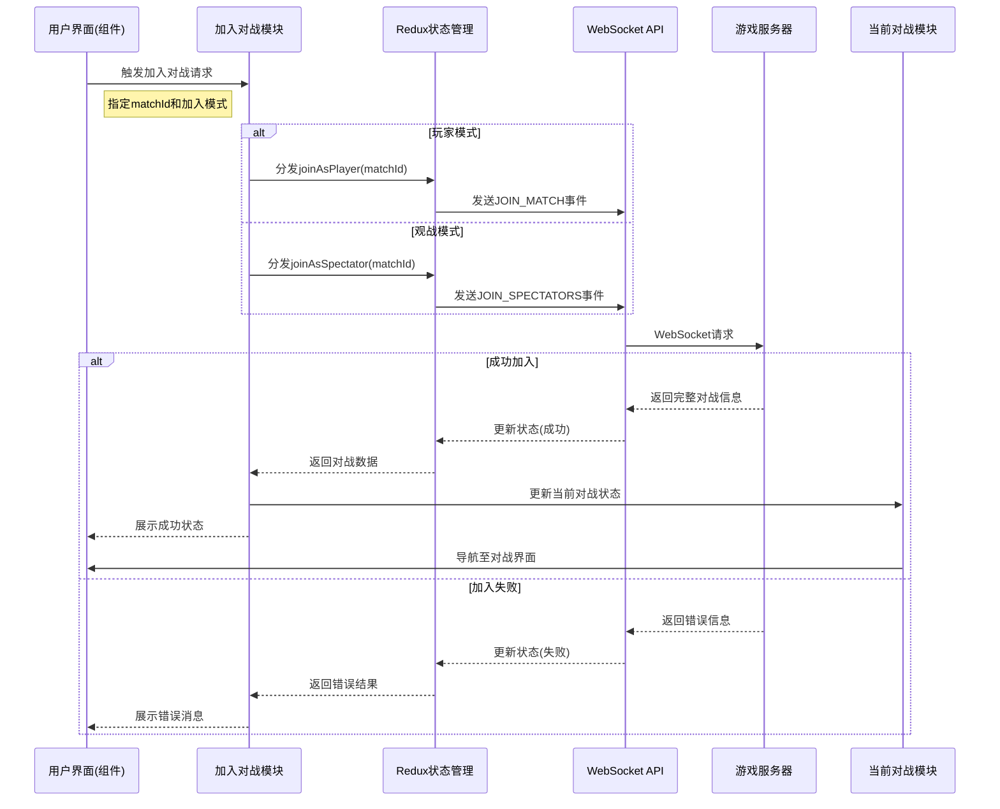

# 加入对战功能模块 (Join Match Feature)

## 模块概述

加入对战模块提供了让玩家加入现有游戏对战的功能，支持以玩家或观战者身份参与。该模块处理对战加入请求、验证资格、处理响应结果，并将用户引导至对战界面。这个模块是游戏连续性的重要保障，允许玩家重新加入中断的对战，或者作为观战者观看其他玩家的游戏。

## 核心功能

- **玩家身份加入**: 提供重新加入已参与对战的功能，支持因断线或离开而中断的游戏继续进行
- **观战者身份加入**: 支持以观战者身份加入对战，允许用户观看游戏但不直接参与
- **权限验证**: 确保只有对战相关玩家能够重新加入，防止未授权访问
- **状态管理**: 使用 Redux 处理加入对战流程中的各种状态（加载中、成功、失败）
- **对战同步**: 在成功加入后自动同步当前对战状态，确保用户获取最新游戏信息
- **实时通信**: 通过 WebSocket 提供低延迟的实时对战加入体验，确保游戏流畅性

## 关键组件

### 模型层 (model/)

- **index.ts**: 整合并导出模型逻辑，提供统一的模型访问接口
- **actions.ts**: 使用 Redux Toolkit 的 createAsyncThunk 定义核心异步操作：joinAsPlayer 和 joinAsSpectator

### 根目录

- **index.ts**: 主入口文件，导出模块功能供其他模块使用

## 依赖关系

### 内部依赖

- **@shared/api/match**: 提供 matchApi 服务，处理对战加入的 WebSocket 通信
- **@shared/lib/ws**: WebSocket 连接管理，处理与服务器的实时通信
- **@entities/match**: 提供 OngoingMatch 实体的数据结构和类型定义
- **@entities/user**: 提供用户相关数据结构，用于对战玩家和观战者信息

### 外部依赖

- **@reduxjs/toolkit**: 用于创建异步 thunk 和管理加入对战操作的状态
- **react-router-dom**: 处理加入成功后的导航逻辑
- **react-redux**: 连接 Redux 状态与 React 组件

## 使用示例

### 基本使用方式

```tsx
import { useDispatch } from 'react-redux';
import { useNavigate } from 'react-router-dom';
import { joinMatchModel } from '@features/join-match';

const ReJoinMatchButton = ({ matchId }) => {
  const dispatch = useDispatch();
  const navigate = useNavigate();
  
  const handleRejoin = async () => {
    try {
      // 发起重新加入对战请求
      const result = await dispatch(joinMatchModel.actions.joinAsPlayer({ 
        matchId 
      }));
      
      // 处理成功响应
      if (result.payload && result.payload.match) {
        navigate(`/matches/${matchId}`);
      }
    } catch (error) {
      console.error('重新加入对战失败:', error);
    }
  };
  
  return (
    <button onClick={handleRejoin}>
      重新加入对战
    </button>
  );
};
```

### 加入观战模式

```tsx
import { useState } from 'react';
import { useDispatch } from 'react-redux';
import { useNavigate } from 'react-router-dom';
import { joinMatchModel } from '@features/join-match';

const SpectateMatchButton = ({ matchId }) => {
  const dispatch = useDispatch();
  const navigate = useNavigate();
  const [isJoining, setIsJoining] = useState(false);
  
  const handleSpectate = async () => {
    try {
      setIsJoining(true);
      
      // 发起加入观战请求
      const result = await dispatch(joinMatchModel.actions.joinAsSpectator({
        matchId
      }));
      
      // 处理成功响应
      if (result.payload && result.payload.match) {
        navigate(`/matches/${matchId}/spectate`);
      }
    } catch (error) {
      console.error('加入观战失败:', error);
    } finally {
      setIsJoining(false);
    }
  };
  
  return (
    <button 
      onClick={handleSpectate}
      disabled={isJoining}
    >
      {isJoining ? '加入中...' : '观战'}
    </button>
  );
};
```

## 架构说明

加入对战模块采用了基于 Redux Toolkit 的状态管理方案，通过异步 thunk 处理 WebSocket 通信。模块设计遵循以下原则：

1. **关注点分离**: 将加入对战的核心逻辑与 UI 呈现分离，便于独立维护
2. **异步管理**: 使用 createAsyncThunk 处理异步请求流程，自动处理加载、成功和错误状态
3. **WebSocket 通信**: 通过 WebSocket 实现实时对战加入，保证低延迟和即时反馈
4. **数据一致性**: 对战加入后同步获取完整对战状态，确保所有玩家视图一致
5. **最小依赖**: 模块只依赖必要的共享组件和基础设施，降低耦合度

模块核心是通过 Redux 异步 thunk 发起加入对战请求，请求成功后将对战信息存入状态管理系统，并触发导航至对战界面。整个流程保证了用户体验的流畅性和数据的一致性。

## 功能模块泳道流程图



## 主要数据模型

```typescript
// 加入对战数据（请求参数）
export type JoinMatchData = {
  matchId: string;  // 对战的唯一标识符
};

// 加入为玩家选项
export type JoinAsPlayerOptions = JoinMatchData;

// 加入为玩家响应载荷
export type JoinAsPlayerPayload = {
  match: OngoingMatch;  // 包含完整对战信息的响应
};

// 观战对战数据（请求参数）
export type SpectateMatchData = {
  matchId: string;  // 对战的唯一标识符
};

// 加入为观战者选项
export type JoinAsSpectatorOptions = SpectateMatchData;

// 加入为观战者响应载荷
export type JoinAsSpectatorPayload = {
  match: OngoingMatch;  // 包含完整对战信息的响应
};
```

## 开发指南

1. **权限管理**: 确保正确验证用户对战加入权限，只允许原玩家重新加入
2. **重连逻辑**: 处理用户重连逻辑，确保断线重连时能够恢复正确的游戏状态
3. **错误处理**: 提供明确的错误信息，特别是当对战已结束或不可加入时
4. **观战信息过滤**: 在观战模式下过滤敏感信息，如其他玩家的手牌
5. **状态同步**: 确保加入对战后获取的状态是最新的，避免数据不一致

## 可能的改进方向

- **对战回放**: 增加历史对战回放功能，允许观看已完成的对战记录
- **观战权限控制**: 实现更细粒度的观战权限管理，如私人对战的邀请机制
- **数据分析**: 为观战者提供实时数据分析，如胜率预测和最佳出牌建议
- **社交功能**: 在观战模式中添加评论和互动功能，增强社区参与感
- **多设备同步**: 支持同一账号在多设备间无缝切换对战，提高用户体验 