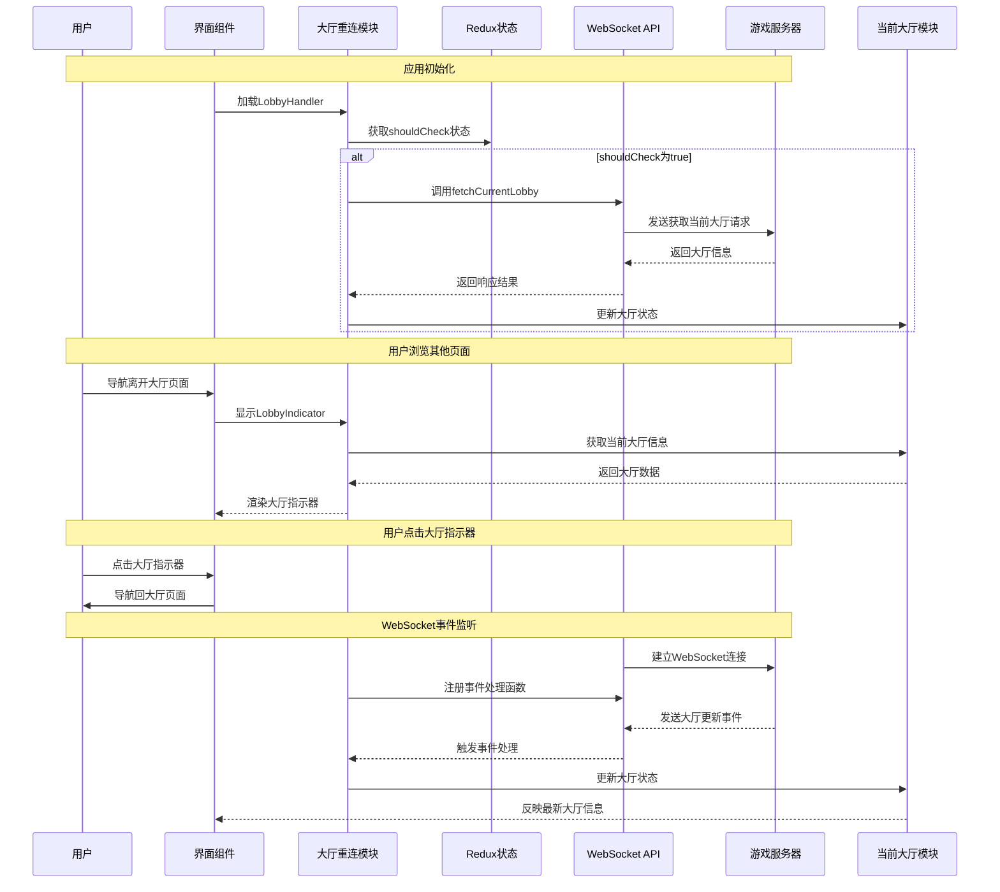

# 大厅重连功能模块 (Lobby Rejoin Feature)

## 模块概述

大厅重连模块提供了玩家从断线状态恢复并重新加入游戏大厅的关键功能。该模块负责检测用户大厅连接状态、处理重连请求、显示重连过程中的UI反馈，以及确保用户在断线后能够无缝回到游戏大厅，提高游戏体验的连续性和可靠性。

## 核心功能

- **连接状态检测**: 监控WebSocket连接状态和服务器心跳，及时发现断线情况
- **自动重连管理**: 使用优化的重连策略自动尝试重新建立与大厅的连接
- **大厅状态恢复**: 在重连成功后恢复用户在大厅中的状态和参与信息
- **UI状态反馈**: 提供视觉化的重连状态提示，增强用户体验
- **手动重连选项**: 在自动重连失败后提供手动重连功能
- **大厅指示器**: 当用户离开大厅页面时显示当前大厅状态的指示器

## 关键组件

### 模型层 (model/)

- **index.ts**: 统一导出模型相关的actions、selectors和store
- **store.ts**: 定义大厅重连状态管理的Redux store，包含shouldCheck等核心状态
- **actions.ts**: 提供fetchCurrentLobby和setShouldCheck等异步和同步操作
- **selectors.ts**: 定义从全局状态中获取大厅重连状态的选择器函数

### 用户界面 (ui/)

- **lobby-handler.tsx**: 负责监控大厅连接状态并自动触发重连过程的高阶组件
- **lobby-indicator.tsx**: 当用户浏览其他页面时在屏幕底部显示当前大厅信息的组件
- **index.ts**: 导出UI组件，简化模块引用

## 依赖关系

### 内部依赖

- **@features/current-lobby**: 获取和管理当前大厅状态信息
- **@app/store**: 访问全局Redux状态和dispatch方法
- **@shared/lib/ws**: WebSocket连接管理和事件处理
- **@shared/api/match**: 提供大厅相关API接口，如getCurrentLobby

### 外部依赖

- **@reduxjs/toolkit**: 用于创建异步thunk和管理重连状态
- **react-router-dom**: 处理页面导航和路由信息获取
- **@mui/material**: 提供UI组件和样式系统
- **react-redux**: 连接Redux状态与React组件

## 使用示例

### 基本集成方式

```tsx
import { LobbyHandler, LobbyIndicator } from '@features/lobby-rejoin';

// 在应用根组件中使用LobbyHandler
const App = () => {
  return (
    <LobbyHandler>
      {/* 应用内容 */}
      <Routes>
        <Route path="/" element={<HomePage />} />
        <Route path="/lobby/:id" element={<LobbyPage />} />
        {/* 其他路由 */}
      </Routes>
      
      {/* 在所有页面显示大厅指示器 */}
      <LobbyIndicator />
    </LobbyHandler>
  );
};
```

### 手动控制重连检查

```tsx
import { useDispatch } from 'react-redux';
import { lobbyRejoinModel } from '@features/lobby-rejoin';

const LobbySettings = () => {
  const dispatch = useDispatch();
  
  // 禁用自动重连检查
  const disableAutoRejoin = () => {
    dispatch(lobbyRejoinModel.actions.setShouldCheck({ 
      shouldCheck: false 
    }));
  };
  
  // 启用自动重连检查
  const enableAutoRejoin = () => {
    dispatch(lobbyRejoinModel.actions.setShouldCheck({ 
      shouldCheck: true 
    }));
  };
  
  return (
    <div>
      <h2>大厅设置</h2>
      <button onClick={enableAutoRejoin}>启用自动重连</button>
      <button onClick={disableAutoRejoin}>禁用自动重连</button>
    </div>
  );
};
```

## 架构说明

大厅重连模块采用了分层架构设计，主要分为模型层(model)和UI层(ui)：

1. **模型层**：负责状态管理和业务逻辑
   - 使用Redux管理重连相关状态
   - 通过异步thunk执行重连操作
   - 提供选择器获取当前重连状态

2. **UI层**：负责用户界面展示和交互
   - LobbyHandler自动处理重连检查和状态恢复
   - LobbyIndicator提供当前大厅的视觉提示
   
3. **工作流程**：
   - 模块启动时，LobbyHandler检查shouldCheck状态
   - 如果shouldCheck为true，自动调用fetchCurrentLobby获取当前大厅信息
   - 获取成功后，通过currentLobbyModel.actions.setLobby更新大厅状态
   - LobbyIndicator监听WebSocket事件，在用户离开大厅页面时显示大厅状态

## 功能模块泳道流程图



## 主要数据模型

```typescript
// 大厅重连状态
export interface LobbyRejoinStore {
  shouldCheck: boolean; // 是否应该检查并尝试重连
}

// 设置是否检查的payload
export interface SetShouldCheckPayload {
  shouldCheck: boolean;
}

// 获取当前大厅的响应
export type FetchCurrentLobbyPayload = {
  lobby: {
    id: string;
    participants: Array<{
      id: string;
      avatar: string;
      username: string;
    }>;
    // 其他大厅信息
  }
};
```

## 开发指南

1. **WebSocket事件处理**: 确保正确注册和注销WebSocket事件处理器，避免内存泄漏
2. **导航集成**: 在用户点击大厅指示器时，正确导航回大厅页面
3. **状态一致性**: 保持当前大厅状态和重连状态的一致性
4. **错误处理**: 妥善处理重连过程中可能出现的错误
5. **性能优化**: 避免不必要的重渲染和状态更新

## 可能的改进方向

- **离线模式**: 增加临时离线状态，允许用户在断线期间查看历史信息
- **连接状态监测优化**: 实现更精确的连接状态监测，减少误判
- **重连策略配置**: 允许用户或开发者自定义重连策略和参数
- **多大厅支持**: 扩展支持用户同时参与多个大厅
- **断线原因分析**: 添加断线原因分析，提供更针对性的解决方案 