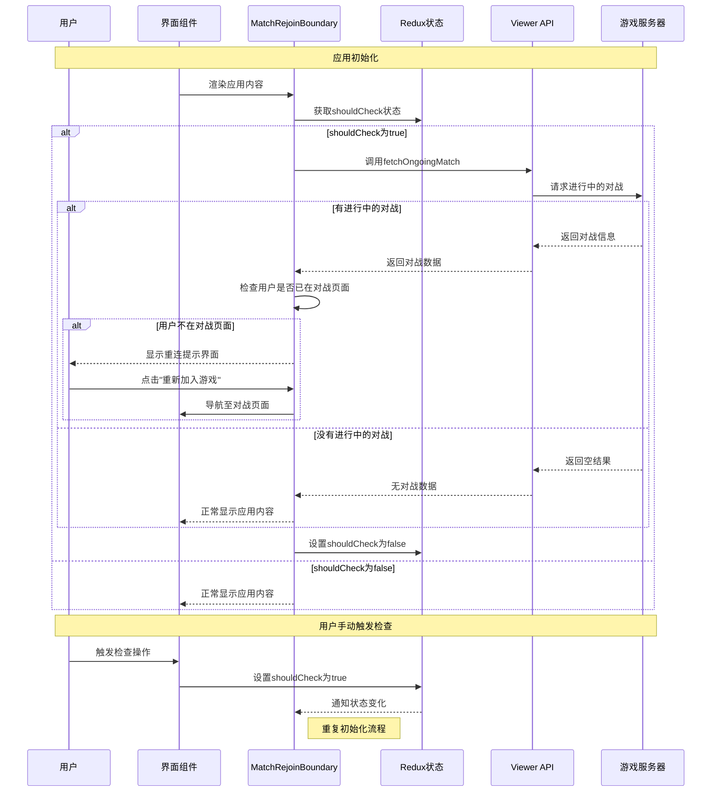

# 对战重连功能模块 (Match Rejoin Feature)

## 模块概述

对战重连模块提供了玩家在游戏对战中断线后能够无缝重新加入的关键功能。该模块负责检测玩家是否有进行中的对战，提示用户重新加入，并处理重连流程，确保玩家能够从断点继续游戏，保持游戏体验的连续性和公平性。

## 核心功能

- **对战状态检测**: 自动检测用户是否有未完成的对战，避免玩家无意中放弃已开始的游戏
- **无缝重连提示**: 在用户尝试进行其他操作前，提供明确的对战重连提示和选项
- **状态恢复管理**: 在重连时恢复对战的完整状态，包括卡牌位置、回合信息和游戏进度
- **断线保护机制**: 为断线玩家提供合理的保护期，防止因短暂网络问题导致游戏中断
- **全局监控**: 在应用的任何部分都能检测到未完成对战，确保用户不会意外丢失游戏进度
- **用户体验优化**: 提供友好的UI反馈，清晰展示重连状态和选项，减少用户焦虑

## 关键组件

### 模型层 (model/)

- **index.ts**: 统一导出模型相关的actions、selectors和store
- **store.ts**: 定义对战重连状态管理的Redux store，维护shouldCheck状态
- **actions.ts**: 提供setShouldCheck等操作，控制对战检测行为
- **selectors.ts**: 定义从全局状态中获取对战重连相关状态的选择器函数

### 用户界面 (ui/)

- **match-rejoin-boundary.tsx**: 高阶边界组件，检测用户是否有未完成的对战，并提供重连界面
- **index.ts**: 导出UI组件，简化模块使用

## 依赖关系

### 内部依赖

- **@entities/viewer**: 获取用户信息和进行中的对战状态
- **@entities/card**: 提供游戏卡牌UI组件
- **@app/store**: 访问全局Redux状态和dispatch方法
- **@shared/api/common**: 使用OngoingMatch等通用类型定义

### 外部依赖

- **@reduxjs/toolkit**: 用于创建Reducer和Action Creator
- **react-router-dom**: 处理导航和路由参数获取
- **@mui/material**: 提供UI组件和样式系统
- **react-redux**: 连接Redux状态与React组件

## 使用示例

### 基本集成方式

```tsx
import { MatchRejoinBoundary } from '@features/match-rejoin';

// 在应用根组件中使用MatchRejoinBoundary
function App() {
  return (
    <MatchRejoinBoundary>
      {/* 应用内容 */}
      <Routes>
        <Route path="/" element={<HomePage />} />
        <Route path="/:matchId" element={<MatchPage />} />
        {/* 其他路由 */}
      </Routes>
    </MatchRejoinBoundary>
  );
}
```

### 控制对战检测行为

```tsx
import { useDispatch } from 'react-redux';
import { matchRejoinModel } from '@features/match-rejoin';

function GameSettings() {
  const dispatch = useDispatch();
  
  // 手动触发对战检测
  const checkForOngoingMatches = () => {
    dispatch(matchRejoinModel.actions.setShouldCheck({ 
      shouldCheck: true 
    }));
  };
  
  // 禁用对战检测
  const disableMatchCheck = () => {
    dispatch(matchRejoinModel.actions.setShouldCheck({ 
      shouldCheck: false 
    }));
  };
  
  return (
    <div>
      <h2>游戏设置</h2>
      <button onClick={checkForOngoingMatches}>检查进行中的对战</button>
      <button onClick={disableMatchCheck}>禁用对战检测</button>
    </div>
  );
}
```

## 架构说明

对战重连模块采用了防御性编程和用户体验优先的设计理念：

1. **边界组件模式**: 使用MatchRejoinBoundary作为高阶容器，包裹整个应用内容
   - 应用启动时自动检查是否有进行中的对战
   - 检测到进行中的对战时，阻止用户访问其他功能，优先提示重连

2. **状态管理**: 
   - 使用Redux存储shouldCheck状态，控制检测行为
   - 通过viewer模块获取用户当前的对战信息
   - 检测结果缓存在组件状态中，避免重复检查

3. **工作流程**:
   - 组件加载时检查shouldCheck状态
   - 若为true，调用fetchOngoingMatch获取进行中的对战
   - 若用户不在对战页面，显示重连提示界面
   - 用户选择重连时，导航至对战页面
   - 完成检查后，重置shouldCheck状态为false

## 功能模块泳道流程图



## 主要数据模型

```typescript
// 对战重连状态存储
export interface MatchRejoinStore {
  shouldCheck: boolean; // 是否应该检查进行中的对战
}

// 设置是否检查的payload
export interface SetShouldCheckPayload {
  shouldCheck: boolean;
}

// 进行中的对战
interface OngoingMatch {
  id: string;
  players: Player[];
  spectators: Spectator[];
  createdAt: string;
  status: string;
  // 其他对战相关字段
}

// 对战中的玩家
interface Player {
  id: string;
  username: string;
  avatar: string;
  // 其他玩家相关字段
}
```

## 开发指南

1. **用户体验优先**: 确保重连提示清晰友好，避免用户混淆或沮丧
2. **性能考量**: 避免不必要的重复检查，只在关键时刻触发检测
3. **路由集成**: 正确处理导航逻辑，确保用户能够顺利返回对战
4. **错误处理**: 妥善处理API调用可能的失败情况，避免阻塞用户操作
5. **组件兼容性**: 确保MatchRejoinBoundary能与不同的路由配置和应用结构协同工作

## 可能的改进方向

- **游戏状态快照**: 在断线时保存详细的游戏状态快照，提高重连后的状态恢复准确性
- **自动重连机制**: 实现断线后的自动重连尝试，减少用户手动操作
- **多设备同步**: 支持在不同设备间无缝切换对战，提高用户便利性
- **断线原因分析**: 添加断线原因检测，提供针对性的提示和解决方案
- **对战回放功能**: 提供在对战中断后查看回放的选项，帮助用户了解错过的内容 