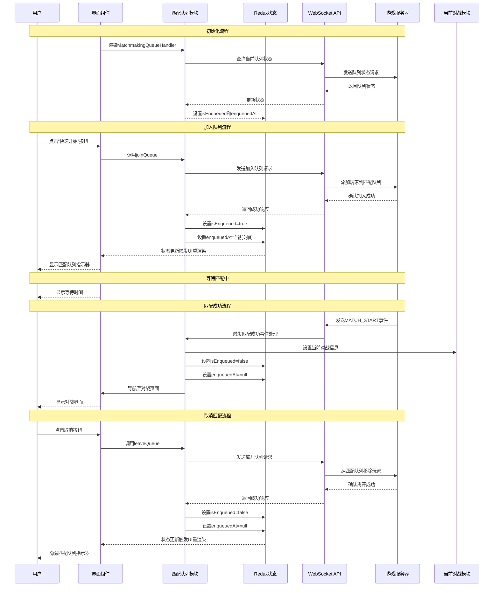

# 匹配队列功能模块 (Matchmaking Queue Feature)

## 模块概述

匹配队列模块管理玩家寻找对战对手的自动匹配流程，是游戏快速开始体验的核心功能。该模块允许玩家加入匹配队列等待系统自动分配对手，跟踪匹配状态，处理匹配成功后的游戏启动，并向玩家提供直观的队列状态反馈。作为游戏核心体验的重要环节，该模块确保玩家能够便捷地进入游戏对战。

## 核心功能

- **队列管理**: 处理玩家加入和离开匹配队列的请求，维护队列状态
- **等待时间追踪**: 记录并显示玩家在队列中的等待时间，提供视觉反馈
- **匹配通知**: 接收并处理服务器发送的匹配成功事件
- **游戏启动**: 匹配成功后自动导航至对战页面并准备游戏会话
- **用户界面反馈**: 通过指示器组件向玩家提供当前队列状态的实时视觉反馈
- **状态持久化**: 支持在页面刷新或临时断线后恢复匹配队列状态

## 关键组件

### 模型层 (model/)

- **index.ts**: 统一导出模型相关的actions、selectors和store，形成完整API
- **store.ts**: 定义匹配队列状态管理的Redux store，维护isEnqueued和enqueuedAt等状态
- **actions.ts**: 提供队列操作，包括fetchQueueStatus、joinQueue和leaveQueue等异步action
- **selectors.ts**: 定义从全局状态中获取队列状态的选择器函数，如isEnqueued和enqueuedAt

### 用户界面 (ui/)

- **matchmaking-queue-handler.tsx**: 监听匹配事件并处理匹配成功后的游戏启动逻辑的容器组件
- **matchmaking-queue-indicator.tsx**: 在玩家处于队列中时显示等待时间和状态的指示器组件
- **index.ts**: 导出UI组件，简化引用

## 依赖关系

### 内部依赖

- **@features/current-match**: 获取和设置当前对战信息，用于匹配成功后的状态更新
- **@features/current-lobby**: 管理当前大厅状态，在匹配成功后清除大厅信息
- **@app/store**: 访问全局Redux状态和dispatch方法
- **@shared/lib/ws**: WebSocket连接管理和事件处理，用于接收匹配事件

### 外部依赖

- **@reduxjs/toolkit**: 用于创建异步thunk和管理队列状态
- **react-router-dom**: 处理匹配成功后的路由导航
- **@mui/material**: 提供UI组件和样式系统
- **dayjs**: 用于格式化和显示等待时间

## 使用示例

### 基本集成方式

```tsx
import { MatchmakingQueueHandler, MatchmakingQueueIndicator } from '@features/matchmaking-queue';

// 在应用根组件中使用MatchmakingQueueHandler
function App() {
  return (
    <MatchmakingQueueHandler>
      {/* 应用内容 */}
      <Routes>
        <Route path="/" element={<HomePage />} />
        <Route path="/:matchId" element={<MatchPage />} />
        {/* 其他路由 */}
      </Routes>

      {/* 显示队列状态指示器 */}
      <MatchmakingQueueIndicator />
    </MatchmakingQueueHandler>
  );
}
```

### 加入和离开队列

```tsx
import { useDispatch, useSelector } from 'react-redux';
import { matchmakingQueueModel } from '@features/matchmaking-queue';

function QuickPlayButton() {
  const dispatch = useDispatch();
  
  // 获取当前队列状态
  const isEnqueued = useSelector(matchmakingQueueModel.selectors.isEnqueued);
  
  // 处理加入队列
  const handleJoinQueue = () => {
    dispatch(matchmakingQueueModel.actions.joinQueue());
    // 设置加入时间戳
    dispatch(matchmakingQueueModel.actions.setEnqueuedAt({ 
      enqueuedAt: Date.now() 
    }));
    // 更新队列状态
    dispatch(matchmakingQueueModel.actions.setIsEnqueued({ 
      isEnqueued: true 
    }));
  };
  
  // 处理离开队列
  const handleLeaveQueue = () => {
    dispatch(matchmakingQueueModel.actions.leaveQueue());
    // 更新队列状态
    dispatch(matchmakingQueueModel.actions.setIsEnqueued({ 
      isEnqueued: false 
    }));
    // 清除加入时间戳
    dispatch(matchmakingQueueModel.actions.setEnqueuedAt({ 
      enqueuedAt: null 
    }));
  };
  
  return (
    <button onClick={isEnqueued ? handleLeaveQueue : handleJoinQueue}>
      {isEnqueued ? '取消匹配' : '快速开始'}
    </button>
  );
}
```

## 架构说明

匹配队列模块采用了组件-状态分离的设计原则，包含以下架构特点：

1. **数据层分离**: 
   - 通过Redux管理匹配队列状态，包括是否在队列中和加入时间
   - 使用异步thunk处理与服务器的通信，如加入队列和离开队列

2. **事件驱动设计**:
   - 通过WebSocket监听服务器事件，如匹配成功事件
   - 事件处理器负责更新状态和触发导航

3. **UI组件解耦**:
   - MatchmakingQueueHandler作为容器组件处理事件和状态管理
   - MatchmakingQueueIndicator作为展示组件显示队列状态和等待时间

4. **工作流程**:
   - 应用初始化时检查当前队列状态
   - 用户加入队列时更新状态并开始计时
   - 匹配成功时接收服务器事件，更新对战信息并导航至对战页面
   - 用户可随时取消匹配，退出队列

## 功能模块泳道流程图



## 主要数据模型

```typescript
// 匹配队列状态存储
export interface MatchmakingQueueStore {
  isEnqueued: boolean;           // 是否在匹配队列中
  enqueuedAt: number | null;     // 加入队列的时间戳
}

// 加入队列的Action载荷
export type JoinQueueOptions = void;
export type JoinQueuePayload = void;

// 离开队列的Action载荷
export type LeaveQueueOptions = void;
export type LeaveQueuePayload = void;

// 设置队列状态的Action载荷
export interface SetIsEnqueuedPayload {
  isEnqueued: boolean;
}

// 设置加入时间的Action载荷
export interface SetEnqueuedAtPayload {
  enqueuedAt: number | null;
}

// 获取队列状态的响应
export interface FetchQueueStatusPayload {
  isEnqueued: boolean;
  enqueuedAt: number | null;
}

// 匹配开始事件选项
export interface MatchStartEventOptions {
  match: {
    id: string;
    // 其他匹配相关字段
  };
}
```

## 开发指南

1. **用户体验优化**: 确保队列状态变更时有清晰的视觉反馈，减少用户等待焦虑
2. **错误处理**: 加入和离开队列时处理可能的网络错误，提供友好的错误消息
3. **状态同步**: 确保客户端队列状态与服务器保持一致，定期同步队列状态
4. **性能考虑**: 避免不必要的重渲染，特别是在等待时间更新时
5. **断线重连**: 实现在网络临时断开后重新建立的队列状态恢复机制

## 可能的改进方向

- **队列位置估计**: 向玩家提供在队列中的大致位置和预计等待时间
- **匹配偏好设置**: 允许玩家设置匹配偏好，如游戏模式和技能水平范围
- **多队列支持**: 扩展支持同时存在的多个队列类型，如休闲、排名和特殊活动
- **匹配历史记录**: 提供匹配历史和统计数据，如平均等待时间和成功率
- **预约匹配**: 允许玩家预约特定时间的匹配，减少繁忙时段的等待时间 