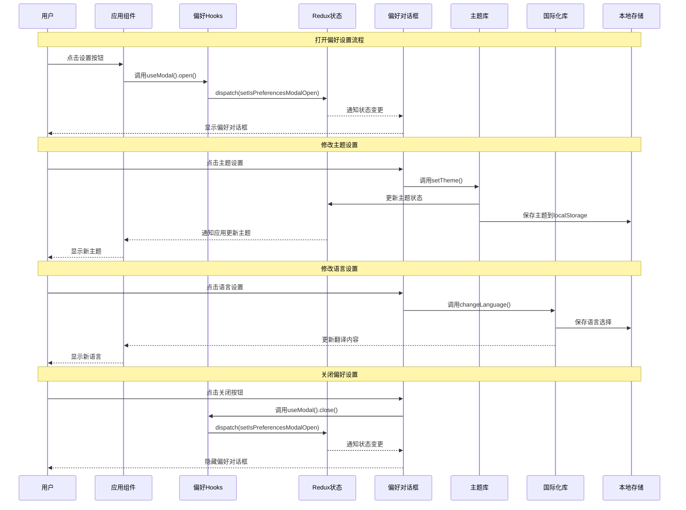

# 用户偏好功能模块 (Preferences Feature)

## 模块概述

用户偏好模块管理玩家的个性化设置和界面选项，提供一个集中的方式来控制应用的主题、语言和其他用户体验相关设置。该模块通过提供统一的偏好管理界面和状态管理，确保整个应用中用户设置的一致性，增强了游戏的可访问性和个性化体验。

## 核心功能

- **主题切换**: 提供浅色和深色主题之间的切换，适应不同的环境和用户视觉偏好
- **语言管理**: 支持多语言切换功能，实现游戏的国际化和本地化
- **偏好持久化**: 将用户的偏好设置保存到本地存储，在会话之间保持设置的一致性
- **模态对话框**: 提供易于访问的偏好设置界面，可以从应用任何地方打开
- **中心化状态**: 使用Redux统一管理偏好状态，确保应用各部分的一致访问
- **钩子API**: 提供简洁的React钩子，便于组件访问和修改偏好设置

## 关键组件

### 模型层 (model/)

- **index.ts**: 统一导出偏好模型相关的actions、selectors、store和hooks
- **store.ts**: 定义偏好状态管理的Redux store，维护isPreferencesModalOpen等核心状态
- **actions.ts**: 提供setIsPreferencesModalOpen等操作，控制偏好设置界面的显示和隐藏
- **selectors.ts**: 定义从全局状态中获取偏好设置相关状态的选择器
- **hooks.ts**: 提供useModal等钩子函数，简化组件对偏好功能的访问

### 用户界面 (ui/)

- **preferences-modal.tsx**: 偏好设置的模态对话框组件，包含主题和语言设置等选项
- **index.ts**: 导出PreferencesModal组件，简化模块引用

## 依赖关系

### 内部依赖

- **@app/store**: 访问全局Redux状态和dispatch方法
- **@shared/lib/theming**: 提供主题管理功能和相关操作
- **@shared/lib/i18n**: 提供国际化和语言管理功能
- **@shared/ui/atoms**: 使用Button、H3等基础UI组件
- **@shared/lib/layout**: 提供布局组件和工具

### 外部依赖

- **@reduxjs/toolkit**: 用于创建reducer和action creator
- **react-i18next**: 提供国际化和翻译功能
- **@mui/material**: 提供Modal和样式系统
- **react-redux**: 连接Redux状态与React组件

## 使用示例

### 打开偏好设置对话框

```tsx
import { useDispatch } from 'react-redux';
import { preferencesModel } from '@features/preferences';

function SettingsButton() {
  const { open } = preferencesModel.useModal();
  
  return (
    <button onClick={open}>
      打开设置
    </button>
  );
}
```

### 集成偏好对话框组件

```tsx
import { PreferencesModal } from '@features/preferences';

function App() {
  return (
    <div className="app">
      {/* 应用其他内容 */}
      
      {/* 在应用根级别添加偏好对话框 */}
      <PreferencesModal />
    </div>
  );
}
```

## 架构说明

用户偏好模块采用了基于Redux的状态管理模式，并通过React钩子提供简洁的API：

1. **状态管理**: 
   - 使用Redux存储偏好设置状态，包括模态对话框是否打开
   - 通过actions和reducers管理状态更新
   - 使用selectors访问当前状态值

2. **UI组件**: 
   - PreferencesModal是一个独立的模态对话框组件
   - 可以从应用的任何部分触发打开或关闭
   - 使用MUI的Modal组件实现模态行为

3. **Hook API**:
   - useModal hook封装了打开/关闭偏好对话框的逻辑
   - 提供简洁的接口，消除了组件直接与Redux交互的复杂性

4. **偏好实现**:
   - 主题切换直接与theming模块交互
   - 语言切换利用react-i18next的i18n实例
   - 设置保存到localStorage实现持久化

## 功能模块泳道流程图



## 主要数据模型

```typescript
// 偏好状态存储
export interface PreferencesStore {
  isPreferencesModalOpen: boolean;  // 偏好模态对话框是否打开
}

// 设置模态对话框可见性的载荷
export interface SetIsPreferencesMoadlOpenPayload {
  isOpen: boolean;
}

// 主题类型
export type Theme = 'light' | 'dark';

// 可用语言
export const langs = ['en', 'zh', 'ru', ...]; // 支持的语言代码列表
```

## 开发指南

1. **模态访问**: 使用`preferencesModel.useModal()`钩子来控制偏好对话框的显示/隐藏
2. **主题设置**: 通过`themingModel.actions.setTheme()`修改主题，记得同时更新localStorage
3. **语言选择**: 使用`i18n.changeLanguage()`切换语言，确保支持的语言在langs数组中定义
4. **组件集成**: 在应用根组件中添加`<PreferencesModal />`组件以确保偏好对话框可全局访问
5. **状态一致性**: 确保偏好设置的状态变更同时更新本地存储和Redux状态，保持一致性

## 可能的改进方向

- **更多偏好选项**: 扩展支持更多个性化设置，如音频设置、游戏玩法偏好、键盘快捷键等
- **偏好分类**: 将偏好设置按功能区域分类，提供更有组织的设置界面
- **设置预设**: 添加预设配置选项，允许快速应用一组相关设置
- **云端同步**: 实现偏好设置的云端同步，使用户在不同设备上保持一致设置
- **偏好导入/导出**: 提供导出和导入偏好设置的功能，便于备份和分享 