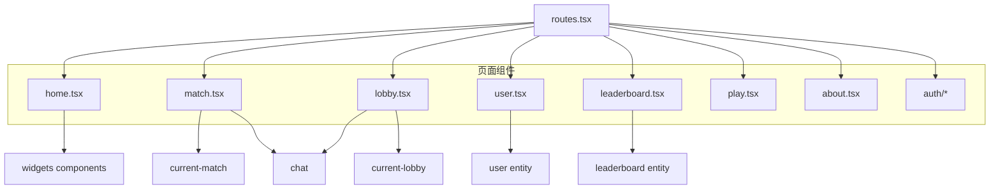
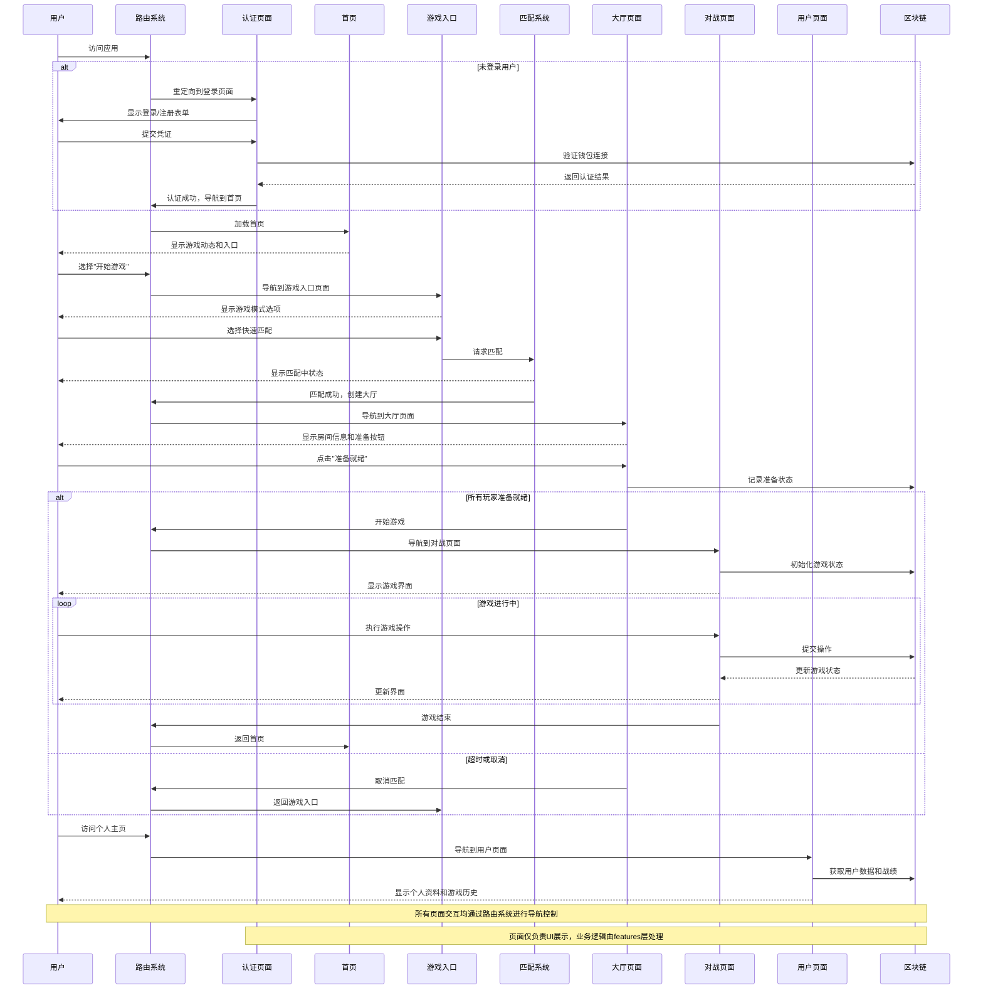

# 页面层 (Pages Layer)

## 模块概述

页面层是应用程序的视图层，作为用户界面的主要入口点，它将特性、实体和部件组合成完整的页面视图。每个页面表示应用中的一个主要导航目标，通过路由系统进行访问和切换。页面层关注布局和组件组合，将复杂业务逻辑委托给底层特性模块。

## 核心功能

- **页面组合**: 集成多个功能模块和UI组件成完整界面
- **路由管理**: 定义应用的导航结构和路由规则
- **布局组织**: 负责页面级别的布局和响应式设计
- **权限控制**: 实现基于用户权限的页面访问限制
- **页面状态同步**: 协调页面中不同组件的状态和数据流

## 关键组件

### 路由配置 (routes.tsx)
- 定义应用的完整路由结构
- 实现公共路由和受保护路由
- 处理路由重定向和嵌套路由
- 配置页面过渡效果

### 首页 (home.tsx)
- 游戏平台的主入口页面
- 展示游戏亮点和最新动态
- 提供主要功能导航入口
- 展示用户个性化内容

### 对战页面 (match.tsx)
- 呈现完整的游戏对战界面
- 集成游戏棋盘和控制组件
- 显示玩家信息和对战状态
- 提供游戏内聊天和互动功能

### 大厅页面 (lobby.tsx)
- 管理游戏大厅界面
- 显示房间成员和设置
- 集成聊天和社交功能
- 提供游戏准备和启动控制

### 用户页面 (user.tsx)
- 展示用户个人资料
- 显示游戏历史和统计数据
- 提供账户设置和管理
- 展示用户成就和社交信息

### 排行榜页面 (leaderboard.tsx)
- 显示全局游戏排名
- 提供排名筛选和搜索
- 展示详细的玩家统计
- 显示赛季和历史数据

### 游戏入口 (play.tsx)
- 提供各种游戏模式入口
- 展示活跃游戏大厅
- 访问匹配系统
- 显示最近游戏记录

### 关于页面 (about.tsx)
- 展示游戏背景和故事
- 提供游戏规则说明
- 显示开发团队信息
- 包含帮助和支持链接

### 认证页面 (auth/)
- 用户登录和注册表单
- 密码恢复功能
- 第三方认证选项
- 认证流程状态管理

## 依赖关系

页面层依赖于：
- **features**层提供的业务功能组件
- **entities**层提供的业务数据和基础组件
- **widgets**层提供的复合UI组件
- **shared**层提供的工具和基础UI

页面层是应用的最顶层视图，直接由**app**层的路由系统渲染。

## 使用示例

```tsx
// 一个典型的页面组件
import React, { useEffect } from 'react';
import { useDispatch } from 'react-redux';
import { Header } from '@widgets';
import { MatchBoard } from '@features/current-match';
import { ChatPanel } from '@features/chat';
import { PlayerInfo } from '@entities/user';
import { matchModel } from '@entities/match';
import { PageLayout } from '@shared/ui/templates';

const MatchPage: React.FC = () => {
  const dispatch = useDispatch();
  const matchId = useParams<{ id: string }>().id;
  
  // 初始化页面数据
  useEffect(() => {
    dispatch(matchModel.actions.loadMatch(matchId));
    return () => {
      dispatch(matchModel.actions.cleanup());
    };
  }, [matchId, dispatch]);
  
  return (
    <PageLayout>
      <Header />
      <div className="match-content">
        <div className="match-main">
          <MatchBoard />
        </div>
        <div className="match-sidebar">
          <PlayerInfo />
          <ChatPanel scope="match" />
        </div>
      </div>
    </PageLayout>
  );
};

export default MatchPage;
```

## 架构说明

页面层作为用户界面的顶层视图，将其他层的功能组合成完整的用户体验：



页面作为应用的集成点，负责组织布局和用户导航流程，同时将具体的业务逻辑委托给特性层和实体层，保持清晰的关注点分离。

## 功能模块泳道流程图

以下泳道图展示了用户在页面间的导航流程以及各页面与功能模块间的交互关系：

