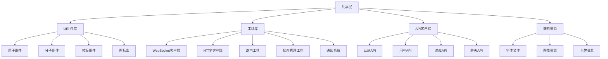
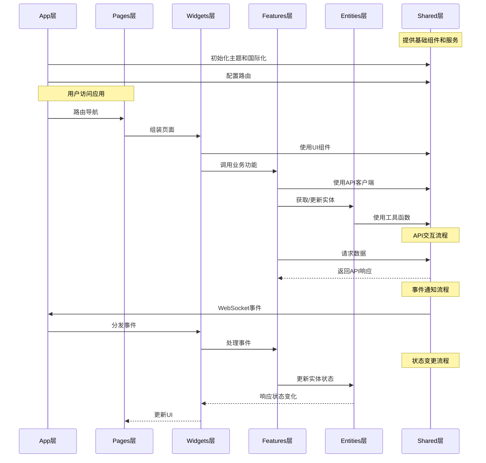

# 共享层 (Shared Layer)

## 模块概述

共享层是应用的技术基础设施，提供跨应用可重用的工具、组件和服务。作为架构中唯一不依赖其他层的模块，它为整个应用提供通用功能和基础构建块，确保代码的一致性和可维护性。共享层遵循"通用优先"原则，专注于与具体业务逻辑无关的功能实现。

## 核心功能

- **UI组件库**: 提供从原子级到复合级的可重用UI组件，支持主题和样式定制
- **工具函数集**: 提供常用的工具函数、格式化、验证和数据处理功能
- **API客户端**: 封装与后端通信的接口，提供统一的数据获取和错误处理
- **资源管理**: 组织和提供应用的静态资源，如图像、图标和字体
- **基础设施服务**: 实现通知、主题、国际化等跨应用服务

## 关键组件

### UI模块 (ui/)
- **atoms/**: 基础UI元素如按钮、输入框、图标等原子级组件
- **molecules/**: 复合UI组件如表单、卡片、对话框等分子级组件
- **templates/**: 页面布局模板和框架组件
- **icons/**: 应用通用图标集合

### 工具库 (lib/)
- **ws/**: WebSocket客户端实时通信处理工具
- **request/**: HTTP客户端网络请求和响应处理
- **routing/**: 路由导航和参数处理工具
- **theming/**: 主题系统和样式管理
- **notification/**: 应用内通知和提醒服务
- **i18n/**: 国际化和本地化支持
- **styling/**: CSS样式工具和样式系统
- **modal/**: 模态窗口和对话框管理
- **debounce/**: 防抖动和节流函数

### API客户端 (api/)
- **auth.ts**: 用户认证和授权接口
- **user.ts**: 用户资料和设置接口
- **match.ts**: 游戏对战和状态接口
- **chat.ts**: 消息和聊天功能接口
- **leaderboard.ts**: 排名和统计数据接口
- **profile.ts**: 用户个人资料接口
- **common.ts**: 通用API功能和工具

### 静态资源 (assets/)
- **fonts/**: 应用使用的字体资源
- **cards/**: 游戏卡牌图像集
- **bg-light.svg/bg-dark.svg**: 主题背景图像
- **avatar.png**: 默认用户头像

## 依赖关系

共享层不依赖于项目中的其他层，是整个应用的基础：
- **entities**层使用共享层的UI组件和工具
- **features**层使用共享层的API客户端和状态管理工具
- **widgets**层使用共享层的UI构建块和样式系统
- **pages**层使用共享层的布局模板和路由工具
- **app**层使用共享层的配置和全局服务

## 使用示例

### UI组件使用
```tsx
import { Button, Card, TextField } from '@shared/ui/atoms';
import { Modal } from '@shared/ui/molecules';
import { useTheme } from '@shared/lib/theming';

const ProfileForm: React.FC = () => {
  const { theme } = useTheme();
  
  return (
    <Card 
      elevation={2}
      padding="medium"
      background={theme.colors.background.secondary}
    >
      <TextField
        label="用户名"
        placeholder="请输入用户名"
        validation={{ required: '用户名必填' }}
      />
      <Button variant="primary" onClick={handleSubmit}>
        保存更改
      </Button>
    </Card>
  );
};
```

### 工具和API使用
```tsx
import { userApi } from '@shared/api/user';
import { useNotification } from '@shared/lib/notification';
import { formatDate } from '@shared/lib/formatting';

const ProfileData: React.FC = () => {
  const { showNotification } = useNotification();
  const [userData, setUserData] = useState(null);
  
  const fetchUserData = async () => {
    try {
      const data = await userApi.getUserProfile(userId);
      setUserData(data);
    } catch (error) {
      showNotification({
        type: 'error',
        message: '获取用户数据失败'
      });
    }
  };
  
  return userData ? (
    <div>
      <h3>{userData.username}</h3>
      <p>加入时间: {formatDate(userData.joinedAt, 'YYYY-MM-DD')}</p>
    </div>
  ) : null;
};
```

## 架构说明

共享层作为整个应用的基础设施，提供了一系列可重用的工具和组件：



共享层采用模块化设计，每个子模块都有明确的职责和边界，确保功能的内聚性和可重用性。设计上遵循"通用优先"原则，避免包含特定于业务领域的逻辑。

## 功能模块泳道流程图



共享层作为应用的基础设施层，被其他所有层直接使用。它不包含业务逻辑，仅提供通用功能，确保了代码的可重用性和架构的清晰性。通过严格的模块化和清晰的职责划分，共享层降低了应用的复杂度，提高了开发效率和代码质量。 