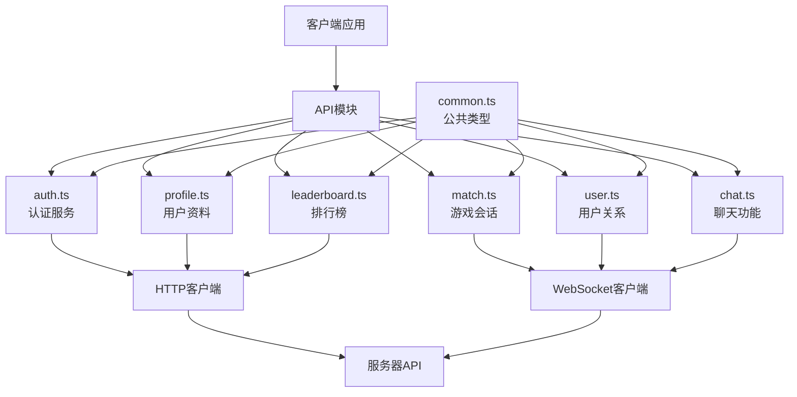
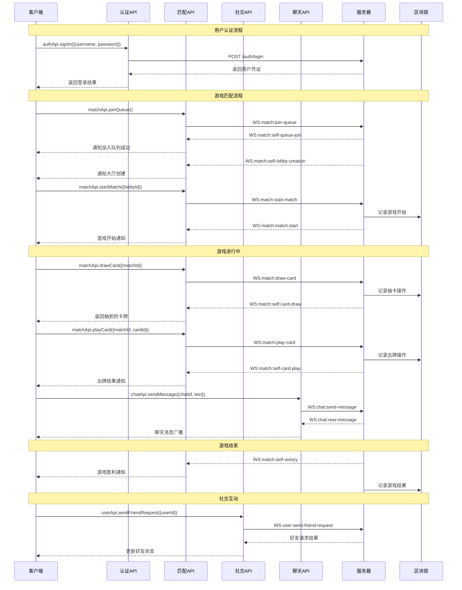

# API模块

## 模块概述

API模块是爆炸猫游戏平台的核心通信层，负责处理客户端与服务器之间的所有数据交互。它提供了一组结构化的接口，用于处理游戏逻辑、用户认证、聊天功能和用户数据管理，使前端应用能够无缝地与后端服务进行通信。

## 核心功能

- **游戏会话管理**: 提供创建、加入、观战和离开游戏会话的接口，处理玩家轮次和游戏状态变化
- **卡牌操作**: 支持抽牌、出牌、特殊技能卡使用等游戏核心操作的API函数
- **用户认证**: 提供用户注册、登录和身份验证功能，确保安全的用户会话管理
- **社交互动**: 实现好友关系管理、聊天功能和社交邀请系统
- **资料管理**: 提供用户资料、游戏统计和历史记录查询功能
- **排行榜服务**: 支持获取全球玩家排名和竞技数据

## 关键组件

### 游戏匹配与会话 (match.ts)

- **matchEvents**: 定义所有游戏相关WebSocket事件，包括客户端和服务器事件
- **joinQueue/leaveQueue**: 处理玩家排队匹配功能
- **joinMatch/spectateMatch**: 提供加入游戏或观战的功能
- **drawCard/playCard**: 核心游戏操作API
- **createLobby/joinLobbyAsPlayer**: 房间创建与加入功能
- **多种游戏特殊操作**: 如defuse、insertExplodingKitten等爆炸猫特有卡牌操作

### 用户认证 (auth.ts)

- **getCredentials**: 获取当前用户认证信息
- **signUp/signIn**: 用户注册和登录功能
- **verifyUsername**: 用户名有效性验证
- **认证响应处理**: 标准化的认证响应结构

### 用户配置文件 (profile.ts)

- **getMe/getUser**: 获取自身或其他用户的个人资料
- **getMyMatches/getMatches**: 查询用户的历史对战记录
- **getMyFriends/getFriends**: 获取好友列表信息
- **getStats**: 获取用户游戏统计数据
- **getMyOngoingMatch**: 查询当前进行中的游戏

### 用户关系 (user.ts)

- **userEvents**: 用户相关WebSocket事件定义
- **sendFriendRequest/acceptFriendRequest**: 好友请求发送与接受
- **revokeFriendRequest/rejectFriendRequest**: 撤销或拒绝好友请求
- **unfriend**: 解除好友关系
- **getInterim**: 获取用户临时状态信息

### 聊天功能 (chat.ts)

- **chatEvents**: 聊天相关WebSocket事件定义
- **sendMessage**: 发送聊天消息
- **joinChat**: 加入特定聊天频道
- **消息传递**: 实时聊天消息的处理与显示

### 排行榜 (leaderboard.ts)

- **getLeaderboard**: 获取全球玩家排行榜数据
- **排名查询**: 基于胜率和分数的玩家排名

### 通用类型 (common.ts)

- **数据模型定义**: 定义系统中使用的所有核心数据结构
- **用户类型**: User、Profile等用户相关数据结构
- **游戏类型**: Match、OngoingMatch等游戏相关数据结构
- **卡牌定义**: CardUnit、CardName等游戏卡牌类型
- **活动状态**: 定义用户在线状态和活动类型

## 依赖关系

API模块主要依赖于以下组件：

- **@shared/lib/request**: HTTP请求工具，用于REST API通信
- **@shared/lib/ws**: WebSocket通信工具，用于实时事件
- **@entities/card**: 卡牌实体定义
- **@entities/match**: 游戏匹配相关实体
- **@entities/lobby**: 游戏大厅实体定义
- **@entities/user**: 用户实体定义
- **axios**: 用于发起HTTP请求的外部库

## 使用示例

```typescript
// 用户认证示例
import { authApi } from '@shared/api';

// 用户登录
const handleLogin = async (username: string, password: string) => {
  try {
    const response = await authApi.signIn({ username, password });
    const { credentials } = response.data;
    // 处理登录成功
    console.log(`用户 ${credentials.username} 登录成功`);
  } catch (error) {
    // 处理登录失败
    console.error('登录失败:', error);
  }
};

// 游戏操作示例
import { matchApi, matchEvents } from '@shared/api';

// 加入游戏匹配队列
const joinGameQueue = () => {
  matchApi.joinQueue();
  
  // 监听匹配成功事件
  ws.on(matchEvents.client.SELF_LOBBY_CREATION, (data) => {
    console.log('成功创建游戏大厅:', data.lobby.id);
  });
};

// 出牌操作
const playCardAction = (matchId: string, cardId: string) => {
  matchApi.playCard({ matchId, cardId });
};
```

## 架构说明

API模块采用模块化设计，清晰划分不同功能域，同时保持一致的接口风格：



每个API模块负责自己的功能域，共享通用类型定义，并通过HTTP或WebSocket与服务器通信。所有模块都遵循一致的接口设计模式，提供易于使用的API函数和类型化的请求/响应结构。

## 功能模块泳道流程图

以下泳道流程图展示了游戏进行过程中API模块的交互流程：

