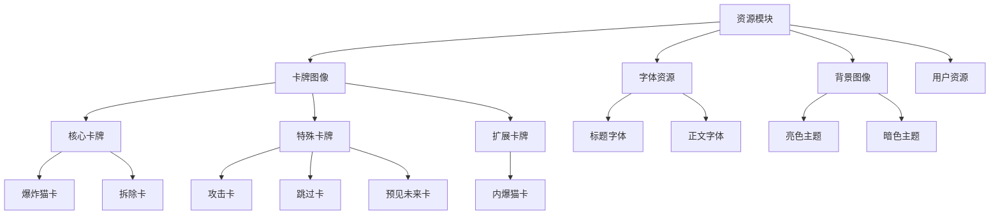
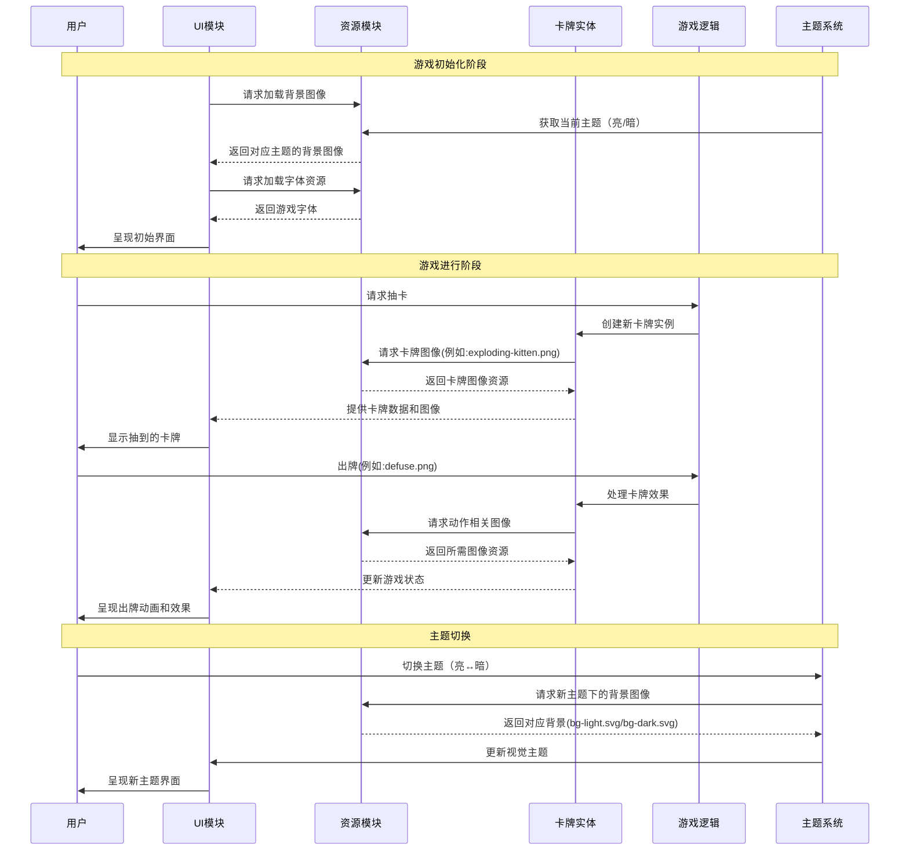

# 资源模块 (Assets Module)

## 模块概述

资源模块是爆炸猫游戏平台的静态资源中心，提供图像、字体、卡牌艺术和背景等多种媒体资源。它负责管理游戏的视觉表现元素，确保在不同设备和主题下呈现一致的用户体验，同时优化资源加载和管理，提升游戏性能和视觉品质。

## 核心功能

- **游戏卡牌资源**: 提供完整的爆炸猫游戏卡牌艺术，包括基础卡牌和特殊卡牌的高质量图像
- **用户界面资源**: 支持游戏界面的视觉元素，如背景、头像和图标等，适配不同主题的视觉风格
- **字体管理**: 提供游戏中使用的特殊字体，确保文本显示的一致性和品牌特性
- **主题适配**: 为亮色和暗色主题提供相应的视觉资源，提升用户体验
- **资源优化**: 通过合理的格式选择和压缩技术，优化资源加载性能和内存占用
- **统一引用**: 提供结构化的资源引用方式，简化开发流程和维护工作

## 关键组件

### 卡牌图像 (cards/)

- **exploding-kitten.png**: 爆炸猫核心卡牌图像，游戏中的关键道具
- **defuse.png**: 拆除牌图像，用于拆除爆炸猫卡
- **attack.png**: 攻击牌图像，用于转移游戏回合
- **skip.png**: 跳过牌图像，用于跳过当前回合
- **nope.png**: 否定牌图像，用于阻止其他玩家的行动
- **shuffle.png**: 洗牌牌图像，用于重新排列牌堆
- **see-the-future.png**: 预见未来牌图像，用于查看牌堆顶部卡牌
- **imploding-kitten.png**: 内爆猫牌图像，扩展包专属卡牌
- **其他特殊卡牌**: 包括alter-the-future、bury、draw-from-the-bottom等特殊功能卡牌

### 字体资源 (fonts/)

- **Bungee-Regular.woff2**: 主标题和强调文本使用的特色字体
- **MiriamLibre-Regular.woff2**: 游戏主要正文和界面文本使用的字体
- **MiriamLibre-Bold.woff2**: 游戏中粗体文本使用的字体变体

### 背景资源

- **bg-light.svg**: 亮色主题下的游戏背景，提供明亮、友好的视觉环境
- **bg-dark.svg**: 暗色主题下的游戏背景，降低光线刺激，适合夜间使用

### 用户资源

- **avatar.png**: 默认用户头像，未设置自定义头像的用户显示此图像

## 依赖关系

资源模块主要被其他模块依赖，而非依赖其他模块：

- 被**ui**模块使用，提供基础界面元素的视觉表现
- 被**entities**模块使用，特别是card实体，提供卡牌的视觉表现
- 被**features**模块使用，增强游戏功能的视觉反馈
- 被**widgets**模块使用，构建复合界面组件的视觉层
- 被**app**模块使用，应用全局样式和主题

## 使用示例

```tsx
// 引入卡牌图像
import { ReactComponent as DefuseCard } from '@shared/assets/cards/defuse.png';
import { ReactComponent as ExplodingKittenCard } from '@shared/assets/cards/exploding-kitten.png';

// 卡牌组件示例
const CardDisplay = ({ cardType }) => {
  // 根据卡牌类型选择对应图像
  const getCardImage = () => {
    switch (cardType) {
      case 'defuse':
        return <DefuseCard className="card-image" />;
      case 'exploding-kitten':
        return <ExplodingKittenCard className="card-image" />;
      default:
        return null;
    }
  };
  
  return (
    <div className="card-container">
      {getCardImage()}
    </div>
  );
};

// 使用背景图像
import bgLight from '@shared/assets/bg-light.svg';
import bgDark from '@shared/assets/bg-dark.svg';
import { useTheme } from '@shared/lib/theme';

const GameBoard = () => {
  const { theme } = useTheme();
  const backgroundImage = theme === 'light' ? bgLight : bgDark;
  
  return (
    <div 
      className="game-board" 
      style={{ backgroundImage: `url(${backgroundImage})` }}
    >
      {/* 游戏内容 */}
    </div>
  );
};

// 使用字体
import '@shared/assets/fonts/index.css';

// 在CSS中使用字体
// global.css
/*
body {
  font-family: 'MiriamLibre', sans-serif;
}

h1, h2, h3 {
  font-family: 'Bungee', cursive;
}
*/
```

## 架构说明

资源模块采用分类组织的结构，将不同类型的资源按功能和用途进行归类：



资源模块的组织遵循清晰的分类结构，使得开发人员能够轻松地找到和使用所需资源。同时，资源的命名和组织方式也保持一致，便于维护和扩展。

## 功能模块泳道流程图

下面的泳道图展示了资源模块如何在游戏进行过程中与其他模块交互：



资源模块在游戏运行过程中充当静态资源的提供者，响应其他模块的资源请求，保证游戏视觉体验的一致性和高品质。通过与主题系统的配合，还能够提供响应式的主题切换体验。 