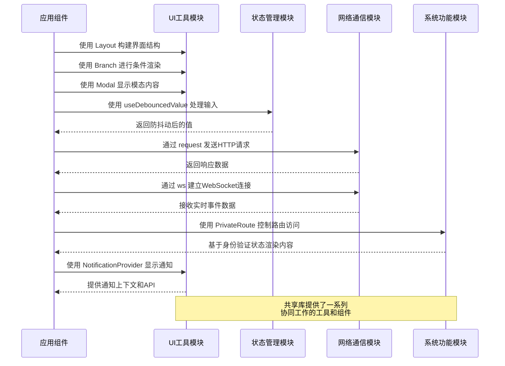

# 共享库模块 (Shared Library Module)

## 模块概述

共享库模块是应用程序的基础工具集合，提供了一系列可重用的功能组件、工具函数和实用程序，用于解决常见的开发问题。该模块为整个应用程序提供了统一的基础设施，简化了复杂任务的实现，确保了代码的一致性和可维护性，同时减少了重复代码。

## 核心功能

- **用户界面工具**: 提供布局系统、条件渲染组件和模态框等UI工具，简化界面构建
- **状态管理辅助**: 包含防抖动函数、WebSocket连接和通知系统，优化状态管理和用户交互
- **路由控制**: 实现受保护路由和公共路由组件，管理应用导航和访问控制
- **类型系统**: 提供类型定义和类型工具，增强类型安全性和开发体验
- **国际化支持**: 提供多语言支持工具，实现应用程序的国际化
- **样式工具**: 包含主题系统和样式辅助函数，确保视觉一致性
- **网络通信**: 封装请求和WebSocket功能，简化与后端的通信

## 关键组件

### 用户界面组件

- **branch/**: 提供条件渲染组件 `Branch`，简化基于条件的内容渲染
- **layout/**: 实现弹性布局系统，包含 `Row` 和 `Col` 组件，提供简洁的布局API
- **modal/**: 封装 MUI 模态框组件，提供自定义样式和简化的 API
- **notification/**: 提供通知系统，基于 notistack 实现统一的消息提示功能

### 工具函数

- **auxiliary/**: 提供常用辅助函数，如 `isNullish` 检查和单位转换工具
- **debounce/**: 实现防抖动钩子 `useDebouncedValue`，优化输入处理和搜索等操作
- **dom/**: 提供 DOM 操作工具，如 `isOverlap` 用于检测元素重叠
- **regex/**: 包含常用正则表达式模式，如用户名验证等
- **request/**: 封装 Axios 实例，统一处理 HTTP 请求和错误响应

### 系统功能

- **ws/**: 提供 WebSocket 客户端，支持实时通信和事件处理
- **routing/**: 实现 `PrivateRoute` 和 `PublicOnlyRoute` 组件，控制路由访问权限
- **i18n/**: 提供国际化支持，管理多语言文本资源
- **theming/**: 实现主题系统，支持明暗主题切换
- **styling/**: 提供样式工具和类型，统一应用样式处理
- **typings/**: 定义通用类型和类型工具，增强类型安全性

## 依赖关系

### 内部依赖

- **@app/store**: 访问全局状态存储
- **@features/auth**: 使用认证模块功能进行路由保护

### 外部依赖

- **React**: 组件构建和钩子函数
- **React Router**: 路由管理
- **Material-UI**: UI组件和样式工具
- **Axios**: HTTP请求处理
- **Socket.io-client**: WebSocket客户端
- **Notistack**: 通知系统

## 使用示例

### 条件渲染 (Branch)

```tsx
import { Branch } from '@shared/lib/branch';

// 使用 Branch 组件进行条件渲染
const UserInfo = ({ user, isLoading }) => (
  <div className="user-container">
    <Branch if={isLoading}>
      <LoadingSpinner />
      <Branch if={user !== null}>
        <UserDetails user={user} />
        <LoginPrompt message="请登录查看用户信息" />
      </Branch>
    </Branch>
  </div>
);
```

### 布局系统 (Layout)

```tsx
import { Layout } from '@shared/lib/layout';

// 使用弹性布局组件构建界面
const ProfileCard = ({ userData }) => (
  <Layout.Col 
    p={2} 
    gap={1.5} 
    w="100%" 
    align="center"
    style={{ backgroundColor: '#f5f5f5', borderRadius: '8px' }}
  >
    <Avatar src={userData.avatar} />
    <h2>{userData.name}</h2>
    
    <Layout.Row justify="space-between" w="100%" gap={1}>
      <StatisticBox label="胜场" value={userData.wins} />
      <StatisticBox label="败场" value={userData.losses} />
      <StatisticBox label="积分" value={userData.score} />
    </Layout.Row>
    
    <Button fullWidth variant="contained">查看详情</Button>
  </Layout.Col>
);
```

### 路由保护 (Routing)

```tsx
import { PrivateRoute, PublicOnlyRoute } from '@shared/lib/routing';
import { Routes, Route } from 'react-router-dom';

// 设置受保护路由和公共路由
const AppRoutes = () => (
  <Routes>
    <Route path="/" element={<HomePage />} />
    
    <Route path="/login" element={
      <PublicOnlyRoute>
        <LoginPage />
      </PublicOnlyRoute>
    } />
    
    <Route path="/dashboard" element={
      <PrivateRoute>
        <DashboardPage />
      </PrivateRoute>
    } />
    
    <Route path="/settings" element={
      <PrivateRoute>
        <SettingsPage />
      </PrivateRoute>
    } />
  </Routes>
);
```

### WebSocket通信 (WS)

```tsx
import { ws } from '@shared/lib/ws';
import { useEffect, useState } from 'react';

// 使用WebSocket进行实时通信
const LiveChat = ({ roomId }) => {
  const [messages, setMessages] = useState([]);
  
  useEffect(() => {
    // 监听消息事件
    ws.on('chat:message', (newMessage) => {
      setMessages((prev) => [...prev, newMessage]);
    });
    
    // 加入聊天室
    ws.emit('chat:join', { roomId })
      .catch(error => console.error('Failed to join chat:', error));
    
    return () => {
      // 离开时清理监听器
      ws.off(['chat:message']);
      ws.emit('chat:leave', { roomId })
        .catch(error => console.error('Failed to leave chat:', error));
    };
  }, [roomId]);
  
  const sendMessage = (content) => {
    ws.emit('chat:send', { roomId, content })
      .catch(error => console.error('Failed to send message:', error));
  };
  
  return (
    <div className="chat-container">
      <MessageList messages={messages} />
      <MessageInput onSend={sendMessage} />
    </div>
  );
};
```

### 通知系统 (Notification)

```tsx
import { NotificationProvider } from '@shared/lib/notification';
import { useSnackbar } from 'notistack';

// 设置通知提供者
const App = () => (
  <NotificationProvider>
    <MainContent />
  </NotificationProvider>
);

// 使用通知
const GameResultPage = ({ gameResult }) => {
  const { enqueueSnackbar } = useSnackbar();
  
  useEffect(() => {
    if (gameResult.isWin) {
      enqueueSnackbar('恭喜您赢得了比赛!', { variant: 'success' });
    } else {
      enqueueSnackbar('很遗憾，本次比赛失败', { variant: 'error' });
    }
  }, [gameResult]);
  
  return <GameSummary data={gameResult} />;
};
```

### 防抖动钩子 (Debounce)

```tsx
import { useDebouncedValue } from '@shared/lib/debounce';
import { useState } from 'react';

// 使用防抖动优化搜索体验
const SearchBar = ({ onSearch }) => {
  const [searchTerm, setSearchTerm] = useState('');
  const debouncedSearchTerm = useDebouncedValue(searchTerm, 500);
  
  // 只有当防抖动值改变时才触发搜索
  useEffect(() => {
    if (debouncedSearchTerm) {
      onSearch(debouncedSearchTerm);
    }
  }, [debouncedSearchTerm, onSearch]);
  
  return (
    <input
      type="text"
      value={searchTerm}
      onChange={(e) => setSearchTerm(e.target.value)}
      placeholder="搜索..."
    />
  );
};
```

## 架构说明

共享库模块采用了模块化和功能分离的架构设计：

1. 每个子模块专注于解决特定的问题域
2. 所有组件和工具都设计为最小依赖和高度可重用
3. 模块之间保持低耦合，遵循单一职责原则
4. 提供统一的、一致的API风格
5. 适当抽象底层实现细节，简化调用方式
6. 支持按需导入，优化应用性能
7. 强调类型安全和声明式编程风格

这种设计使得开发者可以轻松找到并使用所需的工具，同时确保了整个应用程序的代码质量和一致性。

## 功能模块泳道流程图



## 模块组织

共享库模块采用了扁平化的目录结构，每个子模块都包含自己的功能实现和导出：

```
lib/
├── auxiliary/     # 辅助工具函数
├── branch/        # 条件渲染组件
├── debounce/      # 防抖动工具
├── dom/           # DOM操作工具
├── i18n/          # 国际化支持
├── layout/        # 布局系统
├── modal/         # 模态框组件
├── notification/  # 通知系统
├── regex/         # 正则表达式工具
├── request/       # HTTP请求工具
├── routing/       # 路由控制组件
├── styling/       # 样式工具
├── theming/       # 主题系统
├── typings/       # 类型定义
├── ws/            # WebSocket客户端
└── README.md      # 本文档
```

## 最佳实践

1. 使用 `Layout` 组件构建界面而非直接使用原生 flex 布局，以保持一致性和可维护性
2. 优先选择声明式的 `Branch` 组件进行条件渲染，而非使用多层三元运算符或复杂的逻辑判断
3. 对于需要处理用户输入的场景，使用 `useDebouncedValue` 防止频繁触发昂贵操作
4. 使用 `PrivateRoute` 和 `PublicOnlyRoute` 保护需要认证的路由，而非在每个页面中编写重复的认证逻辑
5. 利用 `NotificationProvider` 和 `useSnackbar` 显示统一风格的通知，而非自定义的提示框
6. 优先使用提供的 `styling` 和 `theming` 工具保持样式一致性，避免内联样式和硬编码的值
7. 使用 `ws` 模块处理实时通信，确保一致的事件处理和错误管理
8. 避免直接修改共享库中的代码，需要扩展功能时可以通过组合或包装现有组件实现 