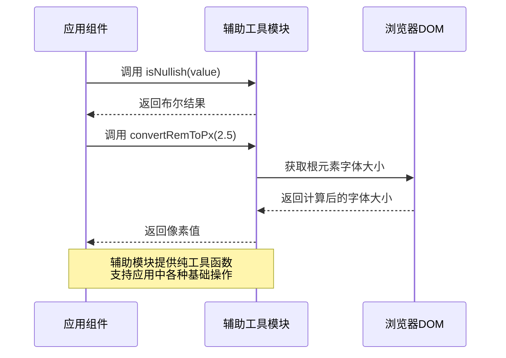

# 辅助工具模块 (Auxiliary Module)

## 模块概述

辅助工具模块提供了一系列通用的工具函数，用于处理常见的数据验证、转换和格式化操作。该模块作为应用程序的基础工具库，为其他模块提供了简单但必要的实用功能，以简化开发流程并确保代码一致性。

## 核心功能

- **空值检测**: 提供统一的方法来检测 `null` 和 `undefined` 值，确保数据有效性验证的一致性
- **单位转换**: 支持不同单位之间的转换，如 rem 到像素，确保跨设备和布局的一致性显示
- **类型验证**: 提供各种数据类型的检查函数，简化类型安全相关的验证逻辑
- **格式化工具**: 包含用于格式化数据的实用函数，确保数据展示和处理的标准化

## 关键组件

### 工具函数

- **is-nullish.tsx**: 提供 `isNullish` 函数，用于检查值是否为 `null` 或 `undefined`，简化空值验证
- **convert.ts**: 包含 `convertRemToPx` 函数，将 rem 单位转换为像素，支持响应式设计计算
- **index.ts**: 集中导出模块中的所有工具函数，提供统一的访问点

## 依赖关系

### 内部依赖

- 该模块是基础工具库，通常不依赖其他内部模块

### 外部依赖

- **DOM API**: 使用 `document.documentElement` 和 `getComputedStyle` 进行计算
- **TypeScript**: 利用类型系统提供类型安全

## 使用示例

### 空值检测

```tsx
import { isNullish } from '@shared/lib/auxiliary';

// 在渲染前检查数据
const UserProfile = ({ userData }) => {
  // 避免处理或渲染无效数据
  if (isNullish(userData)) {
    return <LoadingPlaceholder />;
  }
  
  return <UserCard data={userData} />;
};
```

### 单位转换

```tsx
import { convertRemToPx } from '@shared/lib/auxiliary';

// 计算动态高度
const calculateContainerHeight = () => {
  // 将设计中的 2.5rem 转换为实际像素
  const headerHeight = convertRemToPx(2.5); 
  return `calc(100vh - ${headerHeight}px)`;
};
```

## 架构说明

辅助工具模块采用了函数式编程风格，提供纯函数以确保可预测性和可测试性。每个函数都设计为单一职责，最小化副作用，并确保高度可重用性。

该模块作为应用程序的基础层，为上层模块提供通用功能支持，遵循以下原则：
1. 简单性：每个功能都专注于解决一个特定问题
2. 可测试性：纯函数设计便于单元测试
3. 可发现性：通过统一的入口点暴露所有功能
4. 一致性：提供标准化的接口和行为

## 功能模块泳道流程图



## 最佳实践

1. 优先使用 `isNullish` 而非直接比较 `null` 或 `undefined`，确保代码一致性
2. 在响应式设计中使用 `convertRemToPx` 进行单位转换，而非硬编码像素值
3. 通过索引文件导入函数，而非直接从特定文件导入，以便于将来的重构
4. 当需要添加新的通用工具函数时，应先考虑是否适合放在此模块中 