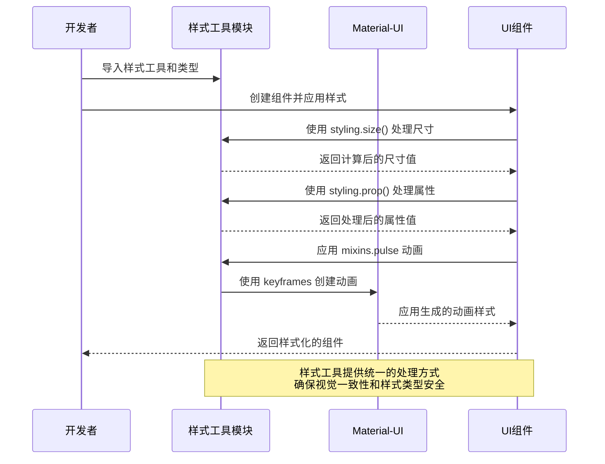

# 样式工具模块 (Styling Module)

## 模块概述

样式工具模块提供了一套统一的样式工具和类型定义，用于简化应用程序的样式管理和确保视觉一致性。该模块与 MUI（Material-UI）框架协同工作，提供动画、样式计算和类型安全的样式属性，帮助开发者创建视觉上一致且具有响应式特性的用户界面。

## 核心功能

- **样式混合**: 提供可重用的样式片段和动画效果，如 `pulse` 动画，实现一致的视觉效果
- **样式工具函数**: 提供样式属性计算和转换工具，简化样式处理
- **类型安全**: 使用 TypeScript 类型定义确保样式属性的类型安全和可预测性
- **单位转换**: 自动处理尺寸单位转换，支持数字到 `rem` 的自动转换
- **风格一致性**: 通过统一的类型和工具，确保整个应用的样式一致性

## 关键组件

### 样式工具与混合

- **mixins.ts**: 定义可重用的样式混合和动画效果，如 `pulse` 脉动动画
- **tools.ts**: 提供样式工具函数，包括 `prop` 和 `size` 函数，用于处理属性默认值和尺寸转换
- **typings.ts**: 定义样式相关的 TypeScript 类型，如尺寸、强调色、颜色类型等
- **index.ts**: 统一导出所有样式工具和类型，方便统一导入使用

## 依赖关系

### 内部依赖

- 该模块可能与 **theming** 模块协同工作，确保样式与主题系统的一致性

### 外部依赖

- **MUI (Material-UI)**: 使用 MUI 的 `keyframes` 工具创建动画效果
- **TypeScript**: 利用类型系统确保样式属性的类型安全

## 使用示例

### 使用混合动画

```tsx
import { styling } from '@shared/lib/styling';
import { styled } from '@mui/material/styles';

// 创建一个带脉动动画的按钮
const PulsingButton = styled('button')({
  padding: '8px 16px',
  background: 'linear-gradient(45deg, #FE6B8B 30%, #FF8E53 90%)',
  border: 0,
  borderRadius: 3,
  boxShadow: '0 3px 5px 2px rgba(255, 105, 135, .3)',
  color: 'white',
  '&:hover': {
    animation: `${styling.mixins.pulse} 1.5s infinite ease-in-out`
  }
});

// 在组件中使用
const ActionButton = () => {
  return (
    <PulsingButton>
      点击执行操作
    </PulsingButton>
  );
};
```

### 使用样式工具函数

```tsx
import { styling } from '@shared/lib/styling';
import { styled } from '@mui/material/styles';
import { StylingSize } from '@shared/lib/styling';

// 组件接口定义
interface CardProps {
  padding?: StylingSize;
  margin?: StylingSize;
  highlighted?: boolean;
}

// 使用工具函数创建组件
const Card = styled('div')<CardProps>(({ padding, margin, highlighted }) => ({
  padding: styling.size(padding || 1),
  margin: styling.size(margin || 0.5),
  border: '1px solid #e0e0e0',
  borderRadius: '4px',
  backgroundColor: styling.prop(highlighted ? '#f5f5f5' : '#ffffff'),
  boxShadow: styling.prop(highlighted ? '0 2px 8px rgba(0,0,0,0.1)' : 'none'),
  transition: 'all 0.3s ease'
}));

// 在组件中使用
const ProductCard = ({ product, isSelected }) => {
  return (
    <Card 
      padding={1.5} 
      margin={1} 
      highlighted={isSelected}
    >
      <h3>{product.name}</h3>
      <p>{product.description}</p>
      <div className="price">{product.price}</div>
    </Card>
  );
};
```

### 使用样式类型

```tsx
import React from 'react';
import { 
  StylingEmphasis, 
  StylingColorType, 
  StylingFontWeight,
  StylingTextTransform 
} from '@shared/lib/styling';
import { styled } from '@mui/material/styles';

// 定义类型安全的文本组件
interface TextProps {
  emphasis?: StylingEmphasis;
  colorType?: StylingColorType;
  fontWeight?: StylingFontWeight;
  textTransform?: StylingTextTransform;
}

// 创建样式化组件
const StyledText = styled('span')<TextProps>(({
  theme,
  emphasis = 'primary',
  colorType,
  fontWeight = 400,
  textTransform = 'none'
}) => ({
  color: colorType 
    ? theme.palette[colorType].main 
    : (emphasis === 'primary' ? theme.palette.text.primary : theme.palette.text.secondary),
  fontWeight,
  textTransform
}));

// 在组件中使用
const StatusMessage: React.FC<{ status: string, message: string }> = ({ status, message }) => {
  let colorType: StylingColorType = 'info';
  
  if (status === 'error') colorType = 'error';
  if (status === 'success') colorType = 'success';
  if (status === 'warning') colorType = 'warning';
  
  return (
    <div className="status-container">
      <StyledText 
        colorType={colorType} 
        fontWeight={600} 
        textTransform="capitalize"
      >
        {status}:
      </StyledText>
      <StyledText emphasis="secondary">
        {message}
      </StyledText>
    </div>
  );
};
```

## 架构说明

样式工具模块采用了简洁而功能丰富的架构设计：

1. **工具函数优先**: 提供轻量级的纯函数，用于样式计算和转换，避免复杂的对象层次结构
2. **类型安全**: 利用 TypeScript 类型系统，确保样式属性的类型安全和一致性
3. **与 MUI 集成**: 与 Material-UI 框架无缝协作，增强默认样式能力
4. **高复用性**: 设计可重用的样式片段和工具，减少重复代码
5. **低耦合**: 与具体组件实现解耦，提高灵活性和可维护性

该模块作为应用程序样式系统的基础工具集，为其他模块提供了一致的样式处理方式，提高了整个代码库的样式一致性和开发效率。

## 功能模块泳道流程图



## 样式类型详解

```typescript
// StylingSize - 表示尺寸的类型，可以是字符串或数字
// 数字会被转换为对应的 rem 值
export type StylingSize = string | number;

// StylingEmphasis - 表示文本强调程度
export type StylingEmphasis = "primary" | "secondary";

// StylingColorType - 表示颜色类型，对应 MUI 的调色板类型
export type StylingColorType = "error" | "warning" | "success" | "info";

// StylingFontWeight - 表示字体粗细，符合 CSS 规范
export type StylingFontWeight = 100 | 200 | 300 | 400 | 500 | 600 | 700 | 900;

// StylingTextTransform - 表示文本转换类型
export type StylingTextTransform = "lowercase" | "uppercase" | "none" | "capitalize";
```

## 工具函数详解

```typescript
// prop 函数 - 提供属性的安全处理，如果值不存在则返回 "initial"
export const prop = (value: any) => value || "initial";

// size 函数 - 处理尺寸值，数字转换为 rem，字符串保持不变
export const size = (value: StylingSize) =>
  typeof value === "number" ? `${value}rem` : value;
```

## 最佳实践

1. 使用 `styling.size()` 函数处理所有尺寸值，保持单位一致性，特别是对于需要响应式的尺寸
2. 使用 TypeScript 类型（如 `StylingColorType`）确保颜色类型安全，避免使用不受支持的颜色类型
3. 优先使用预定义的动画混合（如 `styling.mixins.pulse`）而非自定义的动画，确保视觉一致性
4. 将样式定义与组件逻辑分离，使用 `styled` 组件或 `sx` 属性应用样式
5. 避免硬编码样式值，使用样式工具函数处理所有动态样式属性
6. 结合 theming 模块使用，确保样式与主题变量的协调一致 