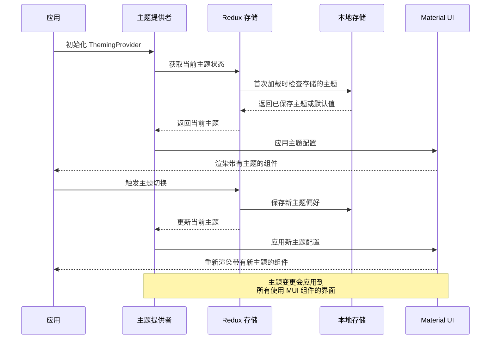

# 主题系统模块 (Theming Module)

## 模块概述

主题系统模块提供了一个完整的主题管理解决方案，使应用程序能够支持多种视觉主题（如明亮模式和深色模式）以及主题切换功能。该模块与 MUI（Material-UI）框架紧密集成，为组件提供一致的视觉样式，同时保持主题偏好的持久化存储。

## 核心功能

- **主题定义**: 提供完整的明亮和深色主题样式配置，包括颜色、排版和断点设置
- **主题切换**: 支持动态切换应用主题，并在本地存储中保存用户偏好
- **状态管理**: 使用 Redux 管理主题状态，实现跨组件的一致性主题应用
- **样式集成**: 与 MUI ThemeProvider 紧密集成，确保整个应用中样式的一致性
- **调色板调整**: 提供自动计算和调整调色板颜色的工具，确保色彩对比度和一致性

## 关键组件

### 提供者组件

- **theming-provider.tsx**: 核心主题提供者组件，包装 MUI 的 ThemeProvider，根据当前主题状态应用相应的主题配置

### 库和工具 (lib/)

- **typings.ts**: 定义主题相关的类型，如 `Theme` 类型（"light" | "dark"）
- **palette.ts**: 提供调色板调整工具，用于计算和设置主题色彩的衍生色
- **themes/**: 包含主题定义文件：
  - **common.ts**: 定义所有主题共享的基础样式，如主色、次色、排版和断点
  - **light.ts**: 定义明亮主题特有的样式配置
  - **dark.ts**: 定义深色主题特有的样式配置
  - **index.ts**: 将不同主题组合并导出为统一的主题字典

### 模型层 (model/)

- **actions.ts**: 定义主题相关的 Redux action，如 `setTheme` 动作
- **hooks.ts**: 提供自定义 hooks，如 `useTheme` 用于在组件中获取当前主题
- **selectors.ts**: 定义从 Redux 状态中选择主题数据的选择器
- **store.ts**: 配置主题 Redux reducer，管理主题状态并处理主题切换操作
- **index.ts**: 集中导出模型层组件，形成模型公共 API

## 依赖关系

### 内部依赖

- **@app/store**: 访问应用的 Redux 存储和 root state 类型
- **@shared/lib**: 可能使用其他共享库功能

### 外部依赖

- **React**: 组件构建和状态管理
- **Redux/Redux Toolkit**: 状态管理和 action 创建
- **MUI (Material-UI)**: 提供 ThemeProvider、createTheme 以及相关的主题工具
- **localStorage API**: 用于持久化存储用户主题偏好

## 使用示例

### 在应用中设置主题提供者

```tsx
import { ThemingProvider } from '@shared/lib/theming';

// 在应用根组件中包装
const App = () => (
  <ThemingProvider>
    {/* 应用的其他组件 */}
    <MainContent />
  </ThemingProvider>
);
```

### 切换主题

```tsx
import { useDispatch } from 'react-redux';
import { themingModel } from '@shared/lib/theming';

const ThemeToggle = () => {
  const dispatch = useDispatch();
  const currentTheme = themingModel.useTheme();
  
  const handleToggle = () => {
    // 切换主题并存储在 localStorage 中
    const newTheme = currentTheme === 'light' ? 'dark' : 'light';
    localStorage.setItem('theme', newTheme);
    dispatch(themingModel.actions.setTheme(newTheme));
  };
  
  return (
    <button onClick={handleToggle}>
      切换至{currentTheme === 'light' ? '深色' : '明亮'}主题
    </button>
  );
};
```

## 架构说明

主题系统模块采用了 Redux 状态管理模式结合 React Context API（通过 MUI 的 ThemeProvider），形成一个完整的主题管理解决方案：

1. Redux 层管理当前激活的主题选择，提供可预测的状态更新
2. ThemeProvider 将主题配置应用到 MUI 组件树
3. 本地存储保证用户主题偏好的持久化
4. MUI 的 theme 对象定义所有样式变量和组件外观

模块内部遵循了清晰的关注点分离：
- Model 层处理状态管理和业务逻辑
- Lib 层定义主题配置和类型
- Provider 组件连接状态和 UI

## 功能模块泳道流程图



## 主题数据模型

```typescript
// 主题类型
export type Theme = "light" | "dark";

// 主题状态
export interface ThemingReducer {
  theme: Theme;
}

// MUI 调色板配置示例（简化）
interface PaletteConfig {
  mode: 'light' | 'dark';
  primary: {
    main: string;
    light?: string;
    dark?: string;
    contrastText?: string;
  };
  secondary: {
    main: string;
    // ...其他属性
  };
  background: {
    default: string;
    paper: string;
  };
  // ...其他调色板配置
}
```

## 最佳实践

1. 在应用根组件使用 `ThemingProvider` 确保主题正确应用到整个组件树
2. 使用 `themingModel.useTheme()` 钩子获取当前主题，而不是直接访问 Redux 状态
3. 创建新组件时，避免硬编码颜色值，而是使用 MUI 的 theme 属性（如 `theme.palette.primary.main`）
4. 添加新的主题时，确保扩展 `Theme` 类型并在 themes 目录下创建对应的配置文件
5. 当需要在组件中访问主题对象时，使用 MUI 的 `useTheme` 钩子而非直接从 Redux 获取主题名称
6. 需要自定义主题相关逻辑时，在现有的 actions、selectors 基础上扩展，保持状态管理的一致性 