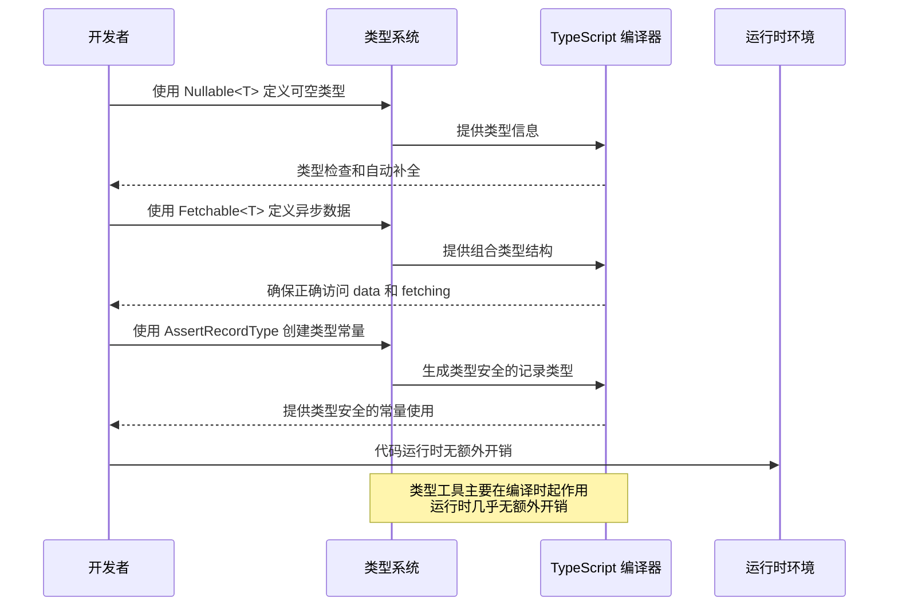

# 类型定义模块 (Typings Module)

## 模块概述

类型定义模块提供了一套通用的 TypeScript 类型工具和辅助函数，用于增强项目的类型安全性和开发体验。该模块负责定义跨应用程序可重用的类型模式、类型转换工具和类型验证函数，帮助开发者编写更加类型安全和自描述的代码。

## 核心功能

- **可空类型封装**: 提供 `Nullable` 类型工具，用于明确表示可能为空的数据类型
- **可获取状态封装**: 提供 `Fetchable` 类型工具，用于管理异步数据的加载状态和数据本身
- **类型断言工具**: 提供 `AssertRecordType` 函数，用于在编译时确保对象符合指定的记录类型结构
- **类型安全保障**: 通过统一的类型定义和工具，实现项目范围内的类型一致性和安全性
- **代码可读性增强**: 使用描述性的类型名称提高代码可读性和自文档化水平

## 关键组件

### 类型定义工具

- **nullable.ts**: 定义 `Nullable<T>` 类型，用于表示可以为 null 的值，增强空值处理的类型安全
- **fetchable.ts**: 定义 `Fetchable<T>` 类型，封装异步数据获取的状态和数据本身，简化异步状态管理
- **assert-record-type.ts**: 提供 `AssertRecordType` 函数，用于在编译时验证对象的类型结构，增强类型检查
- **index.ts**: 统一导出所有类型工具，为应用程序提供一致的类型系统入口点

## 依赖关系

### 内部依赖

- 该模块是基础类型工具库，通常不依赖其他内部模块

### 外部依赖

- **TypeScript**: 利用 TypeScript 的类型系统实现类型安全
- 无其他外部依赖，保持轻量级设计

## 使用示例

### Nullable 类型使用

```tsx
import { Nullable } from '@shared/lib/typings';

// 定义可能为 null 的用户数据
interface UserState {
  currentUser: Nullable<User>;
  selectedProfile: Nullable<Profile>;
}

// 在组件中安全使用
const UserComponent: React.FC<{ user: Nullable<User> }> = ({ user }) => {
  // 类型安全检查
  if (user === null) {
    return <div>请登录</div>;
  }
  
  return <div>欢迎, {user.name}</div>;
};
```

### Fetchable 类型使用

```tsx
import { Fetchable } from '@shared/lib/typings';

// 在状态管理中定义异步数据
interface AppState {
  users: Fetchable<User[]>;
  gameStats: Fetchable<GameStatistics>;
}

// 在 Redux reducer 中使用
const initialState: AppState = {
  users: {
    data: [],
    fetching: false
  },
  gameStats: {
    data: initialStats,
    fetching: false
  }
};

// 在组件中展示加载状态
const UserList: React.FC<{ users: Fetchable<User[]> }> = ({ users }) => {
  if (users.fetching) {
    return <LoadingSpinner />;
  }
  
  return (
    <ul>
      {users.data.map(user => (
        <li key={user.id}>{user.name}</li>
      ))}
    </ul>
  );
};
```

### AssertRecordType 使用

```tsx
import { AssertRecordType } from '@shared/lib/typings';

// 创建类型安全的字典对象
const CARD_TYPES = AssertRecordType<string>()({
  ATTACK: 'attack',
  DEFENSE: 'defense',
  SPECIAL: 'special',
  ITEM: 'item'
});

// 使用类型安全的常量
function getCardColor(type: typeof CARD_TYPES[keyof typeof CARD_TYPES]) {
  switch (type) {
    case CARD_TYPES.ATTACK:
      return 'red';
    case CARD_TYPES.DEFENSE:
      return 'blue';
    case CARD_TYPES.SPECIAL:
      return 'purple';
    case CARD_TYPES.ITEM:
      return 'green';
    default:
      // 编译时类型检查确保所有情况已处理
      const _exhaustiveCheck: never = type;
      return 'gray';
  }
}
```

## 架构说明

类型定义模块采用了简单但功能强大的设计理念：

1. 提供抽象但实用的类型工具，解决常见的类型模式问题
2. 尽量减少运行时开销，主要聚焦在编译时类型安全
3. 使用 TypeScript 的泛型系统实现高度可重用的类型工具
4. 保持简单性和可组合性，使类型工具可以相互组合创建更复杂的类型

该模块作为应用程序类型系统的基础，为其他模块提供了一致的类型表示方式，提高了整个代码库的类型安全性和可维护性。

## 功能模块泳道流程图



## 类型定义详解

```typescript
// Nullable<T> - 表示可能为 null 的类型
export type Nullable<T> = T | null;

// Fetchable<T> - 表示带有加载状态的异步数据
export type Fetchable<T> = {
  data: T;         // 实际数据
  fetching: boolean; // 加载状态标志
};

// AssertRecordType - 类型安全的记录断言函数
export const AssertRecordType =
  <T>() =>  // 指定记录值的类型
  <D extends Record<string, T>>(d: D) => // 验证记录符合指定类型
    d; // 返回原始对象，仅用于类型检查
```

## 最佳实践

1. 使用 `Nullable<T>` 替代直接使用 `T | null`，提高代码可读性和意图表达
2. 在管理异步数据状态时，优先使用 `Fetchable<T>` 确保状态和数据的一致管理
3. 使用 `AssertRecordType` 创建类型安全的常量对象，特别是对于字符串枚举和常量字典
4. 组合使用类型工具创建更复杂的类型，如 `Fetchable<Nullable<User[]>>`
5. 在定义 API 响应类型时，考虑使用这些类型工具增强类型安全
6. 避免过度使用类型转换（type casting），尽量利用类型工具提供的类型安全性

## 文件结构

```
typings/
├── README.md               # 本文档
├── index.ts                # 模块导出
├── api/                    # API相关类型
│   ├── index.ts            # API类型导出
│   ├── responses.ts        # API响应类型
│   ├── requests.ts         # API请求类型
│   ├── endpoints.ts        # API端点类型
│   └── errors.ts           # API错误类型
├── entities/               # 实体类型
│   ├── index.ts            # 实体类型导出
│   ├── user.ts             # 用户实体类型
│   ├── match.ts            # 对战实体类型
│   ├── card.ts             # 卡牌实体类型
│   ├── deck.ts             # 卡组实体类型
│   ├── battle.ts           # 战斗实体类型
│   └── chat.ts             # 聊天实体类型
├── state/                  # 状态类型
│   ├── index.ts            # 状态类型导出
│   ├── app-state.ts        # 应用状态类型
│   ├── feature-states.ts   # 功能模块状态类型
│   ├── actions.ts          # 操作类型
│   └── selectors.ts        # 选择器类型
├── ui/                     # UI类型
│   ├── index.ts            # UI类型导出
│   ├── props.ts            # 组件属性类型
│   ├── styles.ts           # 样式类型
│   ├── themes.ts           # 主题类型
│   └── events.ts           # 事件类型
├── enums/                  # 枚举类型
│   ├── index.ts            # 枚举类型导出
│   ├── game-enums.ts       # 游戏相关枚举
│   ├── api-enums.ts        # API相关枚举
│   └── ui-enums.ts         # UI相关枚举
├── utils/                  # 类型工具
│   ├── index.ts            # 类型工具导出
│   ├── type-guards.ts      # 类型保护工具
│   ├── type-utils.ts       # 类型操作工具
│   └── validation.ts       # 类型验证工具
└── config/                 # 配置类型
    ├── index.ts            # 配置类型导出
    ├── app-config.ts       # 应用配置类型
    └── feature-configs.ts  # 功能模块配置类型
```

## 功能特性

### 实体类型定义

游戏核心实体类型：

- **用户实体**: 用户账户、权限、设置相关类型
- **卡牌实体**: 卡牌属性、效果、分类相关类型
- **对战实体**: 对战状态、阶段、结果相关类型
- **卡组实体**: 卡组结构、限制、统计相关类型
- **战斗实体**: 战斗流程、单位、效果相关类型

### API接口类型

API通信相关类型：

- **请求类型**: API请求参数和请求体类型
- **响应类型**: API响应数据和错构体类型
- **端点类型**: API路径和服务类型定义
- **错误类型**: API错误和异常类型
- **状态类型**: API调用状态和结果类型

### 状态模型类型

状态管理相关类型：

- **全局状态**: 应用全局状态类型
- **模块状态**: 功能模块状态类型
- **操作类型**: Redux操作和负载类型
- **选择器类型**: 状态选择器类型
- **中间件类型**: Redux中间件相关类型

### UI类型定义

用户界面相关类型：

- **组件属性**: React组件Props类型
- **样式类型**: 样式和主题相关类型
- **事件类型**: UI事件和回调类型
- **布局类型**: 布局和容器相关类型
- **动画类型**: 动画和转场相关类型

### 类型工具

类型操作和验证工具：

- **类型保护**: 运行时类型检查工具
- **类型变换**: 类型转换和映射工具
- **类型验证**: 数据验证和约束工具
- **类型推断**: 类型推导和解析工具
- **类型别名**: 常用类型简化工具

## 设计原则

类型定义模块遵循以下设计原则：

1. **完整性** - 覆盖应用程序所有关键类型
2. **一致性** - 保持类型命名和结构一致
3. **单一真相源** - 每个类型只在一处定义
4. **可组合性** - 类型可以组合构建复杂类型
5. **可扩展性** - 易于扩展以适应需求变化
6. **可读性** - 类型定义清晰易懂
7. **严格性** - 尽可能严格的类型约束
8. **实用性** - 类型定义实用且易于使用

## 使用示例

### 实体类型使用

```tsx
import { Card, CardType, CardRarity, CardEffect } from '@shared/lib/typings/entities';

// 使用卡牌类型定义
const myCard: Card = {
  id: 'card-123',
  name: '火焰风暴',
  description: '对所有敌方单位造成2点伤害',
  type: CardType.SPELL,
  rarity: CardRarity.RARE,
  cost: 4,
  effects: [
    {
      type: CardEffect.DAMAGE,
      target: {
        type: 'ALL_ENEMIES',
      },
      value: 2
    }
  ],
  artwork: 'flamestorm.png',
  isCollectible: true,
  set: 'core'
};

// 类型保护示例
import { isSpellCard } from '@shared/lib/typings/utils';

function processCard(card: Card) {
  // 类型保护确保在此代码块中card被识别为SpellCard类型
  if (isSpellCard(card)) {
    // TypeScript知道这个card一定是法术卡
    console.log(`处理法术卡: ${card.name}, 法术效果: ${card.spellSchool}`);
    return;
  }
  
  // 其他卡牌类型处理...
}
```

### API类型使用

```tsx
import { 
  FetchMatchRequest, 
  FetchMatchResponse, 
  APIErrorCode 
} from '@shared/lib/typings/api';
import { api } from '@shared/lib/api';

// 使用API请求和响应类型
async function fetchMatchData(matchId: string): Promise<FetchMatchResponse> {
  try {
    // 请求对象严格遵循FetchMatchRequest类型
    const request: FetchMatchRequest = {
      matchId,
      includeHistory: true
    };
    
    // 响应对象具有类型保障
    const response = await api.match.fetchMatch(request);
    return response;
  } catch (error) {
    // 错误类型检查
    if (error.code === APIErrorCode.NOT_FOUND) {
      console.error('未找到对战');
    } else if (error.code === APIErrorCode.UNAUTHORIZED) {
      console.error('无权限访问此对战');
    }
    throw error;
  }
}

// 使用API类型的组件
import React, { useEffect, useState } from 'react';
import { Match } from '@shared/lib/typings/entities';

const MatchDetails: React.FC<{ matchId: string }> = ({ matchId }) => {
  const [match, setMatch] = useState<Match | null>(null);
  const [loading, setLoading] = useState<boolean>(true);
  const [error, setError] = useState<string | null>(null);
  
  useEffect(() => {
    const loadMatch = async () => {
      try {
        setLoading(true);
        const response = await fetchMatchData(matchId);
        setMatch(response.match);
      } catch (err) {
        setError(err.message);
      } finally {
        setLoading(false);
      }
    };
    
    loadMatch();
  }, [matchId]);
  
  if (loading) return <div>加载中...</div>;
  if (error) return <div>错误: {error}</div>;
  if (!match) return <div>没有对战数据</div>;
  
  return (
    <div className="match-details">
      <h2>{match.title}</h2>
      <div>状态: {match.status}</div>
      {/* 更多对战详情 */}
    </div>
  );
};
```

### 状态类型使用

```tsx
import { createSlice, PayloadAction } from '@reduxjs/toolkit';
import { UserState, User, UserRole } from '@shared/lib/typings/state';
import { AppThunk } from '@shared/lib/state';
import { FetchUserResponse, UpdateUserRequest } from '@shared/lib/typings/api';
import { api } from '@shared/lib/api';

// 使用状态类型定义
const initialState: UserState = {
  currentUser: null,
  isLoading: false,
  error: null
};

const userSlice = createSlice({
  name: 'user',
  initialState,
  reducers: {
    fetchUserStart(state) {
      state.isLoading = true;
      state.error = null;
    },
    fetchUserSuccess(state, action: PayloadAction<User>) {
      state.isLoading = false;
      state.currentUser = action.payload;
    },
    fetchUserFailure(state, action: PayloadAction<string>) {
      state.isLoading = false;
      state.error = action.payload;
    },
    updateUser(state, action: PayloadAction<Partial<User>>) {
      if (state.currentUser) {
        state.currentUser = { ...state.currentUser, ...action.payload };
      }
    }
  }
});

export const { 
  fetchUserStart, 
  fetchUserSuccess, 
  fetchUserFailure,
  updateUser 
} = userSlice.actions;

// 类型安全的异步Thunk
export const fetchUser = (userId: string): AppThunk => async (dispatch) => {
  try {
    dispatch(fetchUserStart());
    const response: FetchUserResponse = await api.user.fetchUser({ userId });
    dispatch(fetchUserSuccess(response.user));
  } catch (error) {
    dispatch(fetchUserFailure(error.message));
  }
};

// 更新用户信息
export const updateUserDetails = (
  updates: Partial<User>
): AppThunk => async (dispatch, getState) => {
  const { currentUser } = getState().user;
  
  if (!currentUser) {
    return;
  }
  
  try {
    const request: UpdateUserRequest = {
      userId: currentUser.id,
      updates
    };
    
    await api.user.updateUser(request);
    dispatch(updateUser(updates));
  } catch (error) {
    console.error('更新用户信息失败', error);
  }
};

export default userSlice.reducer;

// 组件中使用
import React from 'react';
import { useSelector, useDispatch } from 'react-redux';
import { RootState } from '@shared/lib/typings/state';
import { updateUserDetails } from './userSlice';

const UserProfile: React.FC = () => {
  const dispatch = useDispatch();
  const { currentUser, isLoading } = useSelector((state: RootState) => state.user);
  
  const handleUpdateNickname = (nickname: string) => {
    dispatch(updateUserDetails({ nickname }));
  };
  
  if (isLoading) return <div>加载中...</div>;
  if (!currentUser) return <div>请先登录</div>;
  
  return (
    <div className="user-profile">
      <h2>{currentUser.nickname || currentUser.username}</h2>
      <div>角色: {currentUser.role === UserRole.ADMIN ? '管理员' : '普通用户'}</div>
      <div>段位: {currentUser.rank}</div>
      
      <button onClick={() => handleUpdateNickname('新昵称')}>
        更新昵称
      </button>
    </div>
  );
};
```

### 类型工具使用

```tsx
import { 
  DeepPartial, 
  Nullable, 
  NonEmptyArray, 
  WithRequired 
} from '@shared/lib/typings/utils';
import { User, Match } from '@shared/lib/typings/entities';

// 使用类型工具

// DeepPartial - 深层次可选类型
function updateUserSettings(userId: string, settings: DeepPartial<User['settings']>) {
  // 允许只更新部分嵌套设置
  console.log(`更新用户 ${userId} 的部分设置`);
}

// Nullable - 可为null的类型
function processMatch(match: Nullable<Match>) {
  if (match === null) {
    console.log('无对战数据');
    return;
  }
  
  console.log(`处理对战: ${match.id}`);
}

// NonEmptyArray - 非空数组类型
function distributeCards(players: NonEmptyArray<string>) {
  // 确保至少有一个玩家
  const firstPlayer = players[0]; // 安全访问
  console.log(`首先给 ${firstPlayer} 发牌`);
}

// WithRequired - 使可选属性变为必需
type MatchWithWinner = WithRequired<Match, 'winnerId'>;

function announceWinner(match: MatchWithWinner) {
  // 确保有winnerId
  console.log(`对战胜利者: ${match.winnerId}`);
}

// 类型保护函数使用
import { isUser, isDeckValid } from '@shared/lib/typings/utils';

function processEntity(entity: unknown) {
  if (isUser(entity)) {
    // TypeScript知道entity是User类型
    console.log(`处理用户: ${entity.username}`);
  }
}

function saveDeck(deck: unknown) {
  if (isDeckValid(deck)) {
    // TypeScript知道deck是有效的Deck类型
    console.log(`保存卡组: ${deck.name}, 卡牌数: ${deck.cards.length}`);
  }
}
```

### UI类型使用

```tsx
import React from 'react';
import { 
  ButtonProps, 
  CardDisplayProps, 
  Theme, 
  ThemeMode 
} from '@shared/lib/typings/ui';

// 使用UI组件属性类型
const Button: React.FC<ButtonProps> = ({ 
  variant = 'primary', 
  size = 'medium', 
  disabled, 
  onClick, 
  children 
}) => {
  return (
    <button 
      className={`button button-${variant} button-${size}`}
      disabled={disabled}
      onClick={onClick}
    >
      {children}
    </button>
  );
};

// 使用卡牌显示属性类型
const CardDisplay: React.FC<CardDisplayProps> = ({
  card,
  size = 'medium',
  interactive = true,
  onClick,
  onDragStart,
  isHighlighted,
  isDisabled
}) => {
  const handleClick = () => {
    if (interactive && !isDisabled && onClick) {
      onClick(card);
    }
  };
  
  return (
    <div 
      className={`card-display size-${size} ${isHighlighted ? 'highlighted' : ''} ${isDisabled ? 'disabled' : ''}`}
      onClick={handleClick}
      draggable={interactive && !isDisabled}
      onDragStart={interactive && !isDisabled ? (e) => onDragStart?.(e, card) : undefined}
    >
      <div className="card-name">{card.name}</div>
      <div className="card-cost">{card.cost}</div>
      
      <div className="card-description">{card.description}</div>
    </div>
  );
};

// 使用主题类型
const applyTheme = (theme: Theme, mode: ThemeMode = 'light') => {
  // 获取正确的主题变量集
  const themeVariables = theme[mode];
  
  // 应用到DOM
  Object.entries(themeVariables.colors).forEach(([key, value]) => {
    document.documentElement.style.setProperty(`--color-${key}`, value);
  });
  
  Object.entries(themeVariables.fonts).forEach(([key, value]) => {
    document.documentElement.style.setProperty(`--font-${key}`, value);
  });
  
  Object.entries(themeVariables.spacing).forEach(([key, value]) => {
    document.documentElement.style.setProperty(`--spacing-${key}`, `${value}px`);
  });
  
  // 设置当前主题模式标识
  document.body.dataset.themeMode = mode;
};
```

## 类型映射关系

类型定义模块与应用程序其他部分的映射关系：

| 域 | 实体类型 | API类型 | 状态类型 | UI类型 |
|----------|------------|-----------|------------|----------|
| **用户** | User, UserProfile | FetchUserRequest, UserResponse | UserState | UserCardProps, ProfileProps |
| **卡牌** | Card, Deck | FetchCardsRequest, CardResponse | CardState, DeckState | CardProps, DeckViewProps |
| **对战** | Match, Battle | MatchRequest, BattleResponse | MatchState, BattleState | MatchViewProps, BattleUIProps |
| **聊天** | Message, ChatRoom | ChatRequest, MessageResponse | ChatState | ChatUIProps, MessageProps |
| **商店** | Item, Purchase | ItemRequest, PurchaseResponse | ShopState | ShopUIProps, ItemCardProps |

## 命名约定

类型定义模块采用以下命名约定：

1. **实体类型** - 使用PascalCase，例如`User`, `Card`, `Match`
2. **枚举类型** - 使用PascalCase，枚举值使用UPPER_SNAKE_CASE，例如`CardType.SPELL`
3. **接口类型** - 使用PascalCase与I前缀，例如`ICardState`, `IUserProfile`
4. **请求/响应类型** - 使用动词+实体+Request/Response模式，例如`FetchUserRequest`
5. **组件属性类型** - 使用组件名+Props模式，例如`ButtonProps`, `CardProps`
6. **状态类型** - 使用实体+State模式，例如`UserState`, `GameState`
7. **类型工具** - 使用描述性名称，例如`DeepPartial`, `Nullable`

## 开发指南

1. **遵循单一责任** - 每个类型只定义一种实体或功能
2. **优先考虑接口** - 优先使用接口而非类型别名定义对象
3. **明确可选性** - 明确标记哪些属性是可选的
4. **详细注释** - 为类型添加JSDoc注释说明用途
5. **组合优于继承** - 使用类型组合而非深层继承
6. **保持一致性** - 在整个应用中保持类型定义一致
7. **避免any类型** - 尽可能避免使用any类型
8. **适当严格程度** - 在实用性和类型安全间取得平衡

## 与其他模块的关系

- 为**所有模块**提供类型定义基础
- 与**api**模块紧密集成提供接口类型
- 为**state**模块提供状态和操作类型
- 为**ui**组件库提供属性和样式类型
- 与**theming**模块协作提供主题类型 