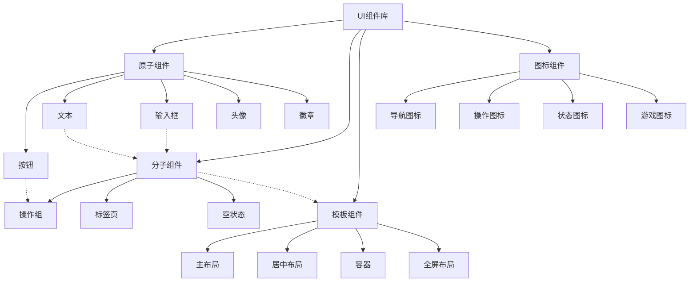
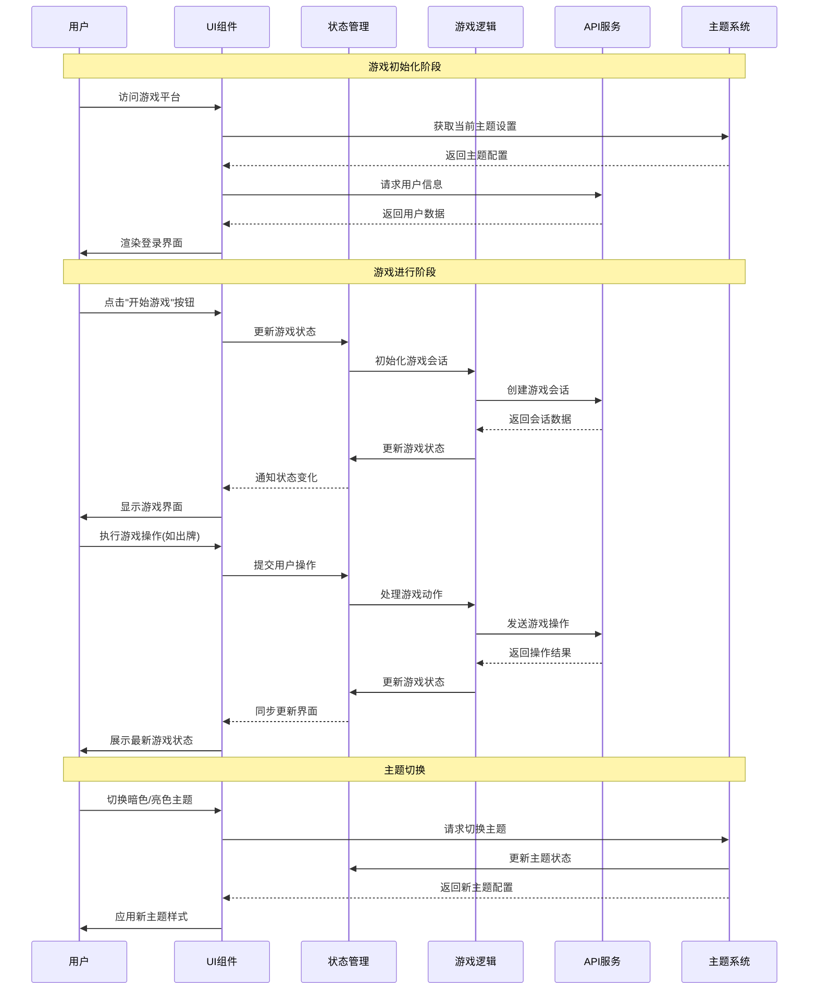

# UI组件库 (UI Component Library)

## 模块概述

UI组件库是爆炸猫游戏平台的视觉表现层，提供了一套统一、可复用的界面组件系统。该模块基于原子设计原则构建，从基础原子组件到复杂模板，形成完整的组件层次结构。所有组件遵循一致的设计语言，支持主题切换、响应式布局和无障碍访问，确保在不同设备和场景下提供一致且高质量的用户体验。

## 核心功能

- **组件系统**: 基于原子设计提供从原子到模板的完整组件层次结构，支持灵活组合与复用
- **主题支持**: 提供亮色和暗色主题，统一的设计语言和视觉风格，支持全局主题切换
- **响应式设计**: 所有组件适配不同屏幕尺寸和设备类型，确保一致的用户体验
- **无障碍支持**: 遵循WCAG标准，适当的语义化标签和ARIA属性，支持键盘导航
- **游戏风格**: 体现爆炸猫游戏特有的视觉风格，包括专用字体、颜色和动画效果
- **开发效率**: 标准化的接口和一致的使用模式，提高开发效率和代码质量

## 关键组件

### 原子组件 (atoms/)

最基础的界面构建块，不可再分解的单一元素：

- **按钮 (button.ts)**: 适应不同场景的交互按钮，包含主要、次要和危险等变体
- **文本 (text.ts)**: 用于显示各类文本内容，支持多种尺寸和样式的文字展示
- **输入框 (input.ts)**: 文本输入控件，带有标签和辅助文本的表单元素
- **标题 (heading.ts)**: 页面和内容的标题元素，提供不同级别的标题展示
- **链接 (link.ts)**: 导航和跳转链接，支持内部和外部链接样式
- **头像 (avatar.tsx)**: 用户头像显示组件，支持图片和文字头像
- **徽章 (badge.ts)**: 用于显示状态、计数或提示的小型标记
- **加载器 (loader/)**: 各种加载状态的视觉指示器

### 分子组件 (molecules/)

由多个原子组件组合的复合界面元素：

- **操作组 (actions.tsx)**: 将多个按钮或交互元素组合为一组相关操作
- **空状态 (empty.tsx)**: 当内容为空时显示的友好提示组件
- **标签页 (tabs.ts)**: 内容分组和切换的标签页组件
- **其他组合组件**: 基于原子组件构建的更复杂交互界面

### 模板组件 (templates/)

页面级布局和结构组件，提供通用的页面框架：

- **主布局 (main.tsx)**: 应用的主要布局结构，包含顶部导航和内容区域
- **居中布局 (center.tsx)**: 内容居中显示的简单布局
- **通用布局 (common.tsx)**: 适合多种场景的通用页面布局
- **容器 (container.tsx)**: 内容容器组件，提供标准间距和宽度限制
- **全屏布局 (fullscreen.tsx)**: 用于全屏显示内容的特殊布局

### 图标组件 (icons/)

丰富的SVG图标集合，为界面提供视觉强化：

- **导航图标**: home.svg、profile.svg、settings.svg等，用于导航和主要功能入口
- **操作图标**: add-person.svg、trash.svg、check.svg等，表示用户可执行的操作
- **游戏图标**: gamepad.svg、trophy.svg等，游戏相关的专用图标
- **状态图标**: eye.svg、question.svg等，表示系统或内容状态
- **社交图标**: social/目录中的图标，用于社交功能和互动

## 依赖关系

UI模块依赖于以下组件：

- **Material UI**: 基础UI框架，提供底层组件和主题系统
- **@shared/assets**: 使用图像、字体等静态资源
- **@shared/lib/theme**: 主题定义和管理
- **@shared/lib/hooks**: 自定义React钩子，增强组件功能
- **styled-components**: 提供组件样式的CSS-in-JS解决方案

## 使用示例

### 按钮组件使用

```tsx
import { Button } from '@shared/ui/atoms';

// 基础按钮
<Button>点击我</Button>

// 主要操作按钮
<Button color="primary" variant="contained">确认</Button>

// 次要操作按钮
<Button color="secondary" variant="outlined">取消</Button>

// 危险操作按钮
<Button color="error" variant="contained">删除</Button>

// 禁用状态
<Button disabled>禁用按钮</Button>

// 带图标的按钮
import { PlayIcon } from '@shared/ui/icons';
<Button startIcon={<PlayIcon />}>开始游戏</Button>
```

### 表单元素使用

```tsx
import { Input, FormControl, Label, InputHelper } from '@shared/ui/atoms';

// 基础输入框
<Input placeholder="请输入内容" />

// 带标签的输入框
<FormControl>
  <Label htmlFor="username">用户名</Label>
  <Input id="username" placeholder="请输入用户名" />
</FormControl>

// 错误状态输入框
<FormControl error>
  <Label htmlFor="password">密码</Label>
  <Input 
    id="password" 
    type="password" 
    placeholder="请输入密码" 
  />
  <InputHelper>密码不能为空</InputHelper>
</FormControl>
```

### 布局模板使用

```tsx
import { MainLayout } from '@shared/ui/templates';
import { Button } from '@shared/ui/atoms';

// 使用主布局
const GamePage = () => {
  return (
    <MainLayout 
      title="游戏大厅"
      headerRight={<Button>开始新游戏</Button>}
    >
      <div className="game-content">
        {/* 游戏内容 */}
      </div>
    </MainLayout>
  );
};

// 使用居中布局
import { CenterLayout } from '@shared/ui/templates';

const LoginPage = () => {
  return (
    <CenterLayout>
      <div className="login-form">
        {/* 登录表单 */}
      </div>
    </CenterLayout>
  );
};
```

### 组合使用示例

```tsx
import { Button, Text, Input } from '@shared/ui/atoms';
import { Tabs, Actions } from '@shared/ui/molecules';
import { Container } from '@shared/ui/templates';

const ProfileSettingsPage = () => {
  return (
    <Container>
      <Text variant="h1">账户设置</Text>
      
      <Tabs>
        <Tabs.Tab label="个人资料">
          <Input 
            label="昵称" 
            defaultValue="爆炸猫玩家001" 
          />
          <Input 
            label="邮箱" 
            type="email" 
            defaultValue="user@example.com" 
          />
          
          <Actions>
            <Button variant="outlined">取消</Button>
            <Button variant="contained" color="primary">保存</Button>
          </Actions>
        </Tabs.Tab>
        
        <Tabs.Tab label="游戏设置">
          {/* 游戏设置内容 */}
        </Tabs.Tab>
      </Tabs>
    </Container>
  );
};
```

## 架构说明

UI组件库采用原子设计模式，从小到大构建组件系统：



组件系统的设计遵循从简单到复杂的层次结构，每层组件都有明确的职责和边界，更高级别的组件通过组合低级组件构建，而不是直接实现所有功能。这种结构提高了代码的可维护性和组件的复用性。

## 功能模块泳道流程图

以下泳道图展示了UI组件如何在游戏流程中与其他功能模块交互：



UI组件库在整个应用中扮演着连接用户与系统的桥梁角色，它负责将系统状态和数据以直观、一致的方式呈现给用户，同时将用户的操作转化为系统可以理解和处理的事件。通过统一的设计语言和交互模式，UI组件库确保用户在整个游戏平台中获得连贯且愉悦的体验。 