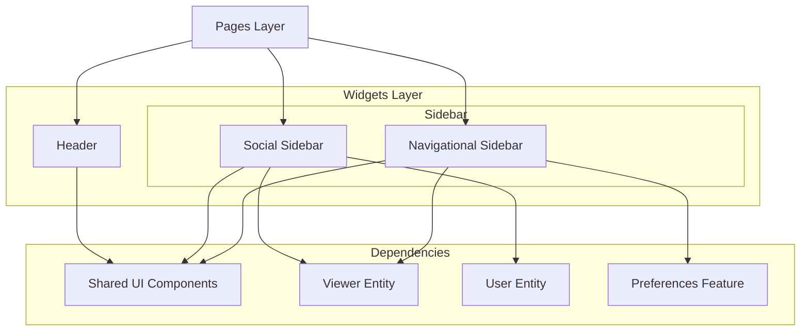
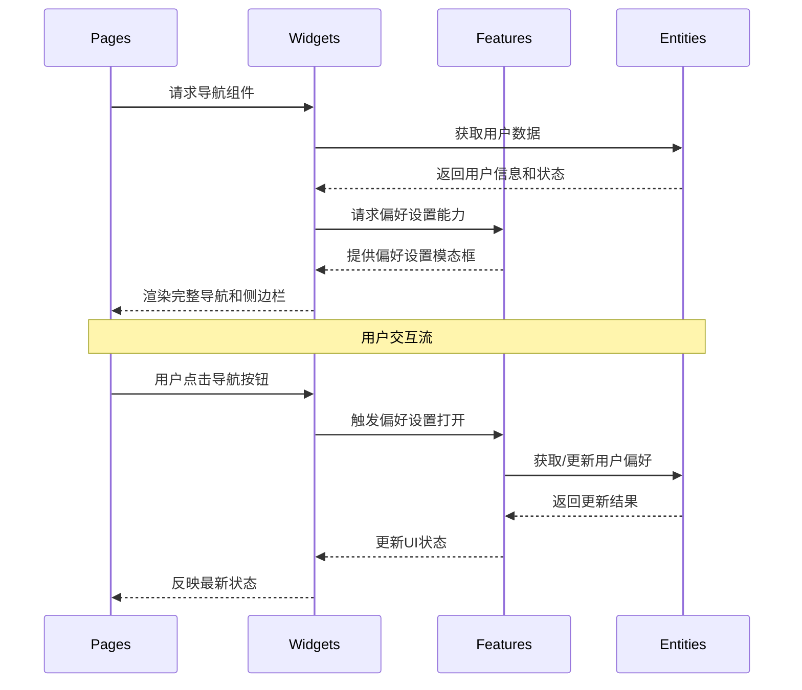

# 部件层 (Widgets Layer)

## 模块概述

部件层是爆炸猫游戏金融(GameFi)应用中的关键组成部分，提供复合UI组件作为特性和实体的集成点。这一层负责呈现更大、更复杂的用户界面单元，它们比基础UI组件更特定于应用领域，但比完整页面更聚焦和可重用，使用户能够在不同游戏环境中获得一致的交互体验。

## 核心功能

- **导航界面**: 提供应用的主要导航结构和用户路径，包括侧边栏导航和顶部标题栏
- **社交互动**: 展示好友列表、在线状态和用户个人资料快速访问
- **布局整合**: 实现可复用的特定布局和排列方式，确保UI一致性
- **状态可视化**: 协调和展示来自多个特性的状态，如用户在线状态
- **响应式设计**: 适应不同屏幕尺寸和设备类型的布局调整

## 关键组件

### 顶部标题 (header.tsx)
- 提供页面标题展示功能
- 使用样式化的组件，带有特定的视觉设计
- 支持自定义标题文本
- 集成MUI主题系统进行样式一致性

### 侧边栏导航 (sidebar/)

#### 社交侧边栏 (social.tsx)
- 展示当前用户头像和个人资料
- 显示好友列表及其在线状态
- 按在线状态自动排序好友显示
- 支持直接链接到好友个人资料

#### 导航侧边栏 (navigational.tsx)
- 提供主要应用导航功能
- 包含首页、个人资料、游戏、排行榜和关于页面的快捷访问
- 通过视觉反馈显示当前活动页面
- 集成设置和偏好访问入口

## 依赖关系

部件层依赖于：
- **@entities/viewer**: 提供当前用户信息和凭证
- **@entities/user**: 管理用户数据和状态
- **@features/preferences**: 提供用户偏好设置功能
- **@shared/lib/layout**: 提供布局工具和组件
- **@shared/ui/atoms**: 提供基础UI原子组件如Avatar
- **@shared/ui/icons**: 提供应用图标系统
- **@shared/api/common**: 提供API类型定义

部件层被以下层使用：
- **pages**层组合部件构建完整页面
- **app**层直接使用某些全局部件

## 使用示例

```tsx
// 在页面中使用部件
import { Header, Sidebar } from '@widgets';
import { PageContent } from '@shared/ui/templates';

const GamePage: React.FC = () => {
  return (
    <div className="game-layout">
      <Sidebar.Navigational />
      
      <div className="main-content">
        <Header>游戏大厅</Header>
        <PageContent>
          {/* 页面主要内容 */}
          <GameBoard />
        </PageContent>
      </div>
      
      <Sidebar.Social />
    </div>
  );
};
```

## 架构说明

部件层位于应用架构的中间层次，连接特性层、实体层和页面层：



## 功能模块泳道流程图



部件遵循组合模式，将多个独立组件组织成更大的功能单元，同时保持组件间的松散耦合。部件通常不实现复杂业务逻辑，而是从特性层和实体层获取状态并展示，实现视图和逻辑的分离。

## 开发指南

1. 部件应该是自包含的，有明确的输入和输出
2. 部件可以有内部状态，但不应直接实现复杂业务逻辑
3. 部件应支持配置，以适应不同使用场景
4. 部件应考虑响应式设计，在不同屏幕尺寸上正常工作
5. 避免部件之间的直接依赖，优先通过props或状态管理通信
6. 部件可以连接到Redux状态，但应限制在必要的范围内
7. 考虑部件的性能优化，特别是频繁重用的部件 