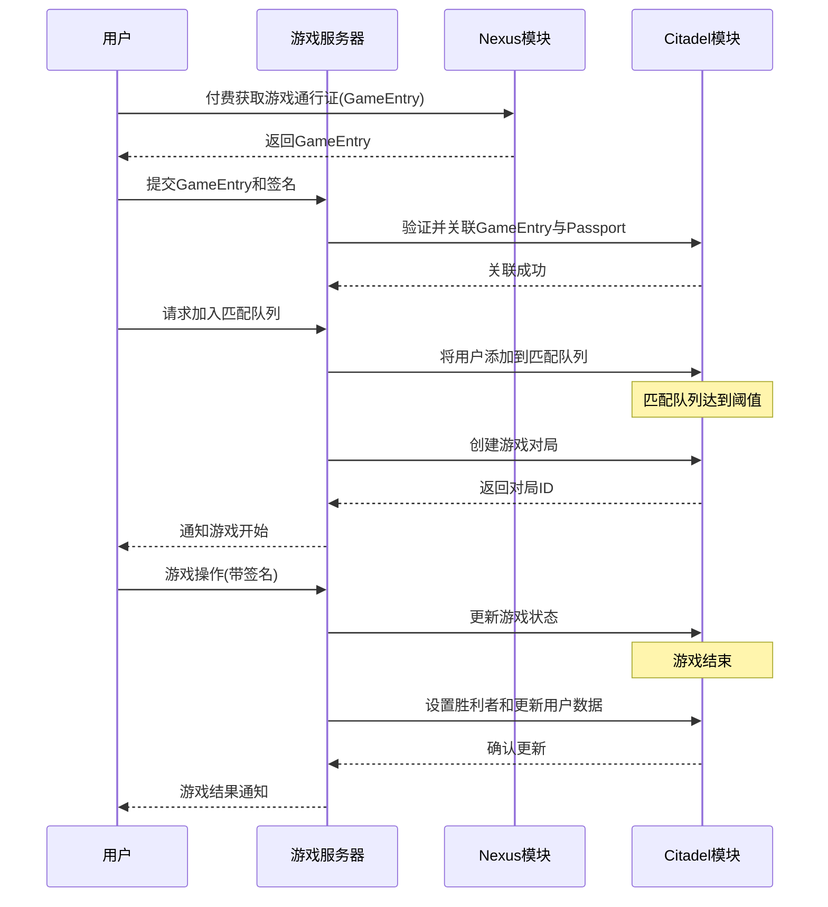

# Citadel 模块

## 模块概述

Citadel 是爆炸猫游戏平台的核心合约模块，负责实现链上游戏逻辑和玩家交互。它通过与 Nexus 模块的集成，实现游戏通行证验证、游戏匹配、对局管理等功能，为爆炸猫卡牌游戏提供完整的链上基础设施。

## 核心功能

- **管理员权限系统**：支持多个游戏服务器作为管理员，通过 AdminCap 实现权限控制和管理。
- **游戏通行证集成**：与 Nexus 模块集成，通过关联游戏通行证(GameEntry)和护照(Passport)实现用户身份认证。
- **游戏匹配系统**：提供游戏大厅和匹配队列功能，支持用户自主创建房间或系统自动匹配。
- **游戏对局管理**：实现游戏状态管理、玩家行为验证、结果记录等核心游戏逻辑。
- **社交功能**：包含好友系统和每日奖励等社交和激励机制。
- **数据存储与事件**：提供链上数据存储和事件通知，便于前端和服务端集成。

## 关键组件

### 管理员系统

- **AdminCap**：管理员权限凭证，允许持有者执行特权操作。
- **AdminRegistry**：记录所有管理员地址的共享对象。
- **create_admin**：创建新管理员权限的函数。

### 用户与身份

- **User**：存储用户信息的对象，包含用户名、头像、评分等信息。
- **GameEntryPassport**：关联游戏通行证与护照的结构体。
- **GameEntryStore**：存储所有游戏通行证关联信息的共享对象。

### 游戏匹配

- **MatchQueue**：游戏匹配队列，存储等待匹配的玩家。
- **Lobby**：游戏大厅，允许玩家创建和加入游戏房间。
- **add_to_match_queue**：将玩家添加到匹配队列的函数。
- **create_match_from_queue**：从队列创建游戏对局的函数。

### 游戏逻辑

- **Match**：游戏对局结构，存储游戏状态和玩家信息。
- **PlayerState**：玩家在游戏中的状态。
- **Deck**：游戏卡组，包含游戏卡牌。
- **update_match_state**：更新游戏状态的函数。
- **set_match_winner**：设置游戏胜利者的函数。

### 社交系统

- **FriendshipStore**：存储用户好友关系的共享对象。
- **send_friend_request**：发送好友请求的函数。
- **accept_friend_request**：接受好友请求的函数。
- **claim_daily_rewards**：领取每日奖励的函数。

### 全局存储

- **CatastropheManager**：全局管理对象，存储用户注册信息和对局数据。

## 依赖关系

### 内部依赖

- **GameEntry <-> User**：游戏通行证与用户对象的关联关系。
- **User <-> Match**：用户参与游戏对局的关联关系。
- **AdminCap <-> AdminRegistry**：管理员权限与注册表的关联关系。

### 外部依赖

- **Sui 标准库**：使用 Sui 的 Table、UID、ID、Clock 等组件。
- **Nexus 模块**：依赖 Nexus 提供的 Passport 和 GameEntry 功能。

## 使用示例

### 游戏服务器集成流程

```
// 1. 关联游戏通行证与护照
// 游戏服务器(管理员)关联用户的游戏通行证与护照
public entry fun link_game_entry(
    game_entry_store: &mut GameEntryStore,
    admin_registry: &AdminRegistry,
    game_entry_id: ID,
    passport_id: address,
    clock: &Clock,
    ctx: &mut TxContext
) {
    // 权限检查与执行
    // ...
}

// 2. 将用户添加到匹配队列
// 用户通过session key签名，服务器验证后添加用户到匹配队列
public entry fun add_to_match_queue(
    match_queue: &mut MatchQueue,
    game_entry_store: &GameEntryStore,
    admin_registry: &AdminRegistry,
    game_entry_id: ID,
    clock: &Clock,
    ctx: &mut TxContext
) {
    // 权限检查与执行
    // ...
}

// 3. 创建游戏对局
// 服务器从匹配队列创建游戏对局
public entry fun create_match_from_queue(
    manager: &mut CatastropheManager,
    match_queue: &mut MatchQueue,
    admin_registry: &AdminRegistry,
    min_players: u64,
    clock: &Clock,
    ctx: &mut TxContext
) {
    // 权限检查与执行
    // ...
}
```

## 架构说明

Citadel 模块采用分层架构设计：

1. **对象层**：定义游戏中的各种对象，如用户、卡牌、游戏对局等。
2. **存储层**：使用共享对象存储全局状态，如用户注册表、游戏通行证关联等。
3. **逻辑层**：实现核心游戏逻辑，包括游戏匹配、状态更新、胜负判定等。
4. **权限层**：通过管理员系统控制权限，确保关键操作只能由授权方执行。
5. **事件层**：发送各类事件，便于外部系统订阅和响应链上状态变化。

该架构通过 session key 机制与后端服务器集成，后端验证用户签名并代为执行链上操作，实现了用户友好的游戏体验与链上数据的一致性。

## 功能模块流程图



## 待优化功能

1. **撤销管理员权限**：添加撤销管理员权限的功能。
2. **游戏历史记录**：完善游戏历史记录的创建和查询功能。
3. **玩家游戏操作**：增加更多玩家在游戏中的操作函数。
4. **用户评分更新**：添加更新用户评分的专用函数。
5. **卡牌分配与管理**：完善卡牌分配和管理相关的功能。 