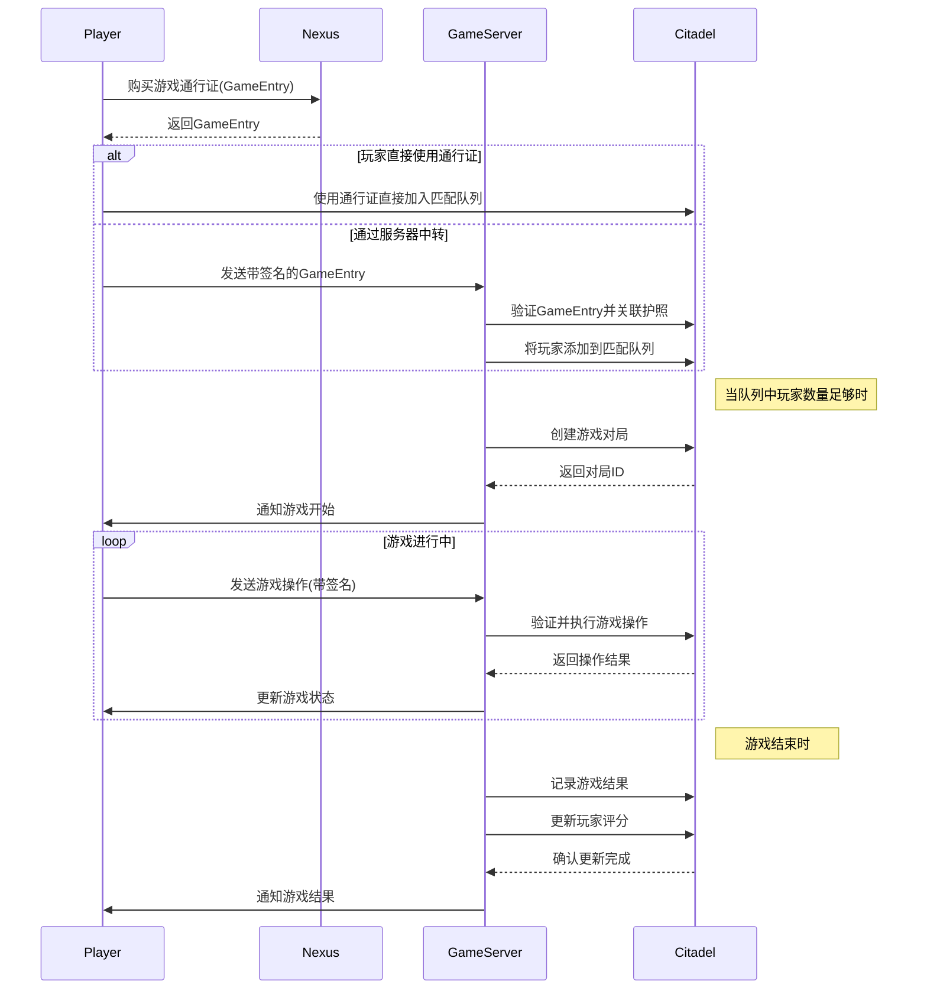

# Citadel 模块

## 模块概述

Citadel是爆炸猫游戏平台的核心合约模块，负责管理游戏内的用户、卡牌、游戏匹配和管理员权限。它通过与Nexus模块的集成，实现了游戏通行证与护照系统的连接，为区块链卡牌游戏提供完整的链上游戏平台解决方案。

## 核心功能

- **管理员权限系统**: 支持多服务器部署的权限管理系统，允许授权的管理员执行敏感操作。
- **游戏通行证集成**: 与Nexus模块的GameEntry系统集成，通过护照ID实现玩家身份验证和游戏数据关联。
- **匹配队列管理**: 支持基于玩家评分和护照ID的游戏匹配机制，高效创建公平的游戏对局。
- **游戏对局控制**: 全面的游戏状态管理，包括游戏创建、卡牌分发、回合管理和胜负判定。
- **社交系统**: 支持玩家之间的好友关系管理，包括发送和接受好友请求。
- **数据统计与排名**: 记录并更新玩家的游戏数据、评分和战绩，支持游戏内排名系统。

## 主要组件

### 用户管理组件

- **User.move**: 用户数据结构和基本操作，管理玩家的游戏内资料和状态。
- **FriendshipStore.move**: 管理用户间的社交关系，包括好友请求和接受流程。

### 卡牌系统组件

- **Card.move**: 定义卡牌类型和基础属性，支持爆炸猫游戏中的各种卡牌效果。
- **Deck.move**: 管理游戏中的卡组，包括洗牌、抽牌和弃牌等操作。

### 游戏匹配组件

- **MatchQueue.move**: 处理玩家的匹配请求，基于各种条件创建公平的游戏对局。
- **Lobby.move**: 提供游戏大厅功能，允许玩家组队或等待其他玩家加入。

### 管理员权限组件

- **AdminCap.move**: 管理员权限凭证，控制对敏感功能的访问。
- **AdminRegistry.move**: 管理所有授权管理员的注册表，支持添加和撤销权限。

### 游戏通行证组件

- **GameEntryStore.move**: 存储游戏通行证与护照的关联信息，实现跨模块数据整合。
- **GameEntryPassport.move**: 定义通行证到护照的映射关系，便于身份验证。

## 依赖关系

### 内部依赖

- 所有组件都依赖于CatastropheManager，这是平台的中央数据存储和控制中心。
- 卡牌组件依赖于用户管理组件，以确保卡牌所有权的正确分配。
- 游戏匹配组件依赖于管理员组件和游戏通行证组件，确保只有授权操作才能创建和管理游戏。

### 外部依赖

- **sui::table**: 用于高效存储和访问键值对数据。
- **sui::clock**: 提供时间戳功能，用于记录事件发生时间和计算时间差。
- **sui::event**: 用于发出事件通知，使外部系统能够响应链上状态变化。
- **nexus::game**: 外部游戏通行证系统，与Citadel集成以提供完整的游戏体验。
- **nexus::passport**: 用户身份验证系统，确保玩家身份的唯一性和持久性。

## Nexus模块直接集成

Citadel模块直接集成了Nexus的护照(Passport)和游戏通行证(GameEntry)系统，提供了以下集成功能：

1. **使用护照创建用户**：玩家可以使用其Nexus护照直接创建游戏用户，确保身份一致性。
```move
citadel::create_user_with_passport(manager, friendship_store, passport, username, avatar, clock, ctx);
```

2. **游戏通行证验证**：验证游戏通行证与护照的关联关系，确保只有有效的通行证才能参与游戏。
```move
let is_valid = citadel::verify_game_entry(game_entry, passport);
```

3. **通行证匹配队列**：玩家可以使用游戏通行证直接加入匹配队列，简化游戏流程。
```move
citadel::join_match_queue_with_entry(match_queue, game_entry, passport, clock, ctx);
```

4. **护照信息查询**：获取玩家护照的关键信息，用于游戏内的数据展示和决策。
```move
let (passport_id, daily_claims) = citadel::get_player_passport_info(passport);
```

## 使用示例

### 游戏匹配流程

```move
// 1. 玩家通过Nexus模块获取游戏通行证
let game_entry = nexus::game::join_game(passport, treasury, payment, game, purpose, clock, ctx);

// 2. 玩家直接使用通行证和护照加入匹配队列
citadel::join_match_queue_with_entry(match_queue, game_entry, passport, clock, ctx);

// 3. 或者通过管理员关联通行证与护照
citadel::link_game_entry(game_entry_store, admin_registry, object::id(game_entry), passport_id, clock, ctx);
citadel::add_to_match_queue(match_queue, game_entry_store, admin_registry, object::id(game_entry), clock, ctx);

// 4. 创建游戏对局
citadel::create_match_from_queue(manager, match_queue, admin_registry, 2, clock, ctx);
```

### 游戏进行流程

```move
// 1. 分配初始卡牌给玩家
citadel::assign_card_to_player(admin_registry, match_obj, 0, 2, ctx); // 给玩家0分配一张拆除牌

// 2. 玩家抽牌
citadel::draw_card(admin_registry, match_obj, current_player, card_index, clock, ctx);

// 3. 更新游戏状态
citadel::update_match_state(match_obj, admin_registry, 2, clock, ctx); // 设置为进行中

// 4. 设置胜利者并结束游戏
citadel::set_match_winner(match_obj, admin_registry, winner_address, ctx);
citadel::update_match_state(match_obj, admin_registry, 3, clock, ctx); // 设置为已结束
```

## 架构说明

Citadel采用了模块化设计模式，将不同功能区分为独立但相互关联的组件。这种设计允许灵活扩展和适应不同的游戏需求，同时保持核心功能的稳定性。

关键的架构决策包括：

1. **权限分离**: 使用AdminCap确保只有授权管理员才能执行敏感操作。
2. **事件驱动**: 通过事件系统实现链上状态变化的通知，便于前端和后端系统响应。
3. **数据存储优化**: 使用Table结构高效存储和检索玩家和游戏数据。
4. **跨模块集成**: 通过直接导入Nexus模块实现与护照和游戏通行证的无缝集成。
5. **状态管理**: 使用清晰定义的状态常量管理游戏和玩家的生命周期。

## 功能模块泳道流程图



## 安全考量

1. **权限控制**: 所有敏感操作都需要AdminCap验证，防止未授权访问。
2. **数据验证**: 输入参数进行严格验证，防止恶意数据注入。
3. **状态一致性**: 通过事务确保状态更新的原子性，避免不一致状态。
4. **签名验证**: 通过session key机制验证玩家操作的真实性。
5. **资源管理**: 严格控制资源的创建和转移，防止资源丢失或重复创建。
6. **护照验证**: 直接验证游戏通行证与护照的关联关系，防止欺诈行为。

## 未来扩展

1. **更多游戏模式**: 支持不同规则的游戏模式和自定义规则。
2. **游戏内奖励系统**: 扩展游戏币系统，支持更多奖励机制。
3. **锦标赛支持**: 添加锦标赛功能，支持多轮淘汰制比赛。
4. **社区功能**: 扩展社交功能，支持公会和团队竞赛。
5. **市场集成**: 与NFT市场集成，支持卡牌的交易和收藏。
6. **深度Nexus集成**: 进一步集成Nexus的其他功能，如租赁卡牌系统等。
