# Catastrophe 合约模块结构

## 模块依赖关系

```mermaid
graph TD
    Card[Card 模块] --> Vector[std::vector]
    Card --> String[std::string]
    Card --> Object[sui::object]
    Card --> TxContext[sui::tx_context]
    Card --> Transfer[sui::transfer]
    Card --> Event[sui::event]

    Fragment[Fragment 模块] --> Balance[sui::balance]
    Fragment --> Coin[sui::coin]
    Fragment --> Package[sui::package]
    Fragment --> Option[std::option]
    Fragment --> Object
    Fragment --> TxContext
    Fragment --> Transfer
    Fragment --> Event
    Fragment --> String

    Passport[Passport 模块] --> Card
    Passport --> Vector
    Passport --> Clock[sui::clock]
    Passport --> Table[sui::table]
    Passport --> Object
    Passport --> TxContext
    Passport --> Transfer
    Passport --> Event
    Passport --> String

    Rental[Rental 模块] --> Card
    Rental --> Fragment
    Rental --> Passport
    Rental --> Clock
    Rental --> Table
    Rental --> Object
    Rental --> TxContext
    Rental --> Transfer
    Rental --> Event
    Rental --> String
    Rental --> Balance
    Rental --> Coin

    Staking[Staking 模块] --> Card
    Staking --> Fragment
    Staking --> Clock
    Staking --> Table
    Staking --> Object
    Staking --> TxContext
    Staking --> Transfer
    Staking --> Event
    Staking --> String
    Staking --> Balance
    Staking --> Coin

    Treasury[Treasury 模块] --> Fragment
    Treasury --> Passport
    Treasury --> Clock
    Treasury --> Object
    Treasury --> TxContext
    Treasury --> Transfer
    Treasury --> Event
    Treasury --> String
    Treasury --> Balance
    Treasury --> Coin
```

## 功能模块划分

### 1. Card 模块

**职责**: 管理卡牌 NFT 的生命周期

**主要功能**:
- 创建卡牌
- 升级卡牌
- 销毁卡牌
- 转移卡牌所有权

### 2. Fragment 模块

**职责**: 管理游戏内碎片代币

**主要功能**:
- 铸造碎片
- 销毁碎片
- 合并碎片
- 分割碎片
- 转移碎片

### 3. Passport 模块

**职责**: 管理用户身份和资格

**主要功能**:
- 创建护照
- 领取每日奖励
- 管理租赁卡牌记录

### 4. Rental 模块

**职责**: 管理卡牌租赁系统

**主要功能**:
- 创建租赁卡牌
- 租用卡牌
- 使用租赁卡牌
- 结束租赁

### 5. Staking 模块

**职责**: 管理卡牌质押系统

**主要功能**:
- 创建质押池
- 质押卡牌
- 解除质押
- 计算和领取奖励

### 6. Treasury 模块

**职责**: 管理游戏资金和奖励

**主要功能**:
- 存入资金
- 发放初始奖励
- 发放每日奖励
- 管理员提取资金

## 对象存储和交互

### 1. 共享对象

以下对象设计为共享对象，可以被多个用户访问:
- `StakingPool`: 多个用户可以在同一个质押池中质押卡牌
- `Treasury`: 作为全局资金库，管理游戏奖励发放

### 2. 拥有对象

以下对象设计为拥有对象，归属于特定用户:
- `Card`: 卡牌 NFT，归属于特定用户
- `Passport`: 护照对象，归属于特定用户
- `RentalCard`: 租赁卡牌对象，归属于出租者

### 3. 对象关系

- `Passport` 对象通过 `vector<address>` 引用租赁的卡牌
- `RentalCard` 对象通过 `original_card_id` 引用原始卡牌
- `StakingPool` 对象通过 `Table<address, StakerInfo>` 存储所有质押者信息

## 代码组织

每个模块文件都包含以下部分:
1. **导入声明**: 引入依赖的标准库和其他模块
2. **常量定义**: 定义错误代码和其他常量
3. **结构体定义**: 定义模块中的对象结构
4. **事件定义**: 定义模块中触发的事件
5. **功能实现**: 实现模块的核心功能
6. **getters**: 提供对象属性的访问方法 