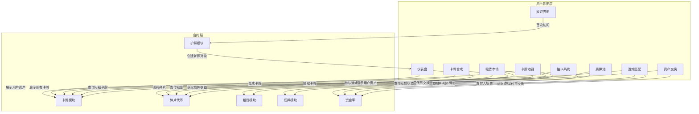

```mermaid
sequenceDiagram
    actor User as 用户
    participant UI as 前端界面
    participant Pass as Passport模块
    participant Treas as Treasury模块
    participant Frag as Fragment模块
    participant Card as Card模块
    participant Rent as Rental模块
    participant Stake as Staking模块

    %% 注册流程
    User->>UI: 首次访问游戏
    UI->>Pass: 请求创建护照
    Pass->>Pass: 创建Passport对象
    Pass->>Treas: 请求初始资产
    Treas->>Frag: 铸造初始碎片(250)
    Treas->>User: 发放初始游戏币
    UI->>User: 显示欢迎界面

    %% 每日奖励
    User->>UI: 每日登录
    UI->>Pass: 检查是否可领取每日奖励
    Pass->>Pass: 验证上次领取时间
    Pass->>Treas: 请求每日奖励
    Treas->>Frag: 铸造每日奖励碎片(50)
    Treas->>User: 发放奖励
    UI->>User: 通知领取成功

    %% 抽卡流程
    User->>UI: 选择卡包抽卡
    UI->>Treas: 支付游戏币
    Treas->>Card: 请求创建新卡牌
    Card->>Card: 根据概率创建卡牌对象
    Card->>User: 发送卡牌至用户钱包
    UI->>User: 展示抽取结果

    %% 卡牌合成
    User->>UI: 选择卡牌合成
    UI->>Frag: 消耗碎片
    Frag->>Frag: 销毁碎片
    Frag->>Card: 请求创建新卡牌
    Card->>User: 发送合成卡牌至用户钱包
    UI->>User: 展示合成结果

    %% 卡牌升级
    User->>UI: 选择卡牌升级
    UI->>Card: 发送升级请求
    Card->>Card: 执行升级逻辑
    Card->>User: 更新卡牌属性
    UI->>User: 展示升级结果

    %% 销毁卡牌
    User->>UI: 选择销毁卡牌
    UI->>Card: 发送销毁请求
    Card->>Card: 销毁卡牌对象
    Card->>Frag: 铸造对应碎片
    Frag->>User: 发送碎片至用户钱包
    UI->>User: 展示销毁结果

    %% 质押流程
    User->>UI: 选择卡牌质押
    UI->>Stake: 发送质押请求
    Stake->>Stake: 记录质押信息
    Stake->>Card: 转移卡牌所有权
    UI->>User: 更新质押状态

    %% 领取质押奖励
    User->>UI: 领取质押奖励
    UI->>Stake: 请求计算奖励
    Stake->>Stake: 计算累积奖励
    Stake->>Frag: 铸造奖励碎片
    Frag->>User: 发送奖励至用户钱包
    UI->>User: 更新奖励信息

    %% 解除质押
    User->>UI: 解除卡牌质押
    UI->>Stake: 发送解除质押请求
    Stake->>Stake: 更新质押记录
    Stake->>Card: 归还卡牌所有权
    Card->>User: 归还卡牌至用户钱包
    UI->>User: 更新质押状态

    %% 租赁流程
    User->>UI: 选择租用卡牌
    UI->>Rent: 发送租赁请求
    Rent->>Frag: 支付租金
    Frag->>Card: 创建租赁卡牌副本
    Rent->>Pass: 将租赁卡牌关联至护照
    UI->>User: 更新租赁状态

    %% 游戏匹配
    User->>UI: 选择游戏匹配
    UI->>Treas: 支付参赛费用
    UI->>Card: 验证卡牌可用性
    UI->>User: 进入游戏

    %% 资产交换
    User->>UI: 选择资产交换
    UI->>Frag: 请求代币交换
    Frag->>Frag: 执行交换逻辑
    Frag->>Treas: 更新代币余额
    UI->>User: 更新资产信息